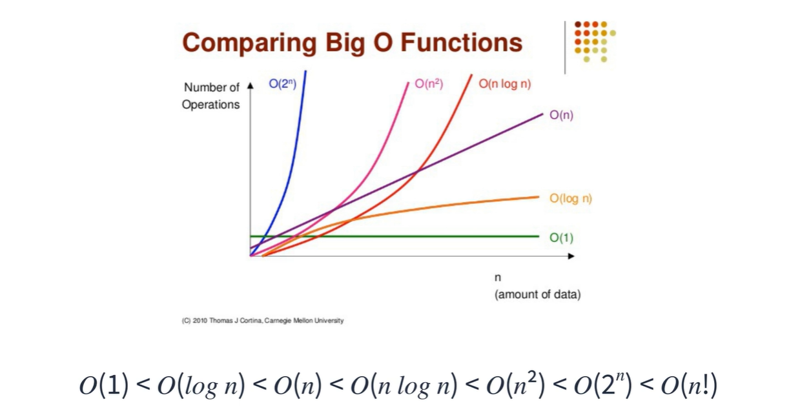
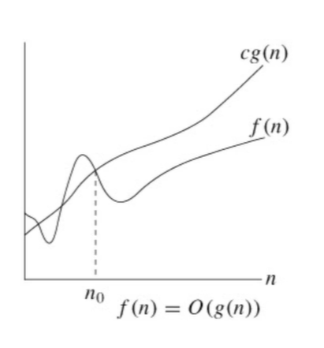
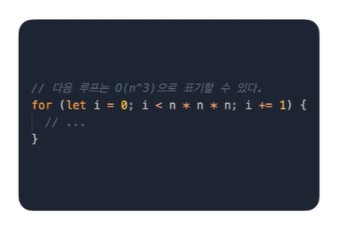
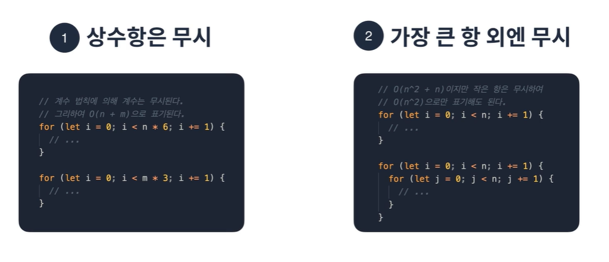

# Coding Test A to Z Javascript

## Ch02-2.시간복잡도

> ### 우리는 프로그램의 성능을 정확히 알 수 있는가?

우리가 프로그램의 성능을 알기 위해서는 고려해야 할 것들이 많다. 입력 크기, 하드웨어 성능, 운영체제 성능, 컴파일러 성능 등등...항상 같은 데이터, 하드웨어, 운영체제를 사용하고 성능 측정을 위해 특정 컴파일러를 만들어 사용하더라도 비슷한 결과는 나올 수 있지만 매번 같은 결과가 나오지는 않는다. 실행 환경과 메모리 사용량에 따라 다른 결과가 나오기 때문이다.

그래서 컴퓨터 과학자들은 대략적인 성능을 나타내기 위해 상대적인 표기법을 사용하기로 했다. 그것이 바로 빅오표기법이다. 

### 빅오표기법

*O(1)이 가장 빠르고 O(n!)이 가장 느리다.

입력받은 크기만큼 루프를 돌면 선형

입력받은 크기에 log를 씌운 만큼 루프를 돔

둘의 차이는 매우 크다

1024일 경우

선형은 1024번, 로그를 씌우게 되면 총 10번만 돌게 된다.

여기서 지수 시간이나 팩토리얼 시간 복잡도는 특정한 상황이 아니라면 사용되어서는 안됨

코딩 테스트 최대 n 3제곱 이상이 소요되는 경우는 거의 없다고 보면 됨

시간 복잡도에 지수가 있거나 상수를 곱하거나 더하고 빼는 경우는 없다

그 이유는 빅오표기법 점근적 표기법을 따르기 때문

함수의 증감 추세 비교하는 방법

	

c와 n0가 양수라고 가정하고

n이 n0를 넘었을 때

f(n) 은 Cg(n) 에 한없이 가까워질 수는 있으나 넘어설 수는 없음

한마디로 함수 g(n)은 함수 f(n)의 한계치라고 할 수 있다

### 계수 법칙

상수 k가 0보다 클 때 f(n)=O(g(n))이면 kf(n)=O(g(n))이다.

n이 무한에 가까울 수록 k의 크기는 의미가 없어짐

물론 k가 클수록 성능에는 영향을 미칠 수 있음

### 합의 법칙, 곱의 법칙

f(n)=O(h(n))이고 g(n) = O(p(n)) 이면 f(n) + g(n) = O(h(n)) + O(p(n))이다.

빅오끼리는 더하고 곱할 수 있다. 

### 다항법칙

f(n) 이 K차 다항식이면 f(n) 은 O(nk제곱)이다.

	

# 딱 2가지만 기억

상수항은 무시

가장 큰 항 외에는 무시

## 성능 측정 방법

Date 객체를 이용

시작 시간을 구하고 로직을 돌린 후의 시간을 구한다음 끝 시간에서 시작 시간을 빼면 얼마나 걸린지 알 수 있음

# :books:참고자료

- 프로그래머스 강의 : 코딩테스트 광탈 방지 A to Z : JavaScript
