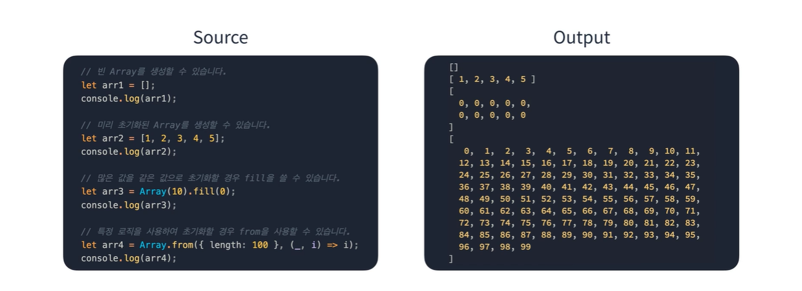

변수를 선언하면 기록된 데이터를 꺼내 쓸 수 있음

연관된 데이터를 사용하려면?

여러 개의 변수를 선언하는 방법

이런 경우에 배열을 이용해 처리함

## 배열

배열

연관된 데이터를 연속적인 형태로 가지고 있는 구조

배열에 포함된 원소는 순서대로 번호가 붙음

배열의 특징

- 고정된 크기를 가지며 일반적으로는 동적으로 크기를 늘릴 수 없다
  - 자바스크립트처럼 대부분의 스크립트 언어는 동적으로 크기가 증감
- 특정 원소의 index를 알고 있다면 해당 원소를 찾을 수 있다.
- 원소를 삭제하면 해당 index에 빈자리가 생긴다.
- 

배열 요소 삭제 후 순서를 맞추려면 O(n)이 소요된다.

요소를 삭제한 후 그 요소 뒤의 원소들을 모두 앞으로 한 칸씩 옮겨주어야 하기 때문

배열 요소 추가

중간에 요소를 추가하고 싶다면 최악의 경우 O(n) 이 걸린다.

추가하려는 인덱스 뒤의 모든 요소들을 뒤로 민다.

추가와 삭제가 반복되는 로직이라면 배열을 권장하지 않음

검색이 많이 일어나는 경우에 배열을 사용하자.

추가

push, splice

삭제

splice

splice는 선형 시간을 가짐

자바스크립트 배열의 특이점

동적으로 작동

배열의 크기가 고정되어있지 않음

인덱스가 문자열이나 논리값도 가능

배열이 근본적으로 객체 타입이기 때문

인덱스가 number가 아닌 경우 길이에 영향을 미치지 않음

인덱스를 넘버로 사용하지 않는 것은 좋은 방법은 아님

따라서 특징을 가지고 있다고만 알아두고 사용하는 것은 권장하지 않음