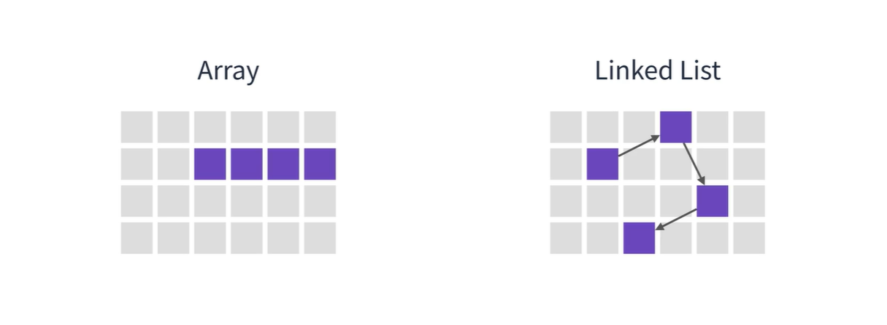
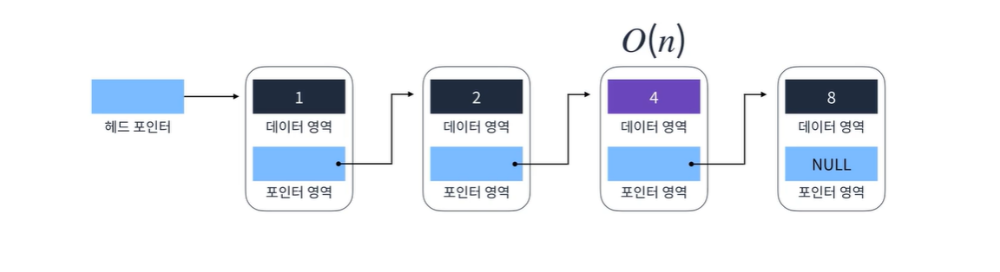

추가와 삭제가 반복되는 로직이라면 어떻게 해야할까?

연결리스트

연결 리스트는 각 요소를 포인터로 연결하여 관리하는 선형 자료구조이다.

각 요소는 노드라고 부르며 데이터 영역과 포인터 영역으로 구성된다.

특징

1. 메모리가 허용하는한 요소를 제한없이 추가 가능
2. 탐색에 O(n)이 소요됨
3. 요소를 추가하거나 제거할 때는 O(1)가 소요됨
4. 단일 연결 리스트, 이중 연결 리스트, 환형 연결 리스트

메모리 영역 사용의 차이

배열은 메모리 영역을 연속적으로 사용, 순차적인 데이터가 들어감

순차적이지 않기에 메모리 영역이 퍼져있음

추가와 삭제 부분에서 차이

연결 리스트 요소 삭제

삭제할 요소 이전 요소의 포인터를 삭제할 요소 다음 요소의 포인터로 연결

이후 요소 삭제

O(1)

연결 리스트 요소 추가

추가할 요소를 끼워넣을 부분의 그 다음 요소의 포인터와 연결

그리고 끼워넣을 부분의 이전 요소가 추가할 요소의 포인터를 가리키도록 설정

단일연결리스트

Head Tail까지 단방향으로 이어지는 가장 단순한 형태

Tail의 포인터 영역은 null

찾기, 추가, 삭제 로직으로 구성되어있음

찾기 로직

O(n)

헤드 포인터에서 시작

포인터를 통해 다음 요소를 찾고 데이터 영역의 값을 확인함

확인 후 찾는 값이 아니라면 포인터 영역을 통해 다음 요소로 넘어감

이렇게 확인해가면서 찾아야 하기 때문에 시간 복잡도는 O(n) 이다.
