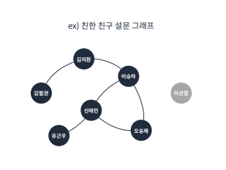
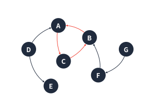
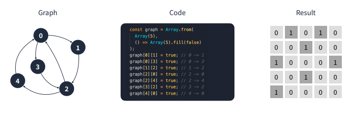
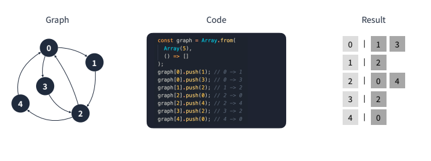

# Coding Test A to Z Javascript

## Ch06-1.그래프

정점(Node)과 정점 사이를 연결하는 간선(Edge)으로 이루어진 비선형 자료구조

### 특징

- 정점은 여러 개의 간선을 가질 수 있음

- 크게 방향 그래프, 무방향 그래프로 나뉨

- 간선은 가중치를 가질 수 있음

- 사이클이 발생할 수 있음

- 사례

  - 인간 관계도

  - 지하철 노선도

  - 페이지 랭크 알고리즘

    ➡구글 검색 알고리즘으로 하나의 페이지가 정점, 페이지에서 파생되는 링크가 간선이 됨

#### 무방향 그래프

간선으로 이어진 정점끼리는 양방향 이동 가능

➡ A->B 와 B->A는 동일한 간선으로 취급

#### 방향 그래프

간선에 방향성이 존재하는 그래프

➡ A->B 와 B->A는 다른 간선으로 취급

#### 연결 그래프

모든 정점이 서로 이동 가능한 상태인 그래프

#### 비연결 그래프

특정 정점들 사이에 간선이 존재하지 않는 그래프

	

#### 완전 그래프

모든 정점끼리 연결된 상태인 그래프

- 한 정점에서의 간선 수 = 모든 정점-1
- (모든 정점의 수)*(모든 정점의 수 -1) = 모든 간선 수 

#### 사이클

그래프의 정점과 간선의 부분 집합에서 순환이 되는 부분

	

### 실제로 구현하기

#### 인접 행렬

	

1. 행을 출발 정점, 열을 도착 정점으로 둔다.

2. 연결된 경우 값을 true로 할당한다.

✔무방향 그래프인 경우에는 모든 값을 대칭으로 넣어준다.

#### 인접 리스트

	

1. 행을 출발 정점으로 둔다.
2. 연결된 정점들을 모두 push 해준다.

# :books:참고자료

- 프로그래머스 강의 : 코딩테스트 광탈 방지 A to Z : JavaScript

