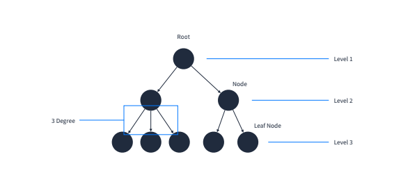
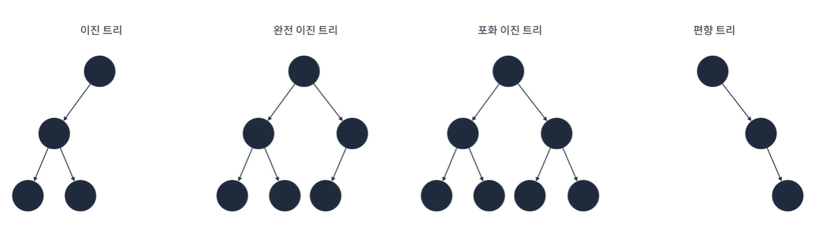
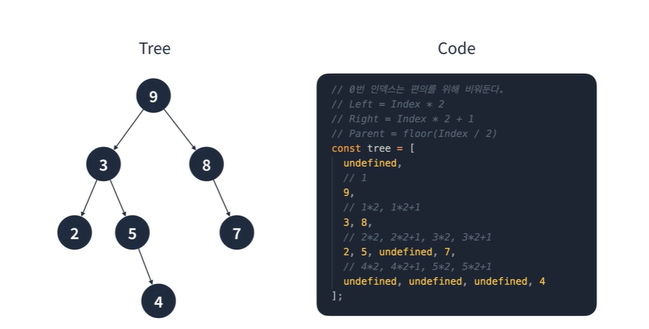
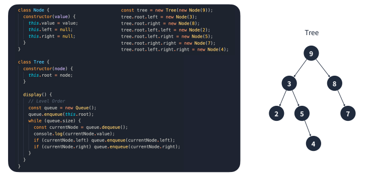

# Coding Test A to Z Javascript

## Ch09.트리

방향 그래프 일종으로 정점을 가리키는 간선이 하나밖에 없는 구조

	

### 특징

- 조직도나 가계도에서 사용

- 루트 정점을 제외한 모든 정점은 반드시 하나의 부모 정점
- 정점이 N개인 트리는 반드시 N-1개의 간선을 가짐
- 루트에서 특정 정점으로 가는 경로는 하나

#### 이진 트리

이진 트리는 각 정점이 최대 2개의 자식을 가지는 트리

#### 이진 트리의 특징

- 정점이 N개인 이진 트리는 최악의 경우 높이가 N이 될 수 있음(편향 트리를 생각하자)

- 정점이 N개인 포화 또는 완전 이진 트리의 높이는 logN

- 높이가 h인 포화 이진 트리는 2^h-1개의 정점을 가짐

- 일반적인 이진 트리를 사용하는 경우는 많지 않고, 다음 자료구조에 응용됨

  - 이진 탐색 트리
  - 힙
  - AVL 트리
  - 레드 블랙 트리

### 실제로 구현하기

#### 트리의 구현 방법

그래프와 같은 방법으로 구현 가능

#### 이진 트리의 구현 방법

##### 배열

1. 인덱스는 0부터 시작하기 때문에 편의를 위해 0번 인덱스는 비워놓는다.
2. 루트 정점의 인덱스를 1로 설정한다.
3. 각 정점은 두 개의 정점을 가질 수 있기 때문에 정점의 순서 * 2, 정점의 순서 * 2 + 1을 인덱스로 설정

✅ 위의 경우 정점의 순서는 9 -> 3 -> 8 -> 2 -> 5 -> 7 -> 4

##### 연결 리스트

	

일반적인 연결 리스트와 비슷하지만, next 필드 대신에 left와 right를 가진다는 점을 알아두자.

# :books:참고자료

- 프로그래머스 강의 : 코딩테스트 광탈 방지 A to Z : JavaScript

