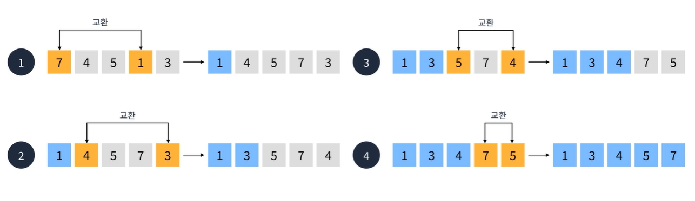
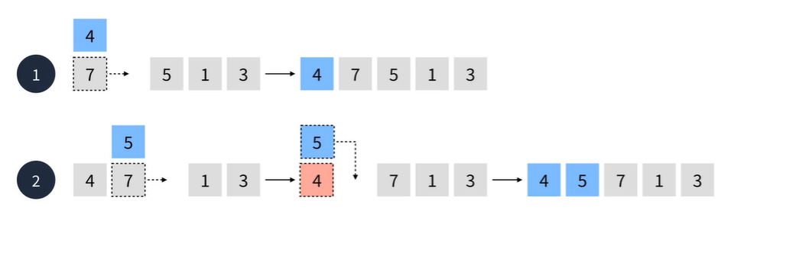
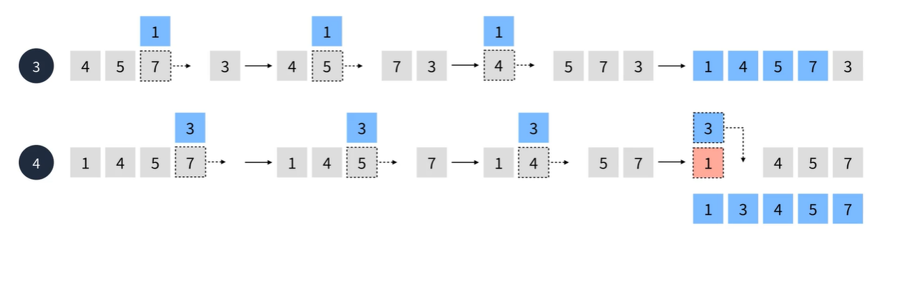
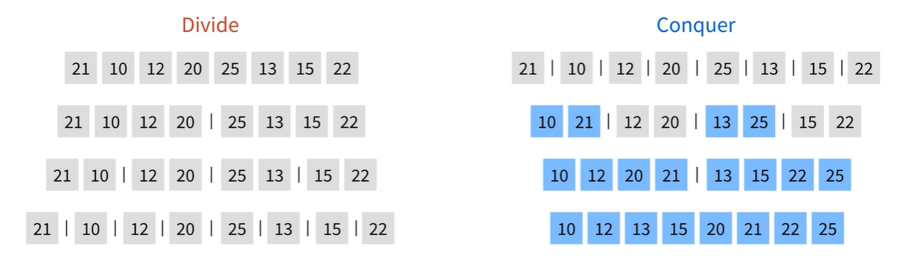
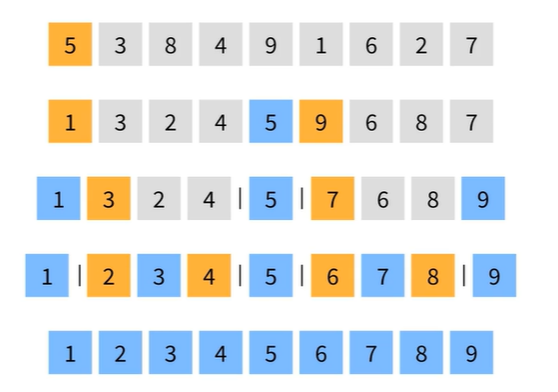

# Coding Test A to Z Javascript

## Ch13.정렬

요소들을 일정한 순서대로 열거하는 알고리즘

### 특징

- 정렬 기준은 사용자가 정할 수 있음
- 크게 비교식과 분산식 정렬로 나눌 수 있음
- 대부분의 언어가 빌트인으로 제공해준다.
- 삽입, 선택, 버블, 머지, 힙, 퀵 정렬 등 다양한 정렬 방식이 존재

### 가장 빠른 정렬은 무엇일까?

각 상황에 따라 정렬은 장단점을 가지므로 상황에 맞는 선택이 필요하다.

### 비교식 정렬

#### 버블 정렬(O(n^2))

서로 인접한 두 요소를 검사하여 정렬하는 알고리즘

n-1 회 순회시 정렬이 마무리됨

#### 선택 정렬(O(n^2))

선택한 요소와 가장 우선순위가 높은 요소를 교환하는 정렬 알고리즘

#### 삽입 정렬(O(n^2))

선택한 요소를 삽입할 수 있는 위치를 찾아 삽입하는 방식의 정렬 알고리즘

어느 정도 정렬이 되어있다는 전제 하에서는 퀵 정렬보다 빠른 속도를 가진다.

### 분산식 정렬

#### 분할 정복

문제를 작은 2개의 문제로 분리하고 더 이상 분리가 불가능할 때 처리한 후 합치는 전략

분산식 정렬은 분할 정복 알고리즘을 이용한 정렬 알고리즘이다.

#### 합병 정렬

##### 특징

- 최선과 최악이 같아 안정적

- O(nlogn) 시간복잡도를 가진다.

1. 더 이상 나눌 수 없을 때까지 반으로 나눈다.

2. 이제 두 요소를 하나로 합친 후 정렬

   -> 정렬은 선형 시간이 소요

3. 정렬된 요소 두 개를 하나로 합친 후 정렬

4. 1-3번 반복

#### 퀵 정렬

##### 특징

- 평균적으로 빠른 속도를 갖지만 최악의 경우 O(n^2) 만큼의 시간이 걸림
- 불안정 정렬이라고도 불린다.
- O(nlogn) 시간복잡도를 가진다.

	

1. 피벗을 기준으로 해서 작은 수를 왼쪽 배치, 큰 수를 오른쪽 배치
2. 피벗으로 나뉜 수들중 첫 번째 수를 다시 피벗으로 설정
3. 1번을 수행
4. 1~3번을 반복
5. 더 이상 나눌 수 없는 상태가 되었다면 합침

# :books:참고자료

- 프로그래머스 강의 : 코딩테스트 광탈 방지 A to Z : JavaScript