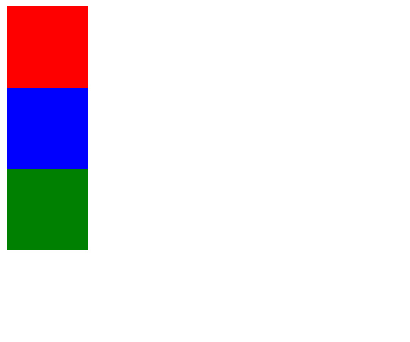
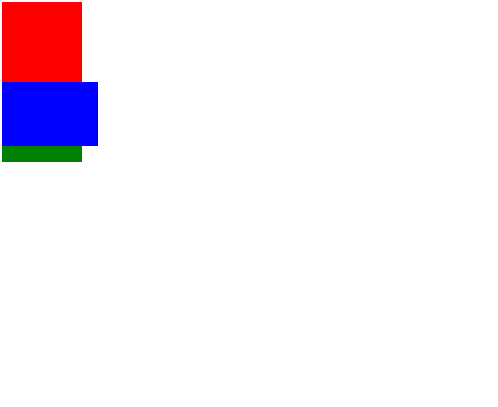
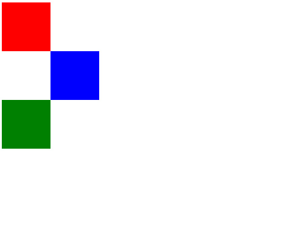
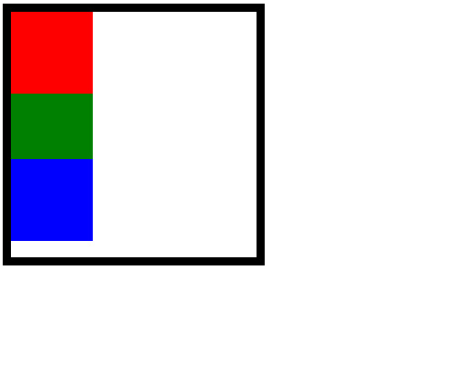
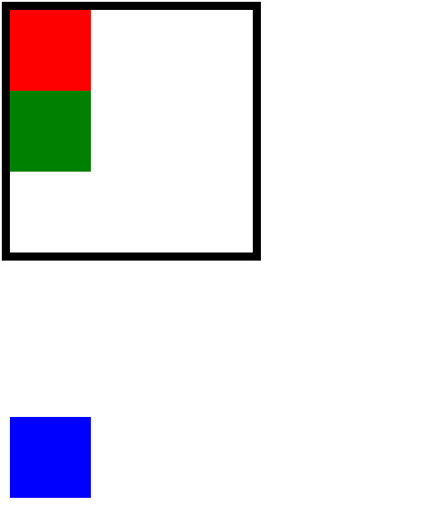

# Position

position 속성은 HTML 요소가 위치를 결정하는 방식을 설정한다.

이 속성에는 총 4가지 값이 존재한다. 각각을 차례대로 알아보자.

## Static

position 속성의 기본값으로 단순히 웹페이지의 흐름에 따라 차례대로 HTML 요소들을 위치시킨다.

position 속성값이 static인 경우 top, left, right, bottom 속성값의 영향을 받지 않는다.

    

세 요소를 모두 static으로 지정했을 때 모습이다.

static은 기본값이기 때문에 따로 속성값을 선언하지 않아도 된다.

명시적으로 선언해도 결과는 같다.

```html
<!DOCTYPE html>
<html lang="ko">
<head>
    <meta charset="UTF-8">
    <title>Position Practice</title>
    <style>
        body {
            height: 100vh;
        }

        div {
            width:100px;
            height:100px;
        }

        .red {
            background-color: red;
            top: 10px;
        }

        .blue {
            background-color: blue;
            position: static;
        }

        .green {
            background-color: green;
        }
    </style>
</head>
<body>
    <div class="red"></div>
    <div class="blue"></div>
    <div class="green"></div>
</body>
</html>
```

## Fixed

말 그대로 HTML 요소를 고정시키기 위해 사용하는 속성값이다.

속성값으로 fixed를 주면 요소가 원래 생성되었던 곳에 고정된다.

이 때 fixed된 요소는 새로운 레이어로 이동하게 되어 다른 요소들의 영향을 받지 않게 된다.

하지만 top, left, right, bottom 속성값을 바꿔서 원래 위치를 변경할 수 있다.

    

파란색 박스가 빨간색 박스 아래 위치에 고정된 걸 볼 수 있다.

여기서 body 요소의 height 값을 엄청 크게 설정하고 스크롤을 아무리 내려도 파란색 박스의 위치는 그대로인 것을 확인할 수 있을 것이다.

그리고 새로운 레이어에 있기 때문에 초록색 박스는 파란색 박스의 영향을 받지 않아 빨간색 박스 바로 밑에 오게 되었고, 

파란색 박스는 초록색 박스를 덮어버린 것이다.

```html
        .blue {
            background-color: blue;
            position: fixed;
            width: 120px;
            height: 80px;
        }

<!--fixed된 걸 좀 더 잘 보기 위해서 파란색 박스의 크기를 수정했다.-->
```

## Relative

HTML 요소가 처음 위치한 곳을 기준으로 주어진 top, left, right, bottom 속성값에 따라 이동시킨다.

    

```html
        .blue {
            background-color: blue;
            position: relative;
            left: 100px;
        }
```

파란색 박스의 원래 위치에서 왼쪽으로 100px 만큼 이동했다.

## Absolute

처음에 가장 이해하기 힘들었던 속성값이다.

position 속성값이 relative인 부모 요소를 기준으로 주어진 top, left, right, bottom 속성값에 따라 이동시킨다.

하지만 속성값이 relative인 부모 요소가 없다면 가장 마지막 부모 요소인 body를 기준으로 이동하게 된다.

    

현재 파란색 박스에 absolute 속성값을 주고 세 박스 요소를 둘러싼 parent 박스에 relative 속성값을 추가한 상태이다.

bottom의 속성값으로 20px을 선언했더니 parent 박스를 기준으로 밑에서 20px 올라온 걸 확인할 수 있다.

속성값을 absolute로 주게 되면 fixed와 마찬가지로 새로운 레이어로 이동하기 때문에 다른 요소들에 영향을 받지 않는다.

위의 예시에서도 초록색 박스를 덮어버린 것을 확인할 수 있다.    

```html
    <style>
...
        .parent {
            width: 300px;
            height: 300px;
            border: 10px solid black;
            position: relative;

        }
...
        .blue {
            background-color: blue;
            position: absolute;
            bottom: 20px;
        }
...
    </style>
</head>
<body>
    <div class="parent">
        <div class="red"></div>
        <div class="blue"></div>
        <div class="green"></div>
    </div>
</body>
```

    

이번에는 부모 요소에 relative 속성값이 추가되지 않아 body를 기준으로 움직이게 된 것이다.

```html
        .parent {
            width: 300px;
            height: 300px;
            border: 10px solid black;

        }

<!-- relative 속성값만 제거해주었다. -->
```
