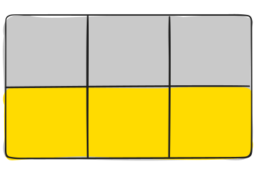
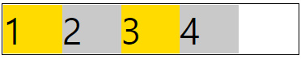
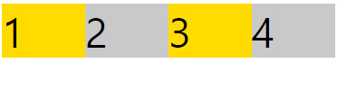
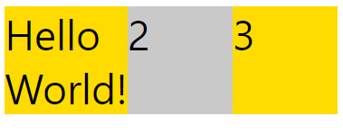
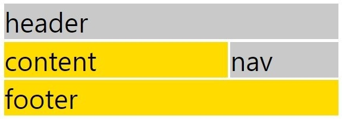
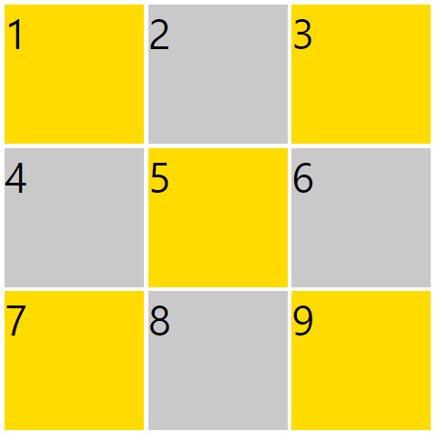
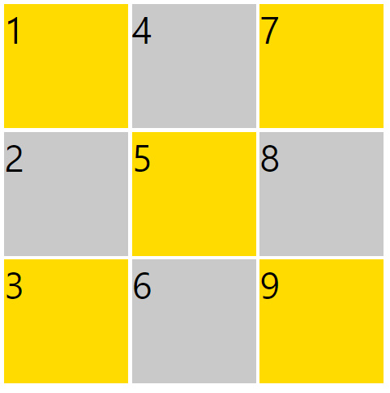
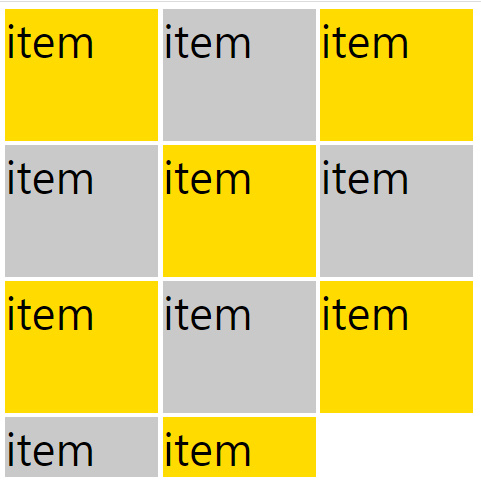
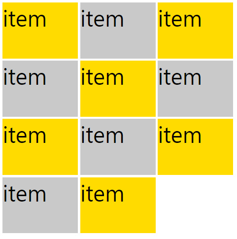

# CSS GRID

## grid란?

CSS grid layout은 flexbox와 마찬가지로 뷰포트나 요소의 크기가 불명확하거나 동적으로 변할 때에도 효율적으로 요소를 배치, 정렬, 분산할 수 있는 방법을 제공하는 CSS의 레이아웃 방식이다.

차이점이 있다면 flexbox는 한 방향 레이아웃 시스템이고, grid는 두 방향 레이아웃 시스템이라는 것이다. 


## grid 구성

### grid container & grid item

grid는 복수의 자식 요소인 grid item과 그 상위 부모 요소인 grid container로 구성된다.

grid는 부모 요소에 display: grid 속성을 선언하는 것을 통해 만들 수 있다.


### grid 라인

그리드를 구성하는 분할 선이다. 수직(열 그리드 라인)과 수평(행 그리드 라인)으로 만들 수 있으며 행 또는 열의 양옆에 위치할 수 있다. 

	

### grid 트랙

두 개의 그리드 라인 사이의 공간으로, 그리드의 열 또는 행으로 볼 수 있다.

	

### grid 셀

두 행과 열의 그리드 라인 사이의 공간이다. 그리드의 구성 단위가 된다. 

	

### grid 영역

네 개의 그리드 라인으로 둘러싸인 공간이다. 몇 개의 그리드 셀로 구성된다. 

	

## grid 속성

grid의 속성은 flexbox와 마찬가지로 container에 적용하는 속성과 item에 적용하는 속성으로 나뉜다.

| grid container        | grid item         |
| --------------------- | ----------------- |
| grid-template-columns | grid-column-start |
| grid-template-rows    | grid-column-end   |
| grid-template-areas   | grid-row-start    |
| grid-template         | grid-row-end      |
| grid-column-gap       | grid-column       |
| grid-row-gap          | grid-row          |
| grid-gap              | grid-area         |
| justify-items         | justify-self      |
| align-items           | align-self        |
| justify-content       | place-self        |
| align-content         |                   |
| place-content         |                   |
| grid-auto-columns     |                   |
| grid-auto-rows        |                   |
| grid-auto-flow        |                   |
| grid                  |                   |


### grid-template-columns / rows

grid 트랙의 크기들을 지정해주는 속성이다.

여러가지 단위를 사용할 수 있고, 섞어서도 사용 가능하다.


grid-template-columns은 column방향, 즉 세로 방향에서 봤을 때의 길이를 설정한다.

따라서 grid-template-columns은 트랙의 너비를 설정한다.

이와 반대로 grid-template-rows는 트랙의 높이를 설정한다.


```css
.container {
	grid-template-columns: 200px 200px 500px;
	}
```

위의 예시는 그리드를 3개의 열로 나누고 그 길이를 각각 200px, 200px, 500px로 나눈다는 의미이다.


### fraction

```css
.container {
	grid-template-columns: 1fr 1fr 1fr;
	}
```

fraction은 조각을 의미한다.

위의 예시는 세로 방향의 길이, 트랙의 너비를 총 3개의 조각으로 나누고, 각각의 비율을 1:1:1로 설정한 것이다.

이 때 grid의 너비가 설정되어 있다면 그 너비를 조각의 숫자대로 나눈다.

너비가 설정되어 있지 않다면 body의 너비를 조각으로 나눈다.

이와 달리 row, 트랙의 높이를 설정하려면 꼭 height를 설정해야 한다.


### auto-fill, auto-fit

auto-fill과 auto-fit은 column의 개수를 미리 정하지 않고 설정된 너비가 허용하는 한 최대한 셀을 채운다.

	

```css
.container {
	grid-template-columns: repeat(auto-fill, minmax(20%, auto));   
}
```

	

```css
.container {
	grid-template-columns: repeat(auto-fit, minmax(20%, auto));   
}
```

둘의 차이점은 그리드 컨테이너가 하나의 트랙에 모든 item을 수용하고 남는 공간이 있을 때 발생한다.

현재 minmax 함수를 통해 너비의 최솟값을 20%으로 설정했기 때문에 row 하나에 5개의 item가 들어올 수 있다.

4개의 item이 들어왔을 때 auto-fill은 남는 공간을 그대로 유지한다.

auto-fit은 남는 공간을 채운다.


### max-content

grid item이 포함하는 내용의 최대 크기를 의미한다.

여기서 최대 크기란 모든 내용이 한 줄로 표현될 수 있는 크기이다.

	

```css
.container {
    display: grid;
	grid-template-columns: max-content 1fr 1fr;
}
```


### min-content

반대로 grid item이 포함하는 내용의 최소 크기를 의미한다.

	

```css
.container {
    display: grid;
	grid-template-columns: min-content 1fr 1fr;
}
```


### repeat()

만약 그리드를 통해 트랙을 나눌 때, 그 수가 100개가 넘어간다면 하나하나 길이를 지정하기는 어려울 것이다.

```css
.container {
	grid-template-columns: repeat(100,100px);
	/* grid-template-columns: 100px 100px 100px...;(총 100개) 와 같은 코드이다. */
	}
	
```

repeat 함수로 간단하게 작성할 수 있다.


### minmax()

최솟값과 최댓값을 지정할 수 있는 함수이다.

```
.container {
	grid-template-columns: repeat(3, 1fr);
	grid-template-rows: repeat(3, minmax(100px, auto));
}
```

minmax(100px, auto)의 의미는 최소한 100px, 최대는 자동으로(auto) 늘어나게.. 이다.

즉 아무리 내용의 양이 적더라도 최소한 높이 100px은 확보하고, 내용이 많아 100px이 넘어가면 알아서 늘어나도록 처리한 것이다.


### grid-column-gap / grid-row-gap

이 속성으로 트랙 사이의 간격을 조정할 수 있다.


### grid-template-areas

각 요소에 이름을 붙이고, 그 이름을 이용해서 배치하는 방법이다.

```css
.container {
    display: grid;
    grid-template-areas:
        "header header header"
        "content content nav"
        "footer footer footer";
    column-gap: 5px;
    row-gap: 5px;
    
}

.header{
    font-size: 50px;
    grid-area: header;
    background-color: #C9C9C9;
}
...
```

각 요소마다 grid-template-areas에서 사용할 이름을 grid-area의 속성값으로 선언해야 한다.

	


### grid-column,

### grid-row-start / end,

### grid-row

grid item에 적용하는 속성으로 각 셀의 영역을 지정한다.

이 때의 속성값은 grid 라인을 기준으로 한다.

```css
.item {
	grid-column-start: 1;
	grid-column-end: 3;
	grid-row: 1/2;
    /* grid-row-start: 1;
       grid-row-end: 2; 와 같다. */
}
```

	


### span

라인값 대신에 span이라는 값을 사용할  수도 있다.

cell을 기준으로 해서 몇 칸을 차지하는지 나타낸다.

```css
.item{
    font-size: 50px;
    background-color: #C9C9C9;
    grid-column: span 2;
    grid-row: span 1;
}
/* 위에 grid-column과 grid-row로 작성한 예시와 같은 결과 */
```


### grid-template

위에서 살펴본 grid-template-columns / rows, areas을 합친 속성이다.

```css
.container {
    display: grid;
    grid-template:
        "header header header" 1fr
        "content content nav" 1fr
        "footer footer footer" 1fr / 1fr 1fr 1fr;
    column-gap: 5px;
    row-gap: 5px;
    
}

.header{
    grid-area:header;
    background-color: #c9c9c9;
}
...
/* grid-template-areas 예시와 같은 결과 */
```

area 뒤에 각각의 row, 트랙의 높이를 설정

마지막 슬래쉬 뒤에다가 column, 트랙의 너비를 설정

grid 템플릿에서는 repeat 함수가 적용되지 않는다.


### justify-items,

### align-items,

### place-items

grid item들을 세로 방향(align-items), 가로 방향(justify-items) 으로 정렬한다.

place-items는 두 방향의 정렬을 한 번에 설정할 수 있고, 작성 순서는 세로, 가로 순이다.


### align-self,

### justify-self,

### place-self

위에서 살펴본 justify-items, ... 속성과 같다.

하지만 뒤에 self를 붙임으로써 grid item 전체가 아닌 속성이 선언된 그 하나의 item만 정렬시킬 수 있다.


### grid-auto-flow

flexbox에서 사용했던 flex-direction 속성과 같다.

grid item들이 자동 배치되는 흐름을 결정하는 속성이다.

	

grid-auto-flow의 속성값이 row일 때의 모습

row는 기본값으로 명시적으로 선언하지 않아도 된다.

	

grid-auto-flow의 속성값이 column일 때의 모습


### grid-auto-rows / columns

grid-template-rows의 통제를 벗어난 위치에 있는 트랙의 크기를 지정하는 속성

```css
.container {
	...
    grid-template-columns: repeat(3, 1fr);
    grid-template-rows: repeat(3, 1fr);
    }
```

	

grid-auto-row 속성이 선언되지 않은 상태이다.

통제를 벗어난 grid item들은 설정된 크기가 없기 때문에 item안의 내용만큼의 크기를 갖는다.

```css
.container {
	...
    grid-template-columns: repeat(3, 1fr);
    grid-template-rows: repeat(3, 1fr);
    grid-auto-rows: 1fr;
    }
```

	

grid-auto-rows의 값을 1fr로 선언했다.

통제를 벗어난 요소들이 있다면 그 크기를 1fr로 하라는 의미이다.


grid-auto-columns을 사용하고 싶다면 먼저 grid-auto-flow의 속성값을 column으로 선언해야 한다.


# :books:참고자료

https://studiomeal.com/archives/533

https://webactually.com/2019/06/05/%ea%b7%b8%eb%a6%ac%eb%93%9c-%ec%99%84%eb%b2%bd-%ea%b0%80%ec%9d%b4%eb%93%9c/#a2

노마드코더 CSS MasterClass 수업 내용