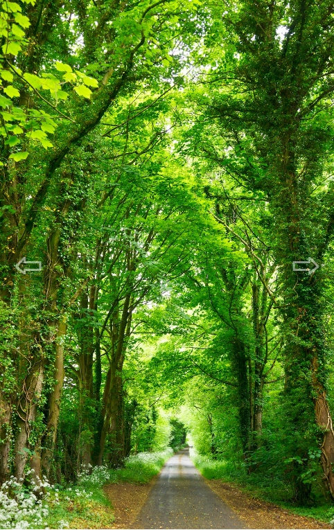

# CSS

## inset & object-fit

[How To Create An Animated Image Carousel With CSS/JavaScript](https://www.youtube.com/watch?v=9HcxHDS2w1s)

이번에 **Web Dev Simplified**의 위 강의를 참고해서 **Carousel**을 만들었다. 만들면서 유용하다고 생각이 든 CSS 속성들을 정리해보고자 한다. 

### inset

`inset`은 `top,right,bottom,left` 속성을 모두 포함하는 속성이다. `margin` 속성과 같이 다중값 구문을 가지고 있다. 

```css
inset: 1em;

/* 아래와 동일 */

top: 1em;
right: 1em;
bottom: 1em;
left: 1em;
```

위 강의에서는 사진 요소의 크기가 화면 전체에 딱 맞추기 위해 `inset` 속성을 사용했다. 전체 과정은 아래와 같다.

- **전체 컨테이닝 블록(body와 같은 역할)**에 `width: 100vw; height: 100vh;`을 정의
- **전체 컨테이닝 블록**에 `position: relative;`을 정의
- **사진 요소 컨테이닝 블록**에 `position: absolute;`을 정의
- **사진 요소 컨테이닝 블록**에 `inset: 0`을 정의
- **사진 요소**에 `width: 100%; height: 100%;`을 정의

각 과정을 좀 더 풀어서 설명해보면, 먼저 **전체 컨테이닝 블록**이 화면 전체 크기를 갖도록 설정한다. 그리고 **전체 컨테이닝 블록**의 `position`의 값을 `relative`로 정의한다. `relative`가 적용된 **전체 컨테이닝 블록**을 기준으로 위치를 지정하기 위해 **사진 요소의 컨테이닝 블록**의 `position`의 값을 `absolute`로 정의한다.

그 다음에 `inset`의 값을 0으로 설정하게 되면 **사진 요소 컨테이닝 블록**의 크기는 **전체 컨테이닝 블록**의 네 방향으로부터 0의 거리를 가지는 위치에 놓여진다. 그런데 **전체 컨테이닝 블록**의 크기는 화면 전체의 크기와 같다. 따라서 네 방향으로부터 0의 거리를 가진다는 건 화면 전체의 크기를 갖는 것과 동일하다. 

마지막으로 **사진 요소**에 `width: 100%; height: 100%;`을 정의하면 **사진 요소**는 **부모 요소**인 **사진 요소 컨테이닝 블록**과 동일한 크기를 가지므로 **사진 요소**은 화면 전체에 맞는 크기를 갖게 된다.

___

이렇게 하면 화면 크기가 변할 경우에 원본 비율이 보장되지 않는다는 단점이 있다. 이를 방지하기 위해 `object-fit` 속성을 사용해주자.

### object-fit

`object-fit` 속성은 사진이나 비디오 요소가 이를 포함한 컨테이너에 맞게 크기가 어떻게 조정되어야 하는지를 설정한다.

#### cover

`object-fit`에 `cover` 값을 설정하면 사진이나 비디오 요소의 가로, 세로 원본 비율을 유지하도록 크기를 조정한다. 이 때 가로, 세로 원본 비율을 유지한 해당 요소의 크기가 컨테이너의 크기와 일치하지 않으면 해당 요소는 원본 비율을 유지한 상태로 컨테이너에 맞게 잘리게 된다. `cover` 값이 적용된 아래 예시를 확인해보자.

 

.png)

보다시피 사진 요소가 전체 화면의 크기를 갖는 건 변하지 않는다. 다만 사진의 원본 비율을 지켜야 하기 때문에 화면의 크기에 따라 사진이 일부 잘리는 걸 확인할 수 있다. 

___

## 마무리

그동안 사진 요소의 크기를 특정 컨테이너에 맞추기 위해서 `<div />`의 `background-image`속성을 사용했었다. 그래서 위와 같은 방법으로 사진 요소의 크기를 맞추는 걸 보고 조금 번잡스럽다고 생각을 했다.

하지만 기존 방법에는 두 가지 문제점이 있다.

- 시멘틱 마크업이 아님
- 사진 요소의 접근성 하락

먼저 `` 태그를 사용하지 않는다는 점에서 시멘틱 마크업이 아니다. 또한 `<div />`에는 사진 요소에 대한 설명을 정의할 수 있는 `alt` 속성이 없기 때문에 사용자의 접근성이 하락한다.

아직 내 역량이 부족한 탓에 개발할 때 이런 부분에서 큰 차이를 느끼지는 못한다. 하지만 사용자를 배려한다면 이런 세세한 부분까지 신경쓰는 것이 개발자로서 수행해야 할 역할이라고는 생각한다. 

# :books:참고자료

https://www.youtube.com/watch?v=9HcxHDS2w1s