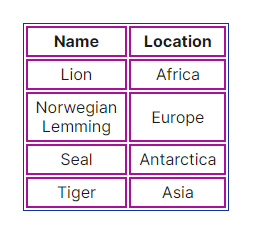
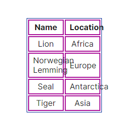

# CSS

회사에서 피그마 디자인에 맞는 표를 만들다보니 크기가 완전히 고정된 표를 만들어야 했다. 그래서 `table-layout` 속성을 `fixed`로 정의해서 표를 만들었는데, 해당 속성에 대해 제대로 알지 못한 상태로 사용한 것 같아 좀 더 자세히 알아보고자 한다.

## table-layout

`table-layout` 속성은 표의 셀, 행(row), 열(column)을 배치하기 위한 알고리즘을 설정한다.

### auto

`table-layout` 속성의 기본값으로 표와 셀의 너비는 콘텐츠에 맞춰 조정된다.

```
table-layout: auto;
width: 150px;
```

	

실제 너비는 `CSS`로 정의된 `150px`과 달리 `204.859px`로 콘텐츠에 맞춰서 너비가 정해진 걸 알 수 있다.

### fixed

표와 열 너비는 `<table>`태그와  `<col>` 태그 너비 또는 첫 번째 행 셀 너비에 의해 설정된다. 후속 행의 셀은 열 너비에 영향을 주지 않는다.

`fixed` 값이 설정된 상태에서는, 표의 첫 번째 행이 다운로드되고 분석되자마자 표 전체가 바로 렌더링된다. 따라서 `fixed` 상태에서는 `table-layout` 의 값을 `auto`으로 설정하는 것보다 렌더링 시간이 더 빠르다. 하지만 콘텐츠에 상관없이 후속 셀들이 정해진 열의 너비에 맞지 않는 경우가 발생할 수도 있다. 

```
table-layout: fixed;
width: 150px;
```

	

`CSS`에 정의된 값대로 표의 너비가 `150px`로 고정되어 콘텐츠가 밖으로 벗어난 걸 확인할 수 있다.

### 🚀Further Study - `fixed` 상태에서 너비가 결정되는 과정

위에서도 말했지만 `fixed`인 상태에서 표와 열의 너비는 총 3가지 값에 의해 결정된다.

1. `<table>`태그의 너비
2. `<col>`태그의 너비
3. 첫 번째 행 셀의 너비

#### `<table>`태그의 너비

위의 예시는 `<table>`태그의 너비가 `150px`로 설정되어 각 열의 너비는 자동으로 표의 너비를 열의 개수로 나눈 값이 된다. 따라서 각 열의 너비는 `75px`이 된다. `<table>`태그의 너비가 결정되어 있지 않다면 `table-layout`의 값은 여전히 `auto`인 상태라는 걸 주의하자.

#### `<col>`태그의 너비

만약 너비가 결정된 `<col>`태그가 있다면, 해당 `<col>`태그를 제외하고 설정된 `<table>`태그의 너비를 남은 열에 동일하게 나눈다. 그러니까 만약 첫 번째 열의 너비가 `100px`이라면 두번째 열의 너비는 `50px`이 되는 것이다.

아래 예시는 `<col>` 태그를 사용하는 방법이다.

```html
<table>
    <colgroup>
        <col>
        <col>
    </colgroup>
...
</table>
```

#### 첫 번째 행 셀의 너비

일반적으로 첫 번째의 행의 셀은  `th`이며 `col`의 너비와 적용되는 과정이 같다.

# :books:참고자료

https://developer.mozilla.org/en-US/docs/Web/CSS/table-layout

https://css-tricks.com/almanac/properties/t/table-layout/