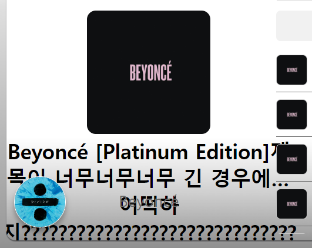
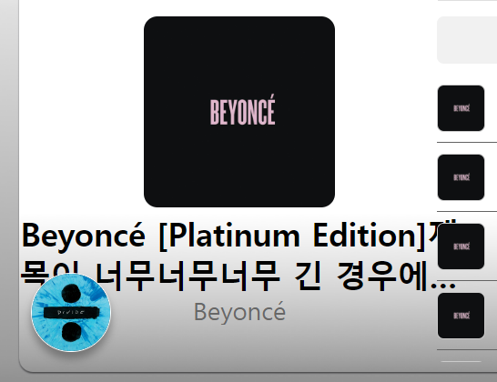

# CSS

## 긴 텍스트 처리하기

텍스트가 요소의 크기를 벗어날 정도로 긴 경우 요소의 크기를 벗어나지 않는 선에서 말줄임표와 함께 노출되도록 처리할 필요가 있다. 실제로 개발을 하다보면 이런 경우가 꽤 많아 회사에서는 SCSS의 기능 중 mixin을 활용해 미리 정의해두었다.

```css
@mixin ellipsis() {
 text-overflow: ellipsis;
 overflow: hidden;
 white-space:nowrap;
}
```

가장 기본적인 형태의 말줄임 처리 mixin이다.

### text-overflow

text-overflow 속성은 숨겨진 overflow 콘텐츠가 사용자들에게 어떻게 표시될지를 정의하는 속성이다.

그러니까 결국 text-overflow 속성을 사용하기 위해서는 overflow가 일어나야 하며 overflow의 속성이 hidden이어야 한다는 의미이다.

그래서 text-overflow 밑에 overflow 속성을 추가로 정의한 것이다. 그렇다면 overflow는 언제 일어나는 것일까?

#### overflow

overflow 속성은 두 가지 경우에만 효력을 갖는다.

- 블록 레벨 컨테이너의 높이가 설정되어 있는 경우
- white-space 속성의 값이 nowrap인 경우

white-space 속성을 추가한 이유는 컨테이너에 높이가 설정되어 있지 않은 경우를 대비하기 위해서이다.

___

> The `text-overflow` property only affects content that is overflowing a block container element in its *inline* progression direction (not text overflowing at the bottom of a box, for example)

추가적으로 알아둬야 할 것은 text-overflow 속성은 인라인 진행 방향으로 overflow된 콘텐츠에만 적용된다는 점이다. 예를 들자면 아래로 overflow된 텍스트에 대해서는 말줄임표가 일어나지 않는다.

___

```css
@mixin line-ellipsis($line-cnt) {
  overflow: hidden;
  display: -webkit-box;
  -webkit-line-clamp: $line-cnt; /* 라인수 */
  -webkit-box-orient: vertical;
}
```

회사에서 추가적으로 사용하는 mixin으로 줄 수가 정해져 있는 경우에 사용한다. 가령 다음과 같은 요구사항에서 사용한다.

> 두 줄 까지는 텍스트를 표시하고 두 줄이 넘어갈 경우에 말줄임표를 적용

### -webkit-line-clamp

-webkit-line-clamp 속성은 블록 컨테이너의 콘텐츠를 지정한 줄 수로 제한하는 속성이다. -webkit-line-clamp 속성은 아래와 같은 경우에만 동작한다.

- display 속성이 -webkit-box 혹은 -webkit-inline-box인 경우
- -webkit-box-orient 속성이 vertical인 경우

추가적으로 -webkit-line-clamp만 사용하는 경우, 말줄임표는 노출되나 넘친 콘텐츠가 숨겨지지 않으므로 overflow 속성 또한 hidden으로 설정해야 한다.

#### hidden 설정하지 않은 경우

	

#### hidden 설정한 경우

	

# :books:참고자료

https://developer.mozilla.org/en-US/docs/Web/CSS/text-overflow

https://developer.mozilla.org/ko/docs/Web/CSS/overflow

https://developer.mozilla.org/ko/docs/Web/CSS/white-space

https://wit.nts-corp.com/2017/07/25/4675

https://developer.mozilla.org/ko/docs/Web/CSS/-webkit-line-clamp
