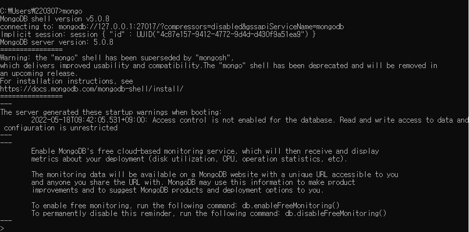
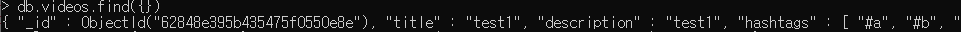

# MongoDB

## 기초

MongoDB는 document 지향 데이터베이스이다. NoSQL 데이터베이스의 일종으로, MongoDB는 JSON과 유사한 document를 사용하고 스키마를 선택적으로 적용한다. 

이전에 사용해본 RDBMS인 Oracle은 **계획**을 중시한다면 MongoDB와 같은 NoSQL은 **변화**에 초점을 맞췄다고 할 수 있겠다.

###  설치

> https://www.mongodb.com/try/download/community
>
> https://www.mongodb.com/try/download/shell

위의 링크에서 MongoDB Community Server와 MongoDB shell을 다운받아주면 된다. MongoDB Community Server가 데이터베이스 그 자체라면, 데이터베이스에게 CLI 환경에서 명령을 내리기 위해 필요한 것이 MongoDB shell이다.

MongoDB shell을 다운받았으면, 시스템 환경 변수에 등록해야만 명령 프롬프트에서 사용이 가능하므로 참고해두자.

	

이제 명령 프롬프트에서 mongo라는 명령어를 입력했을 때 다음과 같은 메시지가 뜬다면 MongoDB, MongoDB shell이 정상적으로 설치된 것이다. 그러면 서버와 데이터베이스를 연결해야 하는데, 서버는 Node.js+express 의 형태로 만들어졌음을 미리 밝힌다.

### mongoose

mongoose는 쉽게 말하면 MongoDB와 서버를 연결해주는 통로 역할을 한다.

#### 설치

```
npm install mongoose
```

#### 연결하기

```javascript
// database.js
import mongoose from 'mongoose'

mongoose.connect('mongodb://127.0.0.1:27017/my-youtube')

const db = mongoose.connection

db.on('error', (error) => console.log('DB Error', error))
db.once('open', () => {
  console.log('Connected to DB')
})
```

1. connect 메서드에 mongodb가 실행되고 있는 url을 인수로 넘겨준다.
2. db 변수에다가 connection 객체를 할당한다.
3. connection의 on 메서드를 통해 에러가 발생할 때마다 'DB Error'를 콘솔에 출력한다.
4. connection의 once 메서드를 통해 서버가 최초에 DB와 연결되었을 때 한 번만 'Connected to DB'라는 메시지를 콘솔에 출력한다.

콘솔창에서 'Connected to DB' 메시지를 확인할 수 있다면 서버와 DB가 연결된 것이다.

### CRUD 작업

데이터베이스의 핵심은 CRUD 작업이다. mongoose로 CRUD 작업을 진행하기 위해서는 schema, model이 필요하다.

#### schema와 model

> Everything in Mongoose starts with a Schema. Each schema maps to a MongoDB collection and defines the shape of the documents within that collection.

mongoose의 모든 것은 스키마로부터 시작되며, 각 스키마는 MongoDB의 Collection과 매핑되어 그 안에 저장되는 document 형태의 데이터의 구조를 정의한다.

```js
import mongoose from 'mongoose'

const videoSchema = new mongoose.Schema({
  title: { type: String },
  description: { type: String },
  createdAt: { type: Date, default: Date.now },
  hashtags: [{ type: String }],
  meta: {
    views: { type: Number, default: 0 },
  },
})

const VideoModel = mongoose.model('Video', videoSchema)
export default VideoModel
```

위 코드는 videoSchema와 이를 사용하는 videoModel을 정의한 코드이다. 스키마를 보면 제목, 내용, 생성날짜 등 다양한 속성들이 적혀 있는데, MongoDB에 저장될 video 데이터는 videoSchema와 같은 형태를 하고 있어야 한다.

> An instance of a model is called a [document](https://mongoosejs.com/docs/documents.html).
>
> Models are responsible for creating and reading documents from the underlying MongoDB database.

schema가 구조를 정의했다면, 그 구조를 따른 document를 실제로 만드는 것이 바로 model이다. 다시 말하면 model의 인스턴스가 MongoDB에 저장되는 데이터인 document이다. 두 가지가 모두 정의되었다면, 데이터베이스에 쿼리를 보낼 준비가 모두 끝난 것이다.

### 예시

간단하게 create query 예시만 확인해보도록 하자.

```js
const postUploadVideo = async (req, res) => {
  const { title, description, hashtags } = req.body
  try {
    await VideoModel.create({
      title,
      description,
      hashtags: formatHashtags(hashtags),
    })
...
```

서버에 대한 자세한 설명이 없기 때문에 이해가 좀 힘들 수도 있지만, 사용자가 보낸 비디오 관련 데이터가 req.body에 담겨있다고만 이해하면 된다. 그  정보들은 videoModel의 create 메서드의 인수로 사용된다. 이렇게 생성된 document는 document의 집합인 collection에 저장된다.

	

위와 같이 videos 라는 collection에 생성된 video document가 정상적으로 저장된 것을 확인할 수 있다. 확실하지는 않지만 아무런 collection이 없는 상황에서 create query를 보냈을 때, videos라는 collection이 자동으로 생성되는 것을 보아 model의 이름에 s를 붙여 collection을 자동으로 생성하는 것 같다.

# :books:참고자료

https://mongoosejs.com/docs/guide.html

https://www.mongodb.com/docs/

노마드코더 강의 내용 정리