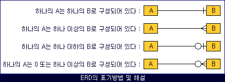
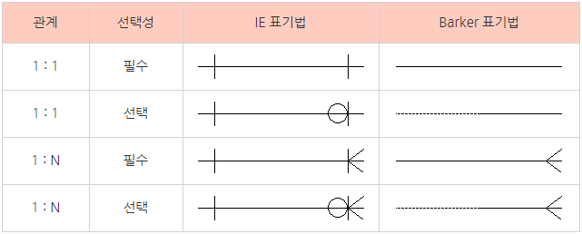

# Tip

- ## Sum 함수 null 연산

sum함수는 동일한 칼럼 내의 null 연산은 처리가능하다.

가령 a 칼럼의 row가 1, null, 1로 구성되어있다면 sum(a)의 값은 2이다. 

하지만 다른 칼럼끼리의 연산에서는 null을 처리하지 못한다. 

- ## Subquery Order by 사용 불가

- ## Grant Role

role은 데이터베이스에서 권한을 묶어서 권한을 관리할 수 있다.

- ## Create, Truncate같은 DDL은 묵시적으로 commit을 실행(oracle)

- ## ERD

  	

`

- ## Count 집계 함수

조건절이 거짓일 경우 0을 반환한다.

count(숫자)인 경우 전체 행 반환, 어떤 숫자라도 전체 행을 반환한다.

null 값도 포함해서 카운트

- ## ROWNUM

rownum은 논리적인 숫자이기 때문에 where rownum=2와 같이 조회할 수 없다.

위와 같이 조회하고 싶다면 inline view를 이용해야 한다.

- ## 연산자 우선순위

1. 산술 연산자(*,-,+,/)
2. 연결 연산자(||)
3. 비교 연산자(<,>,<=,=>,<>,=)
4. IS NULL, LIKE, IN
5. BETWEEN
6. NOT 연산자
7. AND 연산자
8. OR 연산자

- ## 순수 관계 연산자

select, join, divide

- ## LIKE ESCAPE

https://mine-it-record.tistory.com/101

- ## NULLS LAST / NULL 값을 마지막으로 정렬

- ## 도메인

속성이 가질 수 있는 값의 범위

- ## NVL, NVL2, COALESCE, NULLIF

NULL이면 다른 값으로 변경, NVL(SAL, 0) => SAL 칼럼이 NULL이면 0으로 변경

NVL 함수와 DECODE 함수 결합, NVL2(MGR, 1, 0) => MGR 칼럼이 NULL이면 1을, 아니면 0을 반환

NULL이 아닌 최초의 인자 값을 반환

두 개의 값이 같으면 NULL을 아니면 첫 번째 값 반환

- ## 계층형 쿼리문에서 ORDER SIBLINGS BY는 특정 칼럼 기준으로 정렬가능하다.

- ## CHAR, VARCHAR

char는 같은 값에서 길이만 다른 경우 짧은 쪽에 스페이스바를 추가해 같은 값으로 판단

varchar은 같은 값에서 길이가 다를 경우 다른 값으로 판단

- ## 성능 데이터 모델링 고려사항

1.  정규화를 수행하여 데이터베이스 모델의 유연성 확보
2. 데이터베이스의 전체 용량, 월간, 연간 증감율을 예측
3. 애플리케이션의 트랜잭션 유형을 파악
4. 합계 및 정산 등을 수행하는 반정규화를 수행
5. 기본키와 왜래키, 수퍼타입과 서브타입 등을 조정
6. 성능관점에서 데이터 모델을 검증하고 확인

- ## 인덱스

데이터 타입 상관없이 생성 가능

파티션 인덱스의 경우 파티션 키에 대해서 인덱스를 생성 가능, 이를 글로벌 인덱스라고 한다.

- ## SAVEPOINT 중복

SAVEPOINT가 중복될 경우 중복된 SAVEPOINT 중에 맨 뒤에 있는 SAVEPOINT 지점으로 되돌아간다.

- ## NOT IN의 함정

hobby가 null 또는 '낚시' 모두에 속하지 않는 경우를 not in을 이용하여 표현하면 다음과 같다.

hobby not in(낚시, null)

hobby가 낚시가 아니고, null이 아닌 row들이 선택될 것이라 기대하지만, 결과는 아무 row도 선택되지 않는다.

위 query를 where문으로 풀어보면 다음과 같다.

where hobby <> null

and hobby <> '낚시'

즉, null은 비교될 때 is null 이나 is not null로 비교되어야 하므로 hobby <> null 은 항상 false를 반환하게된다.

따라서 and 조건문에 의해 아무 row도 선택되지 않는 것이다.

출처: https://wjheo.tistory.com/entry/IN과-NOT-IN의-함정 [우공공]

- ## 카디널리티

#### 카디널리티(cardinality)란?

중복도가 ‘낮으면’ 카디널리티가 ‘높다’고 표현한다.

중복도가 ‘높으면’ 카디널리티가 ‘낮다’고 표현한다.

카디널리티는 전체 행에 대한 특정 컬럼의 중복 수치를 나타내는 지표이다.

#### 셀 수 있는 카디널리티와 셀 수 없는 카디널리티

셀 수 있는 카디널리티로는 아래와 같은 것들이 있다.

성별 -> 남,여 이므로 카디널리티가 2이다. 요일 -> 요일에 들어갈 수 있는 값은 월,화,수,목,금,토,일 = 즉 카디널리티는 7이다.

#### 셀 수 없는 카디널리티

셀 수 없는 카디널리티는 엄밀히 말하면 세기 어려운이 맞을거 같다. 대표적인 것이 주민등록번호 일것이다. 주민등록번호는 유니크하므로 현재 행을 count한 값이 카디널리티 값이 될것이다.

데이터가 추가됨에 따라 카디널리티가 늘어나므로 해당 컬럼에 카디널리티가 뭐다라고 단언하기 어렵다. (현재 시점에서의 카디널리티는 구할 수 있긴하다.)

#### 카디널리티는 상대적인 개념

당연한 얘기지만 카디널리티가 높다/낮다는 비교대상이 존재하고 그 대상에 비해 높다/낮다라고 말할 수 있으므로 상대적이다.

요일은 7이므로 2인 성별보다 카디널리티가 높다고 말할 수 있지만 셀 수 없는 개념은 주민등록번호 보다는 카디널리티가 낮다고 말할 수 있다.

#### 결론

카디널리티가 높다 -> 인덱싱에 적합함 카디널리티가 낮다 -> 인덱싱에 부적합함.

- ## Row Chaining

하나의 Row를 하나의 블록에 저장할 수 없어서 여러 블록에 걸쳐서 저장하는 현상

블록의 크기를 크게 만드는 것으로 해결할 수 있다. 

- ## 데이터 무결성 보장

1. 애플리케이션

무결성을 보장하는 애플리케이션을 만들어서 사용

2. Trigger

insert, update 등이 발생하면 trigger가 작동하고 그 트리거 안에 무결성을 보장하는 코드를 넣을 수 있다. 

3. 제약조건

Constraint 추가 / 외래키 등

- ## Lock

공유자원에 대해 여러개의 트랜잭션이 접근하려고 경쟁하려고 할때 제어하는 방법

동시성제어(Concurrency Control)이라고 하고 보통 lock 으로 해결

프로그래밍에서 동기화라고도 함.

일관성과 무결성을 지키기위해 적용

- ## Grouping sets

grouping sets(칼럼, ())

이런 식으로 빈 칼럼을 함께 추가하면 전체 합계가 추가된다.