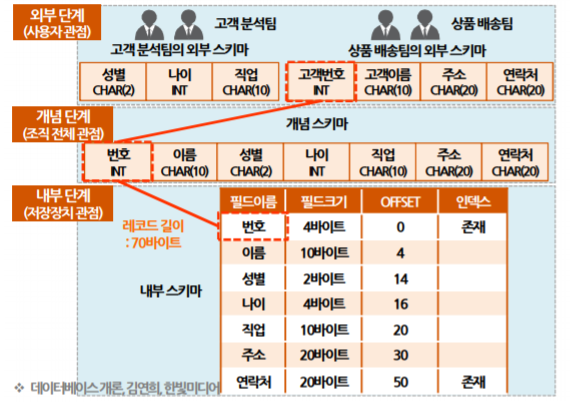
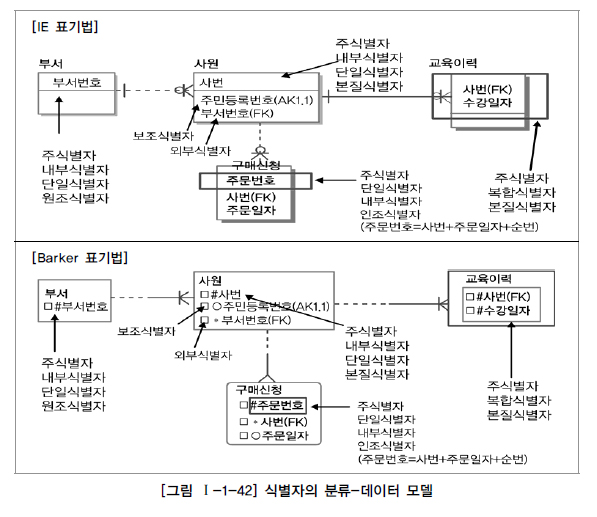

# 데이터 모델링

# 1. 데이터 모델링의 이해

# 1-1. 데이터 모델링의 특징

| 특징   | 설명                                                        |
| ------ | ----------------------------------------------------------- |
| 추상화 | 현실세계를 간략하게 표현한다.                               |
| 단순화 | 누구나 쉽게 이해할 수 있도록 표현한다.                      |
| 명확성 | 명확하게 의미가 해석되어야 하고 한 가지 의미를 가져야 한다. |

# 1-2. 데이터 모델링 단계

## (1) 개념적 모델링

- 고객의 비즈니스 프로세스를 분석하고 업무 전체에 대해서 데이터 모델링을 수행한다.
- 복잡하게 표현하지 않고 중요한 부분을 위주로 모델링하는 단계이다.
- 업무적 관점에서 모델링하며 기술적인 용어는 가급적 사용하지 않는다.
- 엔티티와 속성을 도출하고 개념적 ERD를 작성한다.

## (2) 논리적 모델링

- 개념적 모델링을 논리적 모델링으로 변환하는 작업이다.
- 식별자를 도출하고 필요한 모든 릴레이션을 정의한다.
- 정규화를 수행해서 데이터 모델의 독립성을 확보한다.

## (3) 물리적 모델링

- 데이터베이스를 실제로 구축하는 단계

| 관점              | 설명                                                         |
| ----------------- | ------------------------------------------------------------ |
| 데이터            | 비즈니스 프로세스에서 사용되는 데이터를 의미 구조 분석, 정적 분석 어떤 데이터와 관계있는지, 데이터간의 관계는 무엇인지에 대해서 모델링하는 방법 |
| 프로세스          | 비즈니스 프로세스에서 수행하는 작업을 의미 시나리오 분석, 도메인 분석, 동적 분석 해당 데이터를 가지고 무엇을 해야하는지를 모델링하는 방법 |
| 데이터와 프로세스 | 프로세스와 데이터 간의 관계를 의미 CRUD 분석 데이터를 활용하는 작업에 따라 데이터가 어떻게 영향을 받고 있는지를 모델링하는 방법 |

# 1-3. 데이터 모델링을 위한 ERD

- 1976년 피터첸이 Entity Relationship Model 표기법을 만들었으며, 사실상 데이터 모델링의 표준으로 사용되고 있다.
- 엔티티와 엔티티 간의 관계를 정의하는 모델링 방법이다.

- ERD 작성 순서는 다음과 같다.

1. 엔티티를 도출하고 그린다.

2. 엔티티를 배치한다.

3. 엔티티 간의 관계를 설정한다.

4. 관계명을 서술한다.

5. 관계 참여도를 표현한다.

6. 관계의 필수 여부를 표현한다.

- 중요한 엔티티를 가급적 왼쪽 상단에 배치, 이해가 쉬워야 하고 너무 복잡하지 않아야 한다.

# 1-4. 데이터 모델링 고려사항

## (1) 데이터 모델의 독립성

- 독립성이 확보된 모델은 고객의 업무 변화에 능동적으로 대응할 수 있다.
- 독립성을 확보하기 위해서는 중복된 데이터를 제거해야 한다.
- 데이터 중복을 제거하는 방법이 바로 정규화이다.

## (2) 고객 요구사항의 표현

- 데이터 모델링으로 고객과 데이터 모델러 간의 의사소통을 할 수 있어야 하므로, 고객의 요구사항을 간결하고 명확하게 표현

## (3) 데이터 품질 확보

- 데이터베이스 구축 시에 데이터 표준을 정의하고 표준 준수율을 관리해야 한다.
- 데이터 표준을 확보해야 데이터 품질을 향상시킬 수 있다.

# 2. 3층 스키마

# 2-1. 3층 스키마

시험 전용 용어들이며 현업에서는 잘 사용하지 않는다.

- 사용자, 설계자, 개발자가 데이터베이스를 보는 관점에 따라 데이터베이스를 기술하고 이들 간의 관계를 정의한 ANSI 표준이다.
- 3층 스키마는 데이터베이스의 독립성을 확보하기 위한 방법이다.
- 데이터의 독립성을 확보하면 데이터 복잡성 감소, 데이터 중복 제거, 사용자 요구사항 대응력 향상, 관리 및 유지보수 비용 절감 등의 장점을 갖는다.
- 3단계 계층으로 분리해서 독립성을 확보하는 방법으로 각 계층을 뷰라고 한다.

## > 3층 스키마의 독립성

| 독립성        | 설명                                                         |      |
| ------------- | ------------------------------------------------------------ | ---- |
| 논리적 독립성 | 개념 스키마가 변경되더라도 외부 스키마가 영향을 받지 않는 것이다. |      |
| 물리적 독립성 | 내부 스키마가 변경되더라도 개념 스키마가 영향을 받지 않는 것이다. |      |

# 2-2. 3층 스키마 구조

| 구조        | 설명                                                         |      |
| ----------- | ------------------------------------------------------------ | ---- |
| 외부 스키마 | 사용자 관점, 업무상 관련이 있는 데이터 접근이다. 관련 데이터베이스의 뷰를 표시한다. 응용 프로그램이 접근하는 데이터베이스를 정의한다. 데이터베이스 하나에 여러 개의 외부 스키마 존재 가능 |      |
| 개념 스키마 | 설계자 관점, 사용자 전체 집단의 데이터베이스 구조이다. 전체 데이터베이스 내의 규칙과 구조를 표현한다. 통합 데이터베이스 구조이다. 데이터베이스 하나에 단 하나의 개념 스키마 존재 |      |
| 내부 스키마 | 개발자 관점, 데이터베이스의 물리적 저장 구조이다. 데이터 저장 구조, 레코드 구조, 필드 정의, 인덱스 등을 의미한다. 데이터베이스 하나에 단 하나의 내부 스키마 존재 |      |

# 3. 엔터티

# 3-1. 엔터티

- 엔터티는 업무에서 관리해야 하는 데이터 집합을 의미하며, 저장되고 관리되어야 하는 데이터이다.
- 엔터티는 개념, 사건, 장소 등의 명사이다.

# 3-2. 엔터티 도출

- 엔터티는 고객의 비즈니스 프로세스에서 관리되어야 하는 정보로부터 추출되어야 한다.

ex) 

고객 엔터티

회원ID, 패스워드, 이름, 주소, 전화번호

계좌 엔터티

계좌번호, 계좌명, 예수금, 계좌개설 지점, 계좌담당자

# 3-3. 엔터티 특징

| 엔터티 특징   | 설명                                                         |
| ------------- | ------------------------------------------------------------ |
| 식별자        | 엔터티는 유일한 식별자가 있어야 한다.                        |
| 인스턴스 집합 | 2개 이상의 인스턴스가 있어야 한다. 즉, 고객 정보는 2명 이상 있어야 한다. |
| 속성          | 엔터티는 반드시 속성을 가지고 있다.                          |
| 관계          | 엔터티는 다른 엔터티와 최소한 한 개 이상 관계가 있어야 한다. |
| 업무          | 엔터티는 업무에서 관리되어야 하는 집합이다.                  |

## :bulb:Tip! 릴레이션과 테이블, 인스턴스

- 릴레이션이 테이블보다 큰 개념으로, 릴레이션에 기본키 및 제약조건을 설정하면 테이블이 된다.
- 단 relationship은 릴레이션 간의 관계를 의미한다.
- 인스턴스는 릴레이션이 가질 수 있는 값을 의미하는데, 간단히 행이라고 생각하면 된다.

# 3-4. 엔터티 종류

- 엔터티의 종류는 유형과 무형에 따른 종류, 엔터티가 발생하는 시점에 따른 종류로 나누어진다.
- 엔터티를 유형과 무형으로 분류하는 기준은 물리적 형태의 존재 여부이다.

## > 유형과 무형에 따른 엔터티 종류

| 종류        | 설명                                                         |      |
| ----------- | ------------------------------------------------------------ | ---- |
| 유형 엔터티 | 업무에서 도출되며 지속적으로 사용되는 엔터티이다. ex) 고객, 강사, 사원 등 |      |
| 개념 엔터티 | 유형 엔터티는 물리적 형태가 있지만, 개념 엔터티는 물리적 형태가 없다. ex) 코스닥 종목, 생명보험 상품 |      |
| 사건 엔터티 | 비즈니스 프로세스를 실행하면서 생성되는 엔터티이다. ex) 주문, 체결, 취소주문, 수수료 청구 |      |

## > 발생 시점에 따른 엔터티 종류

| 종류        | 설명                                                         |      |
| ----------- | ------------------------------------------------------------ | ---- |
| 기본 엔터티 | 키 엔터티라고도 한다. 다른 엔터티로부터 영향을 받지 않고 독립적으로 생성되는 엔터티이다. ex) 고객, 상품, 부서 등 |      |
| 중심 엔터티 | 기본 엔터티와 함께 엔터티 간의 중간에 있는 것이다. 즉, 기본 엔터티로부터 발생되고 행위 엔터티를 생성하는 것이다. ex) 계좌, 주문, 취소, 체결 등 |      |
| 행위 엔터티 | 2개 이상의 엔터티로부터 발생된다. ex) 주문 이력, 체결 이력 등 |      |

# 4. 속성

# 4-1. 속성

- 속성이라는 것은 업무에서 필요한 정보인 엔터티가 가지는 항목
- 속성은 더 이상 분리되지 않는 단위로 업무에 필요한 데이터를 저장할 수 있다.
- 인스턴스의 구성요소이고 의미적으로 더 이상 분해되지 않는다.

# 4-2. 속성의 특징과 종류

## (1) 속성의 특징

- 속성은 업무에서 관리되는 정보이다.
- 속성은 하나의 값만 가진다.
- 주식별자에게 함수적으로 종속된다.

## :bulb:Tip! 함수적 종속

어떤 릴레이션 R이 있을 때 X와 Y를 각각 속성의 부분집합이라고 하자.

여기서 X의 값을 알면 Y의 값을 바로 식별할 수 있고, X의 값에 Y의 값이 달라질 때 Y는 X에 함수적으로 종속된다고 한다.

| 학번   | 이름   | 나이 | 성별 |
| ------ | ------ | ---- | ---- |
| 110011 | 박지현 | 26   | 여성 |
| 110011 | 박지현 | 26   | 여성 |
| 131001 | 김민석 | 25   | 남성 |

위 릴레이션에서 학번을 알면 이름, 나이, 성별을 식별할 수 있으며 학번이 다르면 그에 따른 속성의 값들도 달라진다.

따라서 이름, 나이, 성별은 학번에 함수적으로 종속된다고 할 수 있다.

## (2) 속성의 종류

## > 분해 여부에 따른 속성의 종류

| 종류        | 설명                                                         |
| ----------- | ------------------------------------------------------------ |
| 단일 속성   | 하나의 의미로 구성된 것으로 회원ID, 이름 등이다.             |
| 복합 속성   | 여러 개의 의미가 있는 것으로 대표적으로 주소가 있다. 주소는 시, 군, 동 등으로 분해될 수 있다. |
| 다중값 속성 | 속성에 여러 개의 값을 가질 수 있는 것으로 예를 들어 상품 리스트가 있다. 다중값 속성은 엔터티로 분해된다. |

## > 특성에 따른 속성의 종류

| 종류      | 설명                                                         |
| --------- | ------------------------------------------------------------ |
| 기본 속성 | 비즈니스 프로세스에서 도출되는 본래의 속성이다. 회원ID, 이름, 계좌번호, 주문 일자 등 |
| 설계 속성 | 데이터 모델링 과정에서 발생되는 속성 유일한 값을 부여한다. 상품코드, 지점코드 등 |
| 파생 속성 | 다른 속성에 의해 만들어지는 속성 합계, 평균 등          |

# 5. 관계

# 5-1. 관계

- 관계는 엔터티 간의 관련성을 의미하며 존재 관계와 행위 관계로 분류된다.

| 종류      | 설명                                               | 예시                                                         |
| --------- | -------------------------------------------------- | ------------------------------------------------------------ |
| 존재 관계 | 두 개의 엔터티가 존재 여부의 관계가 있는 것        | 인사팀에 소속된 사원                                         |
| 행위 관계 | 두 개의 엔터티가 어떤 행위에 의한 관련성이 있는 것 | 고객과 주문번호(주문번호은 주문이라는 고객의 행위에 의해 생성된다.) |

# 5-2. 관계 차수

- 관계 차수는 두 개의 엔터티 간에 관계에서 참여자의 수를 의미

| 종류                   | 설명                                                         | 예시                                                         |
| ---------------------- | ------------------------------------------------------------ | ------------------------------------------------------------ |
| 완전 1대1(1대1 관계)   | 하나의 엔터티에 관계되는 엔터티의 관계가 하나인 경우         | 사원과 주민등록번호                                          |
| 선택적 1대1(1대1 관계) | 하나의 엔터티에 관계되는 엔터티의 관계가 하나이거나 없을 수도 있음 |                                                              |
| 1대N관계               | 엔터티에 행이 하나 있을 때 다른 엔터티의 값이 여러 개 있는 관계 | 부서와 사원 부서에는 여러 명의 사원들이 포함된다.       |
| M대N관계               | 두 개 엔터티가 서로 여러 개의 관계를 가지고 있는 것          | 학생과 수강과목 학생도 여러 과목을 수강 가능하며, 과목도 여러 학생에 의해 수강된다. |

- M대N관계의 조인은 카테시안 곱이 발생하기 때문에 1대N, N대1로 해소해야 한다.

# 5-3. 필수적 관계, 선택적 관계

| 종류        | 설명                                                         |
| ----------- | ------------------------------------------------------------ |
| 필수적 관계 | 반드시 하나가 있어야 하는 관계 고객이 있어야만 계좌를 개설할 수 있다. |
| 선택적 관계 | 없을 수도 있는 관계 고객은 있지만 계좌가 없을 수도 있다면 선택적 관계 |

# 5-4. 식별 관계와 비식별 관계

## (1) 식별 관계

- 강한 개체의 기본키를 다른 엔터티의 기본키의 하나로 공유하는 관계
- 강한 개체의 기본키가 변경되면 식별 관계에 있는 엔터티의 값도 변경
- 반드시 부모엔터티에 종속, 자식 기본키 구성에 부모 주식별자의 포함이 필요

## (2) 비식별 관계

- 강한 개체의 기본키를 다른 엔터티의 기본키가 아닌 일반 칼럼으로 가지는 것
- 약한 종속 관계, 자식 기본키 구성을 독립적으로 구성

# 6. 엔터티 식별자

- 식별자라는 것은 엔터티를 대표할 수 있는 유일성을 만족하는 속성
- 일반적으로 회원ID, 계좌번호, 주민등록번호, 외국인등록번호 등이 있다.

# 6-1. 주식별자(기본키)

- 주식별자는 최소성, 대표성, 유일성, 불변성을 만족해야 한다.

| 데이터베이스 키 | 설명                                                         |
| --------------- | ------------------------------------------------------------ |
| 기본키          | 후보키 중에서 엔터티를 대표할 수 있는 키                     |
| 후보키          | 유일성과 최소성을 만족하는 키                                |
| 슈퍼키          | 유일성은 만족하지만 최소성은 만족하지 않는 키                |
| 대체키          | 여러 개의 후보키 중에서 기본키를 선정하고 남은 키            |
| 외래키          | 하나 혹은 다수의 다른 테이블의 기본 키 필드를 가리키는 것으로 참조 무결성을 확인하기 위해 사용 |

# 6-2. 식별자의 종류

- 식별자는 대표성, 생성 여부, 속성의 수, 대체 여부로 분류된다.

	

## > 대표성 여부에 따른 식별의 종류

| 종류        | 설명                                                         |
| ----------- | ------------------------------------------------------------ |
| 주식별자    | 유일성과 최소성을 만족하면서 엔터티를 대표하는 식별자 다른 엔터티와 참조 관계로 연결될 수 있다. |
| 보조 식별자 | 유일성과 최소성은 만족하지만 대표성을 만족하지 못하는 식별자 |

## > 생성 여부에 따른 식별자의 종류

| 종류        | 설명                                                 |
| ----------- | ---------------------------------------------------- |
| 내부 식별자 | 내부 식별자는 엔터티 내부에서 스스로 생성되는 식별자 |
| 외부 식별자 | 다른 엔터티와의 관계로 만들어지는 식별자             |

## > 속성의 수에 따른 식별자의 종류

| 종류        | 설명                            |
| ----------- | ------------------------------- |
| 단일 식별자 | 하나의 속성으로 구성된다.       |
| 복합 식별자 | 두 개 이상의 속성으로 구성된다. |

## > 대체 여부에 따른 식별자의 종류

| 종류                     | 설명                                    |
| ------------------------ | --------------------------------------- |
| 본질 식별자(원조 식별자) | 비즈니스 프로세스에서 만들어지는 식별자 |
| 인조 식별자              | 인위적으로 만들어지는 식별자            |

