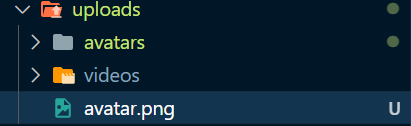

# Express

이전에 파일 업로드 기능을 구현하는 과정을 기록한 적이 있다.

[파일 업로드 기능 구현하기](./Express_파일업로드.md)

파일을 서버에다가 잘 저장했다면, 클라이언트 측에서 그 파일들을 불러와야 한다. 그러면 클라이언트 측에서 서버의 폴더에 접근할 수 있어야 하는데, 이 때 필요한 것이 바로 Static이라는 함수이다.

## Static 미들웨어

서버의 이미지, CSS 파일 및 JavaScript 파일과 같은 static 파일들에 접근하려면 Express의 기본 제공 미들웨어인 `express.static`을 사용하면 된다.

static 파일들이 포함된 디렉토리의 이름을 `express.static` 미들웨어에 전달하면 파일에 대한 직접적인 접근이 가능해진다. 공식 문서에 제공해주는 간단한 예시를 살펴보자.

```javascript
app.use(express.static('public'));
```

이제 다음과 같이 `public` 디렉토리에 포함된 파일을 로드할 수 있다.

```javascript
http://localhost:3000/images/kitten.jpg
http://localhost:3000/css/style.css
http://localhost:3000/js/app.js
http://localhost:3000/images/bg.png
http://localhost:3000/hello.html
```

## 사용해보기

```js
// server.js

import express from 'express'

const app = express()
...
app.use('/uploads', express.static('uploads'))

export default app
```

```js
// init.js

import app from './server'

app.listen(4000, () => {
  console.log('Connected to PORT 4000')
})
// localhost:4000에서 서버 실행
```

위 코드는 서버의 미들웨어를 장착 (?) 시키는 과정이라고 생각하면 된다. 미들웨어가 모두 장착된 express 서버를 export 하고 해당 서버를 listen 메서드를 통해 실행시켜주면 된다.

위에서 정의한 static은 `src/uploads` 폴더에 접근할 수 있도록 해준다. 가령 uploads 폴더에 avatar.png 라는 사용자 사진이 있다면, http://localhost:4000/uploads/avatar.png 경로로 접근할 수 있다. 

	


접근 성공!

# :books:참고자료

http://expressjs.com/en/starter/static-files.html#serving-static-files-in-express