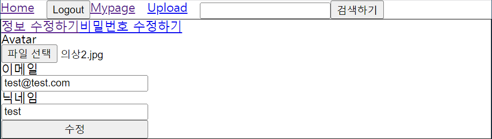
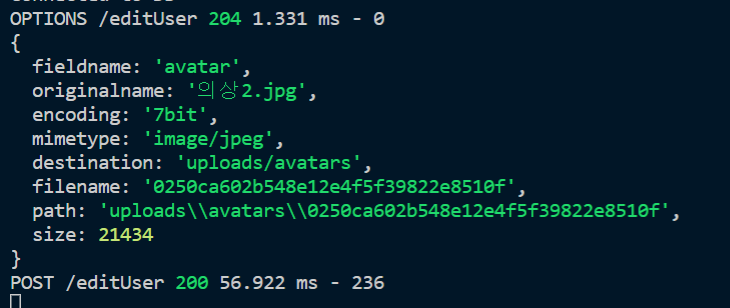
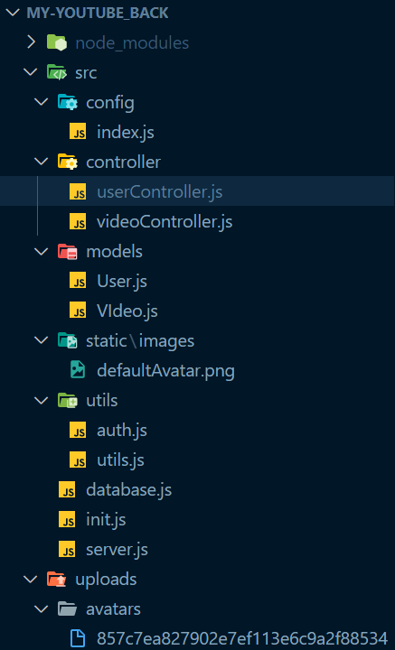

# Express

## 파일 업로드 기능 구현하기

최근 사이드 프로젝트로 유튜브 클론코딩을 진행하고 있는데, 기술스택은 React+Express이다. 처음으로 백엔드까지 구현해보는 프로젝트라 약간은 막막하기도 하지만, 하면 할수록 백엔드도 참 재밌다는 생각이 든다. 아무튼 동영상과 사용자 사진을 업로드할 수 있는 기능을 구현했는데, 그 과정이 조금 복잡해 기록으로 남겨보려고 한다.

### Multer

> Multer is a node.js middleware for handling `multipart/form-data`, which is primarily used for uploading files. It is written on top of [busboy](https://github.com/mscdex/busboy) for maximum efficiency.
>
> **NOTE**: Multer will not process any form which is not multipart (`multipart/form-data`).

Multer는 node.js 미들웨어로 주로 파일을 업로드할 때 사용된다. 여기서 주의할 점은 Multer는 `multipart/form-data` 형식 데이터에 대해서만 작업한다는 점이다.

#### 설치

```bash
$ npm install multer
```

#### 설정하기

당연한 이야기일 수도 있지만 클라이언트측에서 업로드한 파일들을 서버 쪽에 저장해야하기 때문에 multer의 작업은 서버 측에서 이루어져야 한다. 아래 코드는 유저와 관련된 get이나 post 요청에 대한 작업을 하는 userController 파일의 일부분이다.

```js
// userController.js

import multer from 'multer'

const uploadAvatar = multer({
  dest: 'uploads/avatars',
}).single('avatar')
```

Multer를 사용하기 위해서는 dest와 업로드될 파일의 유형은 필수적으로 설정을 해야 한다. dest란 Multer로 하여금 어디에다가 파일을 업로드할지 지정하는 옵션이다. 기본적으로 루트 디렉토리에 폴더가 생성되며, 위에 같이 설정을 할 경우에는 프로젝트폴더/src/uploads/avatars 에 파일들이 저장된다.

그 다음으로는 업로드될 파일의 유형을 정해야 하는데, 위 코드에서는 avatar라는 키 값을 가진 하나의 파일이라고 파일의 유형을 미리 설정해놓은 것이다.

이와 같이 간단한 설정만으로 서버에 파일을 자동으로 업로드시켜주는 강력한 미들웨어를 쉽게 얻을 수 있다.

#### 사용하기

Multer는 방금도 언급했듯이 미들웨어이다. 따라서 아래와 같이 사용해야 한다.

```js
// userController.js
...
const postEditUser = async (req, res) => {
  const avatarFile = req.file
  const { oldEmail, oldUsername, oldAvatartURL, newEmail, newUsername } = req.body
...
}
...
app.post('/editUser', uploadAvatar, postEditUser)
```

위 코드의 마지막 줄을 살펴보자. /editUser라는 url로 post요청이 오게 되면 multer로 만든 uploadAvatar라는 미들웨어가 실행되어 파일을 uploads 폴더에 저장하고, postEditUser 함수를 실행시킨다. 여기서 postEditUser는 데이터베이스의 사용자 정보를 수정하고 수정된 정보를 반환하는 함수 정도로만 이해하면 된다.

추가로 Multer 미들웨어를 거치게 되면 업로드한 파일은 req.file에 담기게 된다는 점은 꼭 알아두자. 이렇게 되면 백엔드, 서버측에서 파일을 업로드하기 위한 설정은 모두 끝났다. 이제 클라이언트 측에서 필요한 작업들을 마저 해보자.

### multipart/form-data

> **NOTE**: Multer will not process any form which is not multipart (`multipart/form-data`).

아까도 살펴봤지만 Multer는 오직 `multipart/form-data`에 대해서만 작업을 한다.

```js
// axios.js

const createInstanceWithFormData = () => {
  const instance = axios.create({
    baseURL: API_HOST,
    headers: {
      'Content-Type': 'multipart/form-data',
    },
  })
  return instance
}

const editUser = (newUserData) => {
  return instanceWithFormData.post('/editUser', newUserData)
}
```

먼저 axios 의 create 메서드를 이용해 baseURL과 headers가 설정된 axios 객체를 미리 만들고 editUser 함수에서는 해당 객체를 사용해 바로 post 요청을 보내게끔 했다. 이렇게 api 구조화를 해놓으면 이해하기 편할 뿐만 아니라 나중에 추가적인 api를 작성할 때도 훨씬 간편해진다. 여기까지 진행했다면 남은 작업은 보낼 데이터를 정의하는 일뿐이다.

```react
// UserInfoEdit.js
const [newEmail, setNewEmail] = useState('')
const [newUsername, setNewUsername] = useState('')
const [avatarFile, setAvatarFile] = useState('')
...
const handleEditUser = async (e) => {
  e.preventDefault()
  let userData = new FormData()
  userData.append('newEmail', newEmail)
  userData.append('newUsername', newUsername)
  userData.append('avatar', avatarFile)

  const { data } = await editUser(userData)

  if (data.userData) {
    saveUserToCookie(JSON.stringify(data.userData))
    alert('정보가 수정되었습니다.')
    navigate('/mypage')
  }
}
return (
...
    <StyledForm onSubmit={handleEditUser}>
      <label htmlFor="avatar">Avatar</label>
      <input
        id="avatar"
        type="file"
        accept="image/*"
        onChange={(e) => {
          setAvatarFile(e.target.files[0])
        }}
    />
...
```

위 코드는 React 프로젝트에서 사용자 정보를 수정하기 위한 페이지를 렌더링하는 컴포넌트이다. return 에 렌더링되는 부분부터 살펴보자.

전부 다 가져오지는 않았지만 새로운 사용자 정보를 작성하기 위한 여러 input이 정의되어 있다. input의 데이터들은 state로 변경될 때마다 그 값을 업데이트하고 있다.

Form에 있는 모든 input들을 작성한 후 submit을 하게 되면 handleEditUser 라는 핸들러가 실행된다. 먼저 submit을 하면 발생되는 reload 를 막기 위해 preventDefault() 메서드를 실행시킨다. 그리고 수정에 필요한 새로운 사용자 데이터를 정의한다. 

FormData 생성자를 사용한 이유는 계속 반복했다시피 Multer는 `mulpart/form-data`만을 받기 때문이다. FormData를 생성하고 append 메서드를 이용해 키와 값의 형태로 FormData 객체에 데이터를 저장한다.

	

	

	

제대로 실행된다! 파일도 uploads/avatars 폴더에 정상적으로 저장된 걸 확인할 수 있다. Multer를 거치게 되면 파일명이 무작위로 바뀌게 되는데, 아마도 업로드되는 파일들이 중복되는 현상이 발생하지 않도록 하기 위함인 것 같다. 그럼에도 브라우저는 아무런 문제 없이 이해하기 때문에 걱정하지 않아도 된다.

# :books:참고자료

https://github.com/expressjs/multer#readme

노마드코더 유튜브 클론코딩 강의