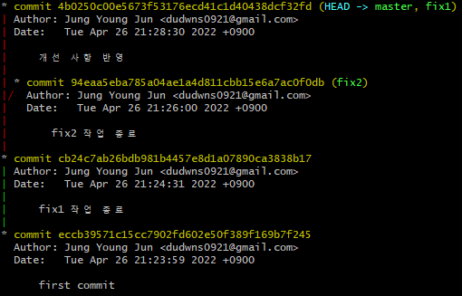
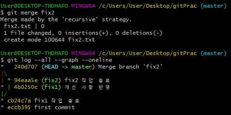

# 3-Way Merge

최근에 회사에서 다음과 같은 일이 있었다.

1. develop 브랜치에서 GUI 수정을 위해 fix 브랜치 생성

2. 작업이 끝난 다음에 pull request

3. 멘토님께 코드 리뷰를 받기 전 작업이 끝나 다음 작업을 진행

4. 다음 작업을 진행하기 위해 fix 브랜치에서 새로운 fix2 브랜치 생성

5. 리뷰 후 개선 사항을 fix 브랜치에 추가 반영

6. 작업이 끝난 fix 브랜치를 develop 브랜치에 fast-forward merge

7. fix2 작업 후 merge 예정

사실 가장 이상적인 과정은 fix 브랜치에서 작업이 끝나면 develop 브랜치에 fix1 브랜치를 merge하고 다시 develop 브랜치에서 새로운 브랜치를 만들어 작업을 진행하는 거라고 생각한다.

아무튼 일은 벌어졌고, develop 브랜치가 앞서 나간 상황에서 작업이 끝난 fix2 브랜치를 병합하면 어떻게 될 지 궁금해 시뮬레이션을 해보기로 했다.

다음과 같은 그래프가 그려졌고, 이제 master에서 fix2 브랜치를 병합해보도록 하겠다.

Merge made by the 'recursive' strategy 라는 처음 보는 메시지가 출력되었다. 해당 내용을 구글링해보니 이 merge가 3-way merge라는 걸 알 수 있었고, 어떤 원리인지 궁금해 좀 더 알아보고자 했다.

## 3-way-merge란?

fast-forward처럼 Merge 브랜치에서 사용하는 전략으로 각 브랜치의 마지막 커밋 두 개와 공통 조상의 총 3개의 커밋을 이용해 새로운 커밋을 만들어내는 방법이다.

가령, 다음 그림에서 보이는 feature와 master의 마지막 커밋은 각각 f2와 m2, 그리고 공통 조상(base)은 b이다. 따라서, 이 세 커밋으로 새로운 커밋을 만들게 될 것이다.

이와 같은 전략을 사용하는 이유가 무엇일까? 그 이유를 좀 더 자세히 알아보자.

우선, 공통 조상이 되는 커밋을 Base라고 가정하고, 변경된 부분이 a, b, c, d라고 가정해보자.다음 표에 비교할 두 브랜치와 공통 조상 Base를 표에 기록해보겠다.

| feature | base | master |
|:-------:|:----:|:------:|
| a       | a    | a*     |
| b       | b    | b      |
| c*      | c    | c**    |
| d*      | d    | d      |

나도 그랬지만, 이런 상황에서 다음과 같이 생각할 수도 있다.

"그냥 feature랑 master만 비교해서 새로운 커밋을 만들어내면 안 되는 건가?"

| feature | master | merge |
|:-------:|:------:|:-----:|
| a       | a*     | ?     |
| b       | b      | b     |
| c*      | c**    | ?     |
| d*      | d      | ?     |

양쪽에서 동일하게 관찰되는 b 부분을 제외하고는 어떤 변경 사항이 더 나중에 이루어졌는지 확인하기가 어렵다. 따라서 충돌이 난 것인지의 여부도 알 수가 없는 것이다. 하지만 base 커밋, 공통 조상 커밋을 함께 비교해 3-way-merge를 수행하면 merge 커밋의 상태를 보다 명확하게 결정할 수 있게 된다.

| feature | base | master | merge    |
|:-------:|:----:|:------:|:--------:|
| a       | a    | a*     | a*       |
| b       | b    | b      | b        |
| c*      | c    | c**    | conflict |
| d*      | d    | d      | d*       |

base 커밋을 출발점으로 두고 각각의 브랜치에서 일어난 변경 사항을 적용시킨다. a*는 a 이후에 추가적으로 이루어진 변경 사항이므로 merge할 때는 `a*`가 merge 커밋에 적용된다. 다른 변경사항들도 마찬가지다. 다만 c는 base 이후에 이루어진 변경 사항이 두 가지이므로 충돌이 일어나게 된다. 이제는 merge 커밋의 상태가 확실하게 결정된 것을 확인할 수 있다.

# 

# :books:참고자료

https://velog.io/@godori/Git-Rebase

[Git - 브랜치와 Merge 의 기초](https://git-scm.com/book/ko/v2/Git-%EB%B8%8C%EB%9E%9C%EC%B9%98-%EB%B8%8C%EB%9E%9C%EC%B9%98%EC%99%80-Merge-%EC%9D%98-%EA%B8%B0%EC%B4%88#_basic_merging)
