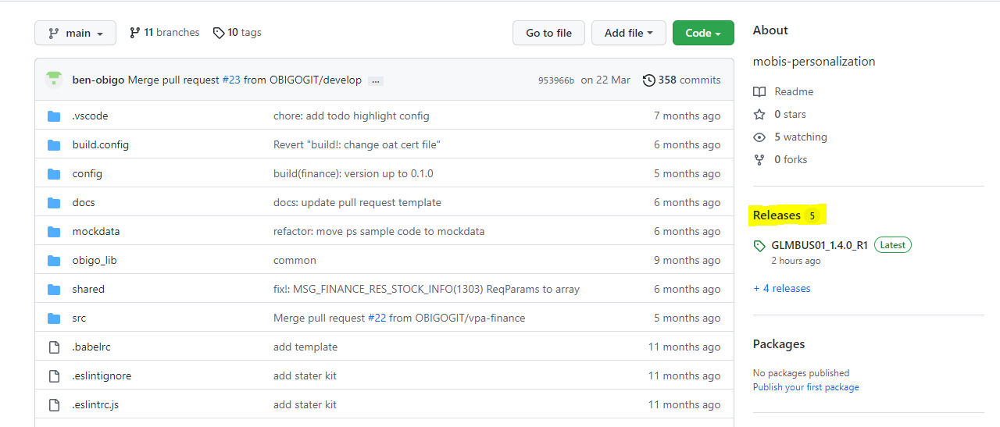
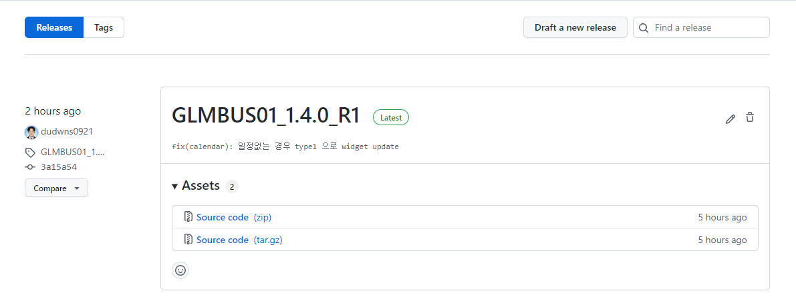
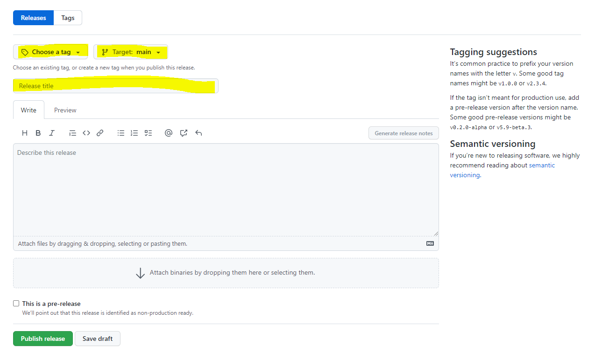

# Git

## Release & Tag

회사에서 처음으로 릴리즈 및 태그 업무를 맡아 진행하면서 학습한 내용을 정리했다. 먼저 릴리즈란 소프트웨어 배포 생명 주기에서 컴퓨터 소프트웨어의 배포를 의미한다.

GitHub에서 프로젝트를 진행하고 있었고, 목표한 기능에 도달했다면 다음 절차에 따라 릴리즈를 진행할 수 있다.

### 1. 우측에서 Releases을 눌러 Releases 페이지로 이동한다.

### 2. 'Draft a new release' 버튼을 누른다.

### 3. tag와 target branch를 지정하고 제목을 작성한다.

tag는 기존에 있던 걸 선택할 수도 있고, 새로 생성할 수도 있다. 하지만 작업 흐름상 태그를 미리 만들어두는 경우는 거의 없기 때문에 릴리즈할 때 태그도 생성한다고 생각하면 될 것 같다.

___

여기까지 진행했다면 필수 입력 사항은 모두 입력한 것이며, 릴리즈를 진행할 수 있다. 

# :books:참고자료

https://github.blog/2013-07-02-release-your-software/

https://www.lesstif.com/gitbook/github-20774996.html