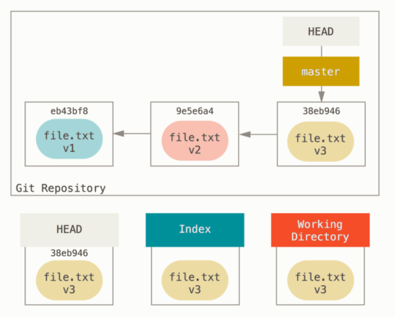
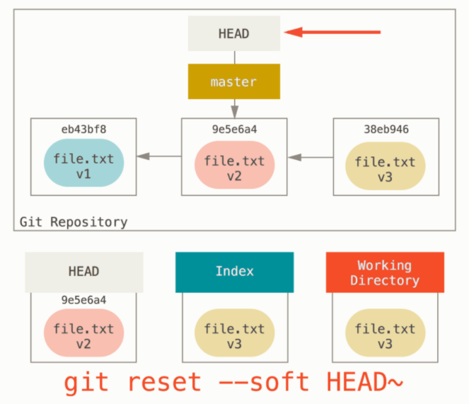
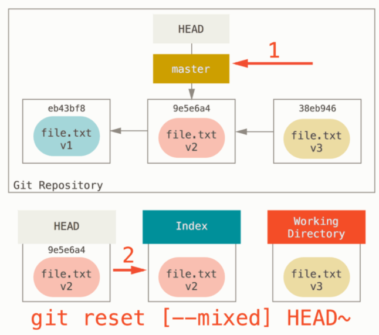
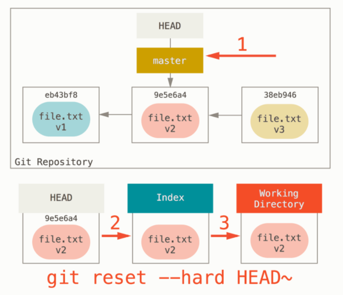

# 멀티캠퍼스 Git 특강 2일차_undoing

## amend

 일부 파일을 추가하는 것을 잊어버렸거나, 커밋 메시지가 너무 엉망이라 다시 작성할 필요가 있을 때 사용하는 명령어이다.  조심해야 할 점은 기존 커밋 후에 수정된 새로운 커밋을 추가하는 것이 아니라 새로운 커밋을 기존에 있던 커밋을 완전히 교체한다는 것이다. 또한 아직 로컬 저장소에서 푸시되지 않은 커밋만 수정해야 한다. 이전에 푸시된 커밋을 수정하고 강제로 푸시하면 문제가 생길 수 있다. 

```bash
$ git add a.txt
$ git commit -m "첫 번째 커밋"
[master (root-commit) 56ff089] 첫 번째 커밋
 1 file changed, 0 insertions(+), 0 deletions(-)
 create mode 100644 a.txt

$ git add b.txt
$ git commit --amend
[master 3734c87] 첫 번째 커밋에서 빼먹은 b.txt 추가합니다.
 Date: Fri Oct 1 21:48:43 2021 +0900
 2 files changed, 0 insertions(+), 0 deletions(-)
 create mode 100644 a.txt
 create mode 100644 b.txt

$ git log
commit 3734c87da4d532600ac5b7af19ad7f357b558f90 (HEAD -> master)
Author: Jun <dudwns0921@gmail.com>
Date:   Fri Oct 1 21:48:43 2021 +0900

    첫 번째 커밋에서 빼먹은 b.txt 추가합니다.

# git log로 확인해보면 "첫 번째 커밋" 이라는 커밋이 아예 교체된 것을 볼 수 있다.
```

## restore

 restore는 스테이징된 파일을 언스테이징시키거나 작업한 파일을 원래대로 되돌릴 때 사용한다. 원래 같은 목적으로 reset을 썼지만, git 버전 2.23.0부터 restore가 도입됐다. restore을 사용하면 절대로 다시 복원이 불가능하므로 사용할 때 주의해서 사용하자.

```bash
$ git add c.txt
$ git status
On branch master
Changes to be committed:
  (use "git restore --staged <file>..." to unstage)
        new file:   c.txt

$ git status
On branch master
Changes not staged for commit:
  (use "git add <file>..." to update what will be committed)
  (use "git restore <file>..." to discard changes in working directory)
        modified:   c.txt
```

## :bulb:Tip

### $ git rm

 비슷한 역할의 **rm**이라는 명령어도 있는데, rm은 원격저장소와 로컬저장소의 staging area에서 파일을 내리면서 실제 파일도 삭제하게 된다. 그래서 일반적으로는 --cached 옵션과 함께 원격저장소에 있는 파일을 삭제하고 스테이징된 파일을 언스테이징하기 위해 사용한다. 

## reset과 revert

작업을 진행하다가 작동이 되던 이전 버전으로 돌아가야 할 때가 있다. 이것이 Git이라는 버전 관리 시스템을 쓰는 가장 큰 이유이며, 이 때 사용하는 명령어로 **reset**과 **revert**가 있다. 이 둘의 가장 큰 차이는 커밋 이력이다. 

**reset**은 되돌린 커밋 이후의 커밋들은 이력에서 모두 삭제된다.

그에 반해 **revert**는 특정 커밋을 되돌린 상태를 다시금 커밋하는 형태이기 때문에 이전 이력이 모두 남아있다. 

## reset

reset을 이해하기 위해서는 먼저 아래의 그림을 이해해야 한다.

    

 여기서 HEAD는 현재 브랜치의 마지막 커밋의 스냅샷이다. Index는 바로 다음에 커밋할 것들로 Staging Area라고도 한다. 마지막으로 Working Directory는 말 그대로 우리의 작업 공간이다.

작업의 흐름을 살펴보면, 

1. file.txt 생성 및 작업 후 commit

2. 수정 후 commit

3. 수정 후 commit

이렇게 진행됐음을 알 수 있다. 이제 reset 명령어의 옵션에 따라 결과가 어떻게 달라지는지 확인해보자.

### reset --soft

    

 --soft는 HEAD만 돌아가려는 커밋으로 옮겨놓는다.  그렇지만 그림에서 볼 수 있듯이 Index(Staging Area)와 Working Directory의 작업들은 그대로 남아있다. 만약 가장 최근의 커밋을 지정했다면, --soft 옵션 후 commit을 하면 원상태로 돌아가게 되는 것이다.

### reset --mixed

    

--mixed는 -soft와 마찬가지로 HEAD로 돌아가려는 특정 커밋을 가리키게 한다. 그러고 나서 Staging Area를 비우기까지 한다. add 명령까지 되돌리는 것이다. 결과적으로는 Working Directory만 그대로 남아있는 것이다.

### reset --hard

    

--hard는 가장 강력한 방법으로  Working Directory의 상태도 특정 버전으로 되돌려버린다. 

## revert

### 예시

```bash
$ git log --oneline
883a219 (HEAD -> master) 세 번째 커밋
b10e6e0 두 번째 커밋
e06bd89 첫 번째 커밋
$ ls
a.txt  b.txt  c.txt

# 각각의 커밋마다 텍스트 파일을 하나씩 만든 상태

$ git revert 883a219
Removing c.txt
[master 4616109] Revert "세 번째 커밋"
 1 file changed, 0 insertions(+), 0 deletions(-)
 delete mode 100644 c.txt
 $ ls
a.txt  b.txt

 # revert로 883a219 커밋을 되돌렸다. 그 결과 해당 커밋에서 만든 c.txt파일이 working directory에서 사라졌다.

 $ git log --oneline
4616109 (HEAD -> master) Revert "세 번째 커밋"
883a219 세 번째 커밋
b10e6e0 두 번째 커밋
e06bd89 첫 번째 커밋

# 커밋 이력을 확인해보면 세 번째 커밋 이후 세 번째 커밋을 revert한 커밋이 추가된 것을 확인할 수 있다.
```

 아직 많이 사용해보지는 않았지만 개인적으로는 reset을 하게 되면 커밋 이력이 사라져 원격 저장소에 바로 push를 할 수 없는데다가 강제로 push하게 되면 데이터가 모두 손실되는 끔찍한 상황이 벌어질 수도 있으므로 revert를 쓰는 것이 훨씬 안전한 선택이라고 생각한다.

## 참고자료

- ### Git 공식 책 https://git-scm.com/doc
