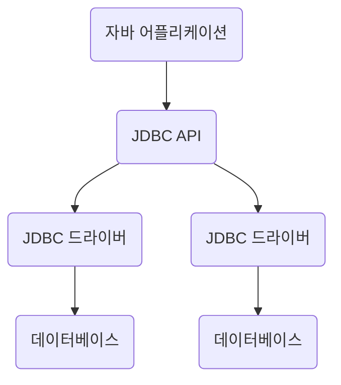

# JAVA JDBC

JDBC는 자바에서 데이터베이스에 접속할 수 있도록 하는 자바 API이다. JDBC는 데이터베이스에서 자료를 쿼리하거나 업데이트하는 방법을 제공한다.

 

# JDBC 연결



## 1. JDBC 드라이버 로드

JDBC 드라이버는 DBMS와 통신을 담당하는 자바 클래스이다. 각 DBMS별로 알맞은 JDBC 드라이버가 필요한데, 이번에는 오라클을 중심으로 살펴보겠다. 

설치 위치에 따라 조금씩 다를 수 있지만 오라클 드라이버의 위치는 다음과 같다.


**C:\oraclexe\app\oracle\product\11.2.0\server\jdbc\lib**


이제 이클립스에서 JDBC 드라이버를 로드해보자.


- 프로젝트 우클릭 → BuildPath →  Configure Build Path 클릭
- Add External JARs → 위 경로에서 JAR 파일 선택 → Apply and Close


JDK 버전이 높아 Modulepath와 Classpath가 나눠져 있다면 Classpath에 추가


## 2. DB 연결

```java
	public Connection makeConnection() throws ClassNotFoundException, SQLException {
		Connection con = null;
		String driver = "oracle.jdbc.OracleDriver";
		String id = "hr";
		String pwd = "oracle";
		String url = "jdbc:oracle:thin:@localhost:1521:xe";
        // 접속에 필요한 정보로 구성된 문자열 작성
		
		Class.forName(driver);
        // JDBC 드라이버 로드
		con = DriverManager.getConnection(url, id, pwd);
        // Connection 객체 생성 및 데이터베이스 접속
		return con;
    }
```


### 1) DB 연결에 필요한 정보들

위의 코드를 보면 연결을 위한 총 4개의 문자열 리터럴을 확인할 수 있다.  첫 번째는 사용할 DB의 드라이버명이다. 

**오라클 드라이버명**

**`"oracle.jdbc.OracleDriver"`**


그 다음은 **오라클 사용자 계정에 대한 id와 password**이다.


마지막으로는 **오라클 데이터베이스에 대한 url 정보*인데**, 이 부분은 좀 더 자세히 살펴보겠다.

**`jdbc:oracle:driver_type:[username/password]@[//]host_name[:port`][/XE]**

- jdbc:oracle:thin은 사용하는 JDBC 드라이버가 thin 타입을 의미한다. 
- username/password은 option이다. [ ]안에 있는 정보는 반드시 입력할 필요는 없다는 뜻이다. url에 필요없다는 뜻이지 id와 password 자체가 필요없다는 뜻이 아니다.
- :port 번호도 option이다. 다만 Oracle의 listener port인 1521을 사용하지 않을 경우는 값을 반드시 명기해 줘야 된다. 
- /XE는 Oracle database client의 고유한 service name이다. 디폴트로 XE를 사용하므로 이 정보도 option이다. 이에 대한 설정 정보는 Oracle이 설치된 폴더 안listener.ora 파일에 아래와 같이 표시되어 있다.

**`DEFAULT_SERVICE_LISTENER = (XE)`**


### 2) 필요 클래스 및 인터페이스

#### DriverManger 클래스

DriverManager 클래스는 JDBC 드라이버들을 관리하는 작업을 수행한다. Class.forName() 메소드를 통해 특정 DB의 드라이버 클래스를 DriverManager에 등록할 수 있다. 등록된 드라이버는 이후 데이터베이스와 연결될 때 사용된다. 

**`Class.forName("oracle.jdbc.OracleDriver")`**

위와 같이 코드를 작성하면 자동으로 객체가 생성되고 DriverManager에 등록된다. 드라이버 클래스를 찾지 못할 경우 forName() 메소드는 ClassNotFoundException을 발생시키므로 반드시 예외처리를 해야한다.


#### Connection 인터페이스

DriverManager 클래스의 getConnection() 메소드를 실행함으로써 정의되며 데이터베이스와 연결된 통로 역할을 한다. 이를 이용해서 데이터베이스에 SQL 쿼리를 전달하고 그 결과를 가져온다.


# 참고자료

 https://developer-joe.tistory.com/82 [코드 조각-Android, Java, Spring, JavaScript, C#, C, C++, PHP, HTML, CSS, Delphi]

https://programmingyoon.tistory.com/53[나는 연어다]

https://codedragon.tistory.com/5936[CodeDragon]

