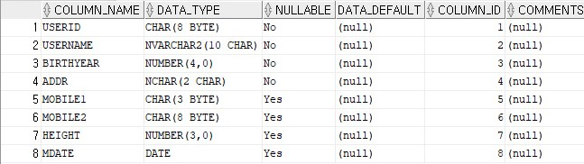
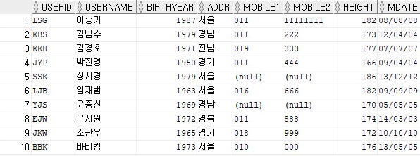

# JAVA SQL 쿼리

이전에 jdbc를 사용해 자바 프로그램과 데이터베이스를 연결시켜보았다.

이번에는 자바에서 데이터베이스로 쿼리문을 전송할 때 사용하는 인터페이스에 대해 알아보자.


## 1. Statement

- Statement 객체는 Connection 클래스의 createStatement( ) 메소드를 호출함으로써 얻어진다.
- Statement 객체가 생성되면 executeQuery( ) 메소드를 호출하여 SQL문을 실행시킬 수 있다. 메소드의 인수로 SQL문을 담은 String객체를 전달한다.
- Statement는 정적인 쿼리문을 처리할 수 있다. 즉 쿼리문에 값이 미리 입력되어 있어야 한다.


### 데이터베이스 예시

#### 칼럼 정보

	

#### 전체 테이블

	


### 자바 예시

```java
public class ConnectionTest {

	public static void main(String[] args){
		ConnectionTest ct = new ConnectionTest();
		try {
			ct.readAll();
		} catch (ClassNotFoundException e) {
			e.printStackTrace();
		} catch (SQLException e) {
			e.printStackTrace();
		}	
	}
	
	public Connection startConnection() throws ClassNotFoundException, SQLException {
		Connection con = null;
		String driver = "oracle.jdbc.OracleDriver";
		String url = "jdbc:oracle:thin:@localhost:1521:xe";
		String id = "HR";
		String pwd = "oracle";
		
		Class.forName(driver);
		con = DriverManager.getConnection(url, id, pwd);
		
		return con;
	}
	
	public void readAll() throws ClassNotFoundException, SQLException {
		String sql = "select * from userTBL";
        // sql 쿼리문 작성해서 문자열 변수에 할당
		Connection con = this.startConnection();
        // startConnection 메소드에서 Connection 객체 리턴
		Statement stmt = con.createStatement();
        // Statement 객체 생성
		ResultSet result = stmt.executeQuery(sql);
        // 데이터베이스에 쿼리문을 전송한 결과가 ResultSet 객체에 담김
		
		while(result.next()) {
            // ResultSet 객체에는 next()라는 메소드가 있다. 이 메소드는 다음 행이 존재하면 true를, 다음 행이 없으면 false를 반환
			System.out.println(result.getString(1).trim()+"|"+result.getString(2)+"|"+result.getInt(3)+"|"+result.getString(4)
			+"|"+result.getString(5)+"|"+result.getString(6)+"|"+result.getInt(7)+"|"+result.getDate(8));
            // 해당 데이터베이스의 칼럼 정보를 확인하고 각 칼럼에 저장되어있는 데이터 형태에 맞춰 받아오기
		}
		
	}
}
```

#### 결과

```
LSG|이승기|1987|서울|011|11111111|182|2008-08-08
KBS|김범수|1979|경남|011|22222222|173|2012-04-04
KKH|김경호|1971|전남|019|33333333|177|2007-07-07
JYP|박진영|1950|경기|011|44444444|166|2009-04-04
SSK|성시경|1979|서울|null|null|186|2013-12-12
LJB|임재범|1963|서울|016|66666666|182|2009-09-09
YJS|윤종신|1969|경남|null|null|170|2005-05-05
EJW|은지원|1972|경북|011|88888888|174|2014-03-03
JKW|조관우|1965|경기|018|99999999|172|2010-10-10
BBK|바비킴|1973|서울|010|00000000|176|2013-05-05

```

## 2. PreparedStatement

- PreparedStatement 객체는 Connection 객체의 preparedStatement( ) 메소드를 사용해서 생성한다. 
- <span style="color:red">Statement 클래스와 달리 객체를 생성할 때 파라미터로 SQL문을 담은 String 객체가 필요하다.</span>
- <span style="color:red">Statement 클래스와 달리 객체를 캐시에 담아 재사용한다. </span>
- 각각의 인수에 대해 placeholder를 사용하여 SQL문장을 정의할 수 있게 해준다. placeholder는 '?' 로 표현된다.
- 동일한 SQL문을 특정 값만 바꾸어서 여러 번 실행해야 할 때, 인수가 많아서 SQL문을 정리해야 될 필요가 있을 때 사용하면 유용하다.


### 자바 예시

```java
public class ConnectionTest {

	public static void main(String[] args){
		ConnectionTest ct = new ConnectionTest();
		try {
			ct.readCondition("이승기");
		} catch (ClassNotFoundException e) {
			e.printStackTrace();
		} catch (SQLException e) {
			e.printStackTrace();
		}
	}
	
    // startConnection() 메소드는 생략
	
	public void readCondition(String userName) throws ClassNotFoundException, SQLException {
		String sql = "select * from userTBL where userName = ?";
		Connection con = this.startConnection();
		PreparedStatement pstmt = con.prepareStatement(sql);
		pstmt.setString(1, userName);
		// placeholder로 처리한 부분에 readCondition() 메소드의 파라미터를 넣는다.
        // placeholder의 순번은 1부터 시작한다.
		ResultSet result = pstmt.executeQuery();
		
		while(result.next()) {
			System.out.println(result.getString(1).trim()+"|"+result.getString(2)+"|"+result.getInt(3)+"|"+result.getString(4)
			+"|"+result.getString(5)+"|"+result.getString(6)+"|"+result.getInt(7)+"|"+result.getDate(8));
		}
	}
}
```

#### 결과

```
LSG|이승기|1987|서울|011|11111111|182|2008-08-08
```


# 참고자료

- https://all-record.tistory.com/79 [세상의 모든 기록]
