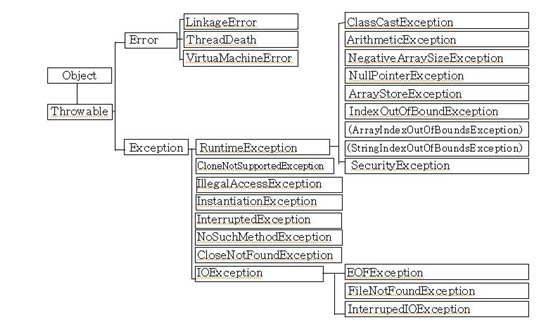

# JAVA 예외처리

컴퓨터 하드웨어의 오동작 또는 고장으로 인해 실행 오류가 발생하는 것을 자바에서는 **에러(error)**라고 한다. 에러는 JVM 실행에 문제가 생긴 것이므로 그 위에서 실행되는 프로그램을 아무리 견고하게 짜도 결국 실행 불능이 된다. 

하지만 자바에서는 에러 이외에 **예외(exception)**이라고 부르는 오류가 있다. 예외란 사용자의 잘못된 조작 또는 개발자의 잘못된 코딩으로 인해 발생하는 프로그램 오류를 뜻한다. 

예외도 에러와 마찬가지로 발생되면 프로그램이 종료되지만, 예외는 예외처리를 통해 프로그램을 종료하지 않고 정상 실행시킬 수 있다. 예외는 일반예외와 실행예외로 나눌 수 있다.

|      | 일반예외(Checked Exception) | 실행예외(Unchecked Exception) |
| ---- | ----------------------- | ------------------------- |
| 처리여부 | 반드시 예외를 처리해야 함          | 명시적인 처리를 강제하지 않음          |
| 확인시점 | 컴파일 단계                  | 실행단계                      |

 이 둘의 가장 명확한 구분 기준은 바로 처리여부이다. 일반예외는 예외 처리 코드로 반드시 처리해야 하는 반면에 실행예외는 개발자가 부주의해서 발생하는 경우가 대부분이고 치명적인 예외 상황을 발생시키지 않기 때문에 굳이 예외 처리를 할 필요는 없다. 따라서 실행예외의 경우에는 예외 처리를 하기보다는 예외가 발생하지 않도록 주의를 기울이는 편이 좋다.

이와 달리 JVM은 RuntimeException을 상속하는지 여부를 이 둘을 구분한다. 아래의 계층도를 참고해보자.

    

RuntimeException 아래에 있는 클래스들이 실행예외 클래스들이다.

## 1. 실행 예외

- ### NullPointerException
  
  객체가 없는 상태에서 객체를 사용했을 때 발생하는 예외

- ### ArrayIndexOutOfBoundsException
  
  배열에서 인덱스 범위를 초과하여 사용할 경우 발생하는 예외

- ### NumberFormatException
  
  문자열을 숫자로 변환할 때, 변환할 수 없는 문자열이 들어가있을 경우 발생하는 예외

- ### ClassCastException
  
  타입 변환은 상위 클래스와 하위 클래스, 구현 클래스와 인터페이스 간에 발생, 이러한 관계가 아님에도 억지로 타입 변환을 시도할 때 발생하는 예외

## 2. 예외 처리 코드

### 2-1. try-catch-finally

​    예외 처리 코드는 **try-catch-finally** 블록을 이용한다. try-catch-finally블록은 생성자 내부와 메소드 내부에서 작성되어 일반 또는 실행예외가 발생할 경우 예외 처리를 할 수 있도록 해준다. 사용방법은 다음과 같다.

```java
try{ // 예외 발생 가능 코드

} catch(예외클래스 e){ // 예외 처리

} finally { // 항상 실행, 생략 가능하며 항상 실행할 내용이 있을 때만 작성해주면 됨

}
```

### 2-2. 다중 catch

```java
try{ // ArrayIndexOutOfboundsException 발생
     // 다른 Exception 발생

} catch(ArrayIndexOutofBoundsException e){ 
    //예외 처리1
} catch(Exception e){
    //예외 처리2, 계층도에서 확인해보면 Exception 예외 클래스는 Array~Exception보다 상위 클래스이다. 따라서 아래쪽에 작성되어야 한다.
}
```

다양한 종류의 예외가 발생할 경우, 다중 catch 블록 작성을 통해 이를 해결할 수 있다. 하지만 catch 블록이 여러 개여도 try에서 예외가 발생하는 즉시 해당 예외의 catch 블록으로 이동하기 때문에 단 하나의 catch 블록만 실행된다.

**:bulb:주의!**

다중 catch 블록을 사용할 때에는 상위 예외 클래스가 하위 예외 클래스보다 아래쪽에 위치해야한다는 점을 주의하자.

### 2-3. 멀티 catch

자바7부터 생긴 멀티 catch 기능으로 여러 예외를 동일하게 처리할 수 있다.

```java
try{ // ArrayIndexOutOfboundsException 또는 NullPointerException 발생

} catch(ArrayIndexOutofBoundsException | NullPointerException e){ 
    //예외 처리, |를 사용해 처리하고 싶은 예외들을 연결해주면 된다.
}
```

**:bulb:주의!**

상속 관계, 즉 상위 예외 클래스와 하위 예외 클래스는 동시에 사용할 수 없다.

### 2-4. 예외 떠넘기기

예외가 발생할 있는 코드를 작성할 때 try-catch 블록으로 예외를 처리하는 것이 기본이지만, 경우에 따라서는 메소드를 호출한 곳으로 예외를 떠넘길 수도 있다. 이 때 사용하는 키워드가 **throws**이다.

```java
    // 최근에 jdbc를 배우면서 썼던 코드이다.
    public static void main(String[] args) {
        DatabaseTest dt = new DatabaseTest();
        Connection con = null;
        try {
            con= dt.makeConnection();
         // 아래의 예외를 떠넘긴 메소드를 try블록 내에서 호출하고 아래에 두 예외를 catch 블록으로 예외처리했다.
            if(con!=null) {
                System.out.println("데이터베이스와 연결됐습니다.");
            }
        } catch (ClassNotFoundException e) {
            e.printStackTrace();
        // e.printStackTrace() : 에러의 발생근원지를 찾아 단계별로 에러를 출력
        } catch (SQLException e) {
            e.printStackTrace();
        }

    }

    public Connection makeConnection() throws ClassNotFoundException, SQLException {
        // ClassNotFoundException과 SQLException을 throws로 떠넘겼다.
        Connection con = null;
        String driver = "oracle.jdbc.OracleDriver";
        String id = "hr";
        String pwd = "oracle";
        String url = "jdbc:oracle:thin:@localhost:1521:xe";

        Class.forName(driver);
        con = DriverManager.getConnection(url, id, pwd);
        return con;
    }
```

throws 키워드가 붙어있는 메소드는 반드시 try 블록 내에서 호출되어야 한다. 그리고 catch 블록에서 떠넘겨 받은 예외를 처리해야 한다. 
