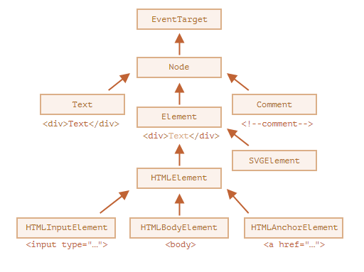

# DOM 노드

## DOM 노드 클래스

DOM 노드는 종류에 따라 각각 다른 프로퍼티를 지원한다. 그런데 모든 DOM 노드는 공통 조상으로부터 만들어지기 때문에 공통된 프로퍼티와 메서드를 지원한다.

DOM 노드는 종류에 따라 대응하는 내장 클래스가 다르다. 계층 구조 꼭대기엔 EventTarget이 있는데, Node는 EventTarget을, 다른 DOM 노드들은 Node 클래스를 상속받는다. 이런 관계를 그림으로 나타내면 다음과 같다.



각 클래스는 다음과 같은 특징을 지닌다.

### EventTarget

루트에 있는 ‘추상(abstract)’ 클래스로, 이 클래스에 대응하는 객체는 실제로 만들어지지 않는다. EventTarget가 모든 DOM 노드의 베이스에 있기때문에 DOM 노드에서 '이벤트’를 사용할 수 있다.

### Node

EventTarget과 마찬가지로 ‘추상’ 클래스이며, DOM 노드의 베이스 역할을 한다. getter 역할을 하는 `parentNode`, `nextSibling`, `childNodes` 등의 주요 트리 탐색 기능을 제공한다. 텍스트 노드를 위한 `Text` 클래스와 요소 노드를 위한 `Element` 클래스, 주석 노드를 위한 `Comment`클래스는 `Node`클래스를 상속받는다.

### Element

DOM 요소를 위한 베이스 클래스이다. `nextElementSibling`, `children` 이나 `getElementsByTagName`, `querySelector` 같이 요소 전용 탐색을 도와주는 프로퍼티나 메서드가 이를 기반으로 한다. 브라우저는 HTML뿐만 아니라 XML, SVG도 지원하는데 `Element` 클래스는 이와 관련된 `SVGElement`, `XMLElement`, `HTMLElement` 클래스의 베이스 역할을 한다.

### HTMLElement

HTML 요소 노드의 베이스 역할을 하는 클래스다. 아래 나열한 클래스들은 실제 HTML 요소에 대응하고 `HTMLElement`를 상속받는다.

**HTMLInputElement** – `<input>` 요소에 대응하는 클래스

**HTMLBodyElement** – `<body>` 요소에 대응하는 클래스

이외에도 다른 클래스가 많은데, 각 태그에 해당하는 클래스는 고유한 프로퍼티와 메서드를 지원한다. 이렇게 특정 노드에서 사용할 수 있는 프로퍼티와 메서드는 상속을 기반으로 결정된다.

정리하자면 DOM 노드는 프로토타입을 기반으로 상속 관계를 갖는 일반 자바스크립트 객체이다.

## :bulb:Tip

`console.dir(elem)`과 `console.log(elem)`의 차이

브라우저 개발자 도구 대부분은 `console.log`와 `console.dir` 명령어를 지원한다. 이 명령어들은 콘솔에 인수를 출력해준다. 인수가 자바스크립트 객체라면 두 명령어는 대개 같은 결과를 보여준다.

하지만 인수가 DOM 요소일 때는 결과가 다르다.

- `console.log(elem)`는 요소의 DOM 트리를 출력한다.
- `console.dir(elem)`는 요소를 DOM 객체처럼 취급하여 출력한다. 따라서 프로퍼티를 확인하기 쉽다는 장점이 있다.

## 주요 노드 프로퍼티

### nodeType

요소 타입을 알고 싶을 때 사용한다. 요소 노드라면 `1`을, 텍스트 노드라면 `3`을 반환한다. 두 타입 외에도 각 노드 타입엔 대응하는 상숫값이 있다. 읽기 전용이다.

### nodeName/tagName

요소 노드의 태그 이름을 알아낼 때 사용한다. XML 모드일 때를 제외하고 태그 이름은 항상 대문자로 변환된다. 요소 노드가 아닌 노드에는 `nodeName`을 사용하면 된다. 읽기 전용이다.

### innerHTML

요소 안의 HTML을 알아낼 수 있다. 이 프로퍼티를 사용하면 요소 안의 HTML을 수정할 수도 있다.

### outerHTML

요소의 전체 HTML을 알아낼 수 있다. `elem.outerHTML`에 무언가를 할당해도 `elem` 자체는 바뀌지 않는다. 대신 새로운 HTML이 외부 컨텍스트에서 만들어지고, `elem`이 삭제된 자리를 채운다.

```html
<div id="container">
    <div id="d">This is a div.</div>
</div>

<script>
const container = document.getElementById('container');
const d = document.getElementById('d');
console.log(container.firstChild.nodeName); // "DIV"를 출력합니다.

d.outerHTML = '<p>This paragraph replaced the original div.</p>';
console.log(container.firstChild.nodeName); // "P"를 출력합니다.
</script>
```

결과적으로 화면에는,

```html
<div id="container">
    <p>This paragraph replaced the original div.</p>
</div>
```

### nodeValue/data

요소가 아닌 노드(텍스트, 주석 노드 등)의 내용을 읽을 때 쓰인다. 두 프로퍼티는 거의 동일하게 동작한다. 주로 `data`를 많이 사용하는 편이며 내용을 수정할 때도 이 프로퍼티를 쓸 수 있다.

### textContent

HTML에서 모든 `<태그>`를 제외한 텍스트만 읽을 때 사용한다. 할당 연산을 통해 무언가를 쓸 수도 있는데 이때 태그를 포함한 모든 특수문자는 문자열로 처리된다. 사용자가 입력한 문자를 안전한 방법으로 처리하기 때문에 원치 않는 HTML이 사이트에 삽입되는 것을 예방할 수 있다.

### hidden

`true`로 설정하면 CSS에서 `display:none`을 설정한 것과 동일하게 동작한다.

# :books:참고자료

https://ko.javascript.info/dom-attributes-and-properties
