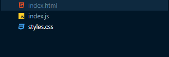
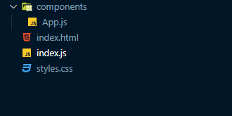
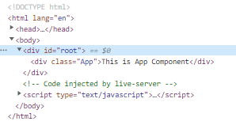
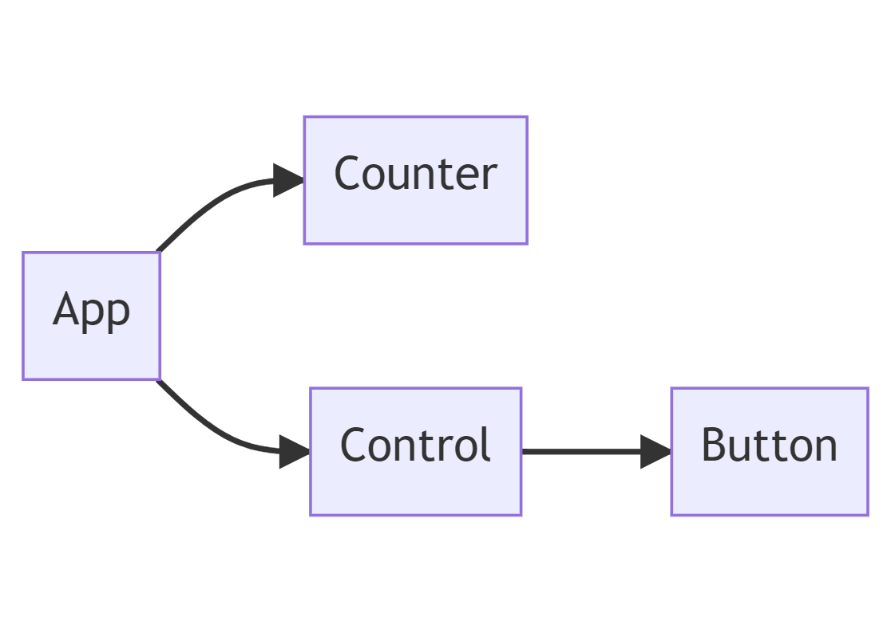

# Javascript

## Vanilla JS로 애플리케이션 만들기

프로그래머스에서는 `Dev-Matching`이라는 채용 프로그램을 진행한다.

> 데브매칭은 이력서 한 개로 다양한 기업에 동시 지원할 수 있는 채용 프로그램입니다. 테스트 점수가 이력서와 함께 전달되어 나를 더욱 주목받게 도와줍니다. 

이번 하반기에 지원해볼 생각이라 가벼운 마음으로 `2022 Dev-Matching:웹 프론트엔드 개발자(상반기)` 과제를 풀어보려고 했다. 하지만 이게 웬 걸. 막상 풀어보니 구현 사항 하나하나가 어렵게 느껴졌다. 이 프로그램의 가장 큰 특징은 `Vanilla Javascript`로 모든 걸 구현해야 한다는 점인데, 제대로 손도 대지 못하는 나를 보면서 내가 UI 프레임워크에 많이 의존하고 있었다는 걸 깨닫게 되었다.

지금부터라도 `Vanilla Javascript`를 잘 활용할 수 있도록 과제 해설을 통해 배운 점들을 정리하고자 한다. 하지만 문제에 대한 직접적인 내용을 담을 수 없어 세세한 구현 내용보다는 개념적인 부분만 정리하도록 하겠다.

### 시작하기

`2022 Dev-Matching:웹 프론트엔드 개발자(상반기)` 과제 구현 사항을 봤을 때, `Vanilla Javascript`로 아래 두 가지 목적을 달성할 수 있는 애플리케이션을 만들어야 한다는 생각이 들었다.

1. 상태 관리가 이루어져야 함
2. 상태에 따라 화면이 자동으로 렌더링되어야 함

이를 위해서는 컴포넌트 기반으로 애플리케이션을 만들어야 한다. 컴포넌트란 프로그래밍에 있어 재사용이 가능한 각각의 독립된 모듈을 뜻한다. 하지만 현재 내가 이야기하고 있는 컴포넌트 개념은 리액트에서의 컴포넌트에 더 가깝다고 생각한다. 

> `React`에서 **컴포넌트**는 props로 입력을 받을 수 있고, 엘리먼트를 반환하는 함수 혹은 클래스이다.

____

	

위의 이미지와 같이 가장 간단한 형태의 프로젝트를 만들었다.

```html
// index.html

<!DOCTYPE html>
<html lang="en">
<head>
    <meta charset="UTF-8">
    <meta http-equiv="X-UA-Compatible" content="IE=edge">
    <meta name="viewport" content="width=device-width, initial-scale=1.0">
    <link rel="stylesheet" href="./styles.css" />
    <script type="module" defer src="./index.js" />
    // Cannot use import statement outside module 에러를 방지하기 위해 type="module"을 작성
    // defer는 HTML 파싱과 script 다운로드를 동시에 진행하며 HTML 파싱이 완료되면 script를 실행
    <title>Practice</title>
</head>
<body>
    <div id="root"></main>
</body>
</html>
```

첫 번째로 `index.html`을 `index.js`와 `styles.css`와 연결했으며, `body`태그 안에 `Root DOM Node`이자 `id`가 `root`인 `div`태그를 작성했다. 이제 자바스크립트를 이용해 앞으로 만들어질 모든 컴포넌트들을 포함할 최상위 컴포넌트인 `App` 컴포넌트를 `Root DOM Node`에 전달하도록 하겠다.

	

컴포넌트 폴더를 새로 생성해 `App` 컴포넌트 파일을 만들었다.

```js
// App.js

export default function App({$target}) {
    const app = document.createElement("div")
    this.mount = () => {
     app.className = "App"
     app.innerText = "This is App Component"
     $target.appendChild(app)
    }
    this.mount()
}
```

```js
// index.js

import App from "./components/App.js";

new App({$target: document.querySelector("#root")})
```

1. `App` 컴포넌트는 객체를 인자로 받는데, 그 안에는 `$target`이라는 프로퍼티가 있다. 이 프로퍼티에는 `App` 컴포넌트가 반환할 엘리먼트들이 들어갈 `Root DOM Node`를 전달해야 한다.
2. 엘리먼트들을 루트 DOM 노드에 전달하는`mount` 메서드를 정의하고 실행 구문을 작성한다.

3. `index.js`에서 생성자 함수를 이용해 새로운 `App` 컴포넌트를 만든다.

___

여기까지 진행하면 아래와 같은 화면을 확인할 수 있다.

 

	

위의 과정을 통해 이번 과제를 왜 컴포넌트 기반으로 만들어야 했는지 알 수 있을 것이다. 보다시피 동적으로 엘리먼트를 생성하고 반환하고 있어, 상태에 따라 다른 화면을 보여줄 수 있다. 이제 만들어볼 카운터 애플리케이션의 컴포넌트 구조를 짜보도록 하자.

	

애플리케이션의 실행 흐름은 다음과 같다.

1. `add`, `minus`, `reset` 중 한 가지 버튼을 누른다.
2. `App` 컴포넌트에 눌린 버튼에 대한 정보가 전달된다.
3. 눌린 버튼의 정보에 따라 `App` 컴포넌트에서 관리하는 상태(state)가 변한다.
4. 상태가 변하면 `Counter` 컴포넌트에 새로운 상태를 전달해 화면을 업데이트한다.

여기서 `Control`은 여러 개의 `Button` 컴포넌트를 생성하기 위한 컴포넌트이다.

## 구현하기

실제 구현 과정과는 순서가 조금 다르지만, 좀 더 쉬운 이해를 위해 실행 흐름에 따라 설명하도록 하겠다.

```js
// Button.js

export default function Button({ $target, buttonText, onClick }) {
    this.$element = document.createElement('button')
    this.$element.className = 'Control__button'
    this.buttonText = buttonText

    $target.appendChild(this.$element)

    this.render = () => {
        this.$element.innerText = this.buttonText
    }
    this.render()
    
    this.$element.addEventListener("click", ()=>{
        onClick(this.buttonText)
    })
}
```

먼저 `Button` 컴포넌트이다. 인자로는 위에서 살펴본 `$target`, `Button`의 텍스트, 그리고 `click`했을 때 실행될 함수가 전달된다. 맨 마지막 줄을 보면 `addEventListener` 메서드를 통해 버튼을 클릭하면 `onClick` 함수가 실행하고 있다. 여기서 `onClick` 함수는 위의 실행 흐름에서 살펴봤던 것처럼 `App` 컴포넌트에 눌린 버튼의 정보를 전달하는 함수이다. 

```js
// Control.js

import Button from "./Button.js"

export default function Control({ $target, onClick }) {
    this.$element = document.createElement('div')
    this.$element.className = 'Control'

    $target.appendChild(this.$element)

    const minusButton = new Button({
        $target: this.$element,
        buttonText: "minus",
        onClick: onClick
    })

    const resetButton = new Button({
        $target: this.$element,
        buttonText: "reset",
        onClick: onClick
    })

    const addButton = new Button({
        $target: this.$element,
        buttonText: "add",
        onClick: onClick
    })

}
```

다음은 `Control` 컴포넌트이다. 카운터의 값을 설정하기 위한 여러 개의 버튼 컴포넌트를 만든다.

```js
import Control from "./Control.js";
import Counter from "./Counter.js";

export default function App({$target}) {
    // mount 관련 코드는 생략
    this.state = {
        counter: 0
    }

    this.setState = (nextState) => {
        this.state = nextState
        console.log(this.state.counter)
    }

    const control = new Control({
        $target: app,
        onClick: (cmd)=>{
            if(cmd==="add") {
                this.setState({
                    counter: this.state.counter+1
                })
            } else if(cmd==="minus") {
                this.setState({
                    counter: this.state.counter-1
                })
            } else if(cmd==="reset") {
                this.setState({
                    counter: 0
                })
            }
        }
    })
    
}
```

이제 컴포넌트의 중심인 `App`컴포넌트를 살펴보자. 먼저 앞에서 다룬 엘리먼트를 루트 DOM 노드에 전달하는 `mount` 메서드 관련 코드들은 모두 생략했다.

-  카운터 값을 0으로 초기화하고 상태로 관리함
- 상태가 변화했을 때 새로운 값을 설정해주기 위한 `setState` 메서드를 정의함
- `Control` 컴포넌트를 생성하고 눌린 버튼에 따라 카운터의 값을 재설정하는 `onClick` 함수 전달

여기까지 코드를 작성했다면, 버튼을 누를 때마다 `counter` 상태가 계속 바뀌는 것을 확인할 수 있다. 상태가 변화했다면 이제  `counter` 값과 함께 실제로 렌더링되는 `Counter` 컴포넌트에 그 값을 전달해주어야 한다.

```js
// Counter.js

export default function Counter({ $target, initialState }) {
    this.$element = document.createElement("div")
    this.$element.className = "Counter"
    this.state = initialState
    
    $target.appendChild(this.$element)

    this.setState = (nextState) => {
        this.state = nextState
        this.render()
    }

    this.render = () => {
        const { counter } = this.state
        this.$element.innerHTML = `<p>Count is now...${counter}</p>`
    }

    this.render()
}
```

`Counter` 컴포넌트는 'Count is now...' 이라는 문구와 함께 `counter` 상태값을 렌더링하고 있다. 여기서 주목해야 할 부분은 중간에 정의된 `setState` 메서드로 상태값이 변할 때마다 `Counter` 컴포넌트를 새롭게 렌더링한다. 그렇다면 `App`컴포넌트에서 관리하는 `counter`상태값이 변할 때 `Counter`컴포넌트의 `setState`메서드에 새로운 상태값이 전달되어 실행되도록 만들면 된다.

```js
// App.js
...
    this.state = {
        counter: 0
    }

    this.setState = (nextState) => {
        this.state = nextState
        counter.setState(this.state)
    }
    
    const counter = new Counter({
        $target: app,
        initialState: {
            counter: this.state.counter
        }
    })
...
```

여기까지 문제 없이 진행했다면 브라우저에서 정상적으로 실행되는 걸 확인할 수 있을 것이다.

솔직히 이 정도의 애플리케이션을 만드는데 이렇게 많은 코드들을 작성할 필요는 없다고 생각한다. 다만 아래의 사항들을 기억하기 위한 연습이었다고 생각하면 될 것 같다.

- 컴포넌트 기반 애플리케이션 디자인
- 객체 생성자 함수 정의 및 사용법
- DOM 관련 메서드 사용법

### 추가 구현

> 새로고침 이후에도 counter가 유지되도록 구현

`localstroage`를 사용하는 것으로 간단하게 구현할 수 있다.

```js
// App.js

export default function App({$target}) {
    this.state = {
        counter: JSON.parse(localStorage.getItem("counter")) || 0
    }

    this.setState = (nextState) => {
        this.state = nextState
        localStorage.setItem("counter", JSON.stringify(this.state.counter))
        counter.setState(this.state)
    }
...
```

1. 최초 실행시 `localstroage`에 `counter`값이 있는지 확인하고 없으면 값을 0으로 초기화한다.
2. `counter`값이 갱신될 때마다 `localstroage`에 새롭게 저장한다.

# :books:참고자료

https://prgms.tistory.com/139

https://velog.io/@heumheum2/%EA%B8%B0%EC%88%A0%EB%A9%B4%EC%A0%91-%EC%A4%80%EB%B9%84%ED%95%98%EA%B8%B0-3

https://jae04099.tistory.com/entry/HTML-script-%ED%83%9C%EA%B7%B8%EB%8A%94-%EC%96%B4%EB%94%94%EC%97%90-%EC%9C%84%EC%B9%98-%ED%95%B4%EC%95%BC-%ED%95%A0%EA%B9%8C

https://bobbyhadz.com/blog/javascript-syntaxerror-cannot-use-import-statement-outside-module