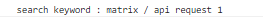
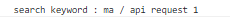
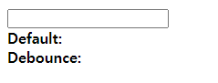
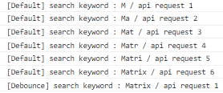
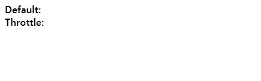

# Javascript

## Debounce & Throttle

검색어 자동완성 기능을 만들면서 `Debounce`에 대해 알게 되었고, 자연스럽게 `Throttle`을 접하게 되었다. 먼저 두 기술이 왜 등장하게 되었는지부터 알아보자.

### 등장배경

자, 우리가 영화 정보를 검색할 수 있는 사이트에서  `Matrix` 시리즈를 보고 싶어 검색창에 `Matrix` 를 입력했다고 가정해보자. 해당 사이트에는 자동완성 기능을 제공하고 있는데, 자동완성 기능의 흐름은 다음과 같다.

1. 사용자가 글자를 입력함
2. 입력할 때마다 서버에 새로운 요청을 보내 해당 검색어와 관련된 키워드들을 가져옴

위 흐름대로 자동완성 기능이 수행될 때 결과를 콘솔에 출력해봤다.

	 

우리는 `matrix`라는 6글자를 입력했을 뿐인데, 6개의 `request`가 서버로 보내졌다 . 만약 더 긴 제목의 영화를 검색한다면 영화 제목을 입력하는 짧은 시간 동안 수십 개의 `request` 가 발생하는 것이다. 이처럼 너무 많은 이벤트 횟수의 실행으로 이벤트 핸들러가 과도한 연산을 수행하는 경우 성능 문제가 발생하고 이는 사용자 경험까지 떨어뜨리게 된다.

여기서 필요한 것이 바로 `Debounce`와 `Throttle`이다. 두 기술 모두 자바스크립트의 이벤트를 제어(제한)해 성능을 향상시키는 방법이다.

### Debounce

`Debounce`는 이벤트를 그룹화해서 특정시간이 지난 후 하나의 이벤트만 발생하도록 하는 기술이다. 예시로 살펴보자.

1. 특정시간(delay)을 1초로 설정
2. `matrix` 를 입력(각 글자를 입력하는데 설정한 시간 미만으로 걸린다고 가정)
3. 설정한 시간 지남

	

보다시피 `matrix`라는 검색어와 함께 요청이 한 번만 발생하는 걸 확인할 수 있다. 원리는 다음과 같다.

1. 이벤트 발생 후 설정한 시간이 지나기 전에 이벤트가 다시 발생하면 지나간 시간을 초기화한다.
2. 설정한 시간이 지나게 되면 그 때 연산을 수행한다.

그러니까 만약 `ma`를 입력하고 1초가 지났다면 다음과 같은 결과가 나올 것이다.

	

어느 정도 개념에 대한 이해가 이루어졌다면 이제 `Debounce` 기술을 직접 구현해보자.

### Debounce 구현하기

	

```html
<body>
    <input type="text" />
    <div>
        <b>Default:</b>
        <span id="default"></span>
    </div>
    <div>
        <b>Debounce:</b>
        <span id="debounce"></span>
    </div>
</body>
```

`Debounce`가 적용됐을 때랑 적용되지 않았을 때의 차이를 좀 더 명확하게 확인하기 위해 위와 같이 `HTML` 구조를 짰다. 

```js
const input = document.querySelector('input')
const defaultText = document.querySelector('#default')
const debounceText = document.querySelector('#debounce')

let debounceReqCnt = 0
let defaultReqCnt = 0

const updateDebounceText = debounce((text) => {
  debounceText.textContent = text
  debounceReqCnt++
  console.log(
    `[Debounce] search keyword : ${text} / api request ${debounceReqCnt}`,
  )
})

const updateDefaultText = (text) => {
  defaultText.textContent = text
  defaultReqCnt++
  console.log(`[Default] search keyword : ${text} / api request ${defaultReqCnt}`)
}

input.addEventListener('input', (e) => {
  updateDefaultText(e.target.value)
  updateDebounceText(e.target.value)
})

function debounce(cb, delay = 1000) {
  let timeout
  return (arg) => {
    clearTimeout(timeout)
    timeout = setTimeout(() => {
      cb(arg)
    }, delay)
  }
}
```

전체 코드는 위와 같다.

1. `input`에 `addEventListener` 를 적용
2. `input` 이벤트가 발생할 때마다 `DefaultText`와 `debounceText`가 업데이트됨 

실행 흐름 자체는 그렇게 복잡하지 않다. 자세히 봐야할 부분은 맨 밑에 정의된 `debounce`함수이다.

```js
function debounce(cb, delay = 1000) {
  let timeout
  return (arg) => {
    clearTimeout(timeout)
    timeout = setTimeout(() => {
      cb(arg)
    }, delay)
  }
}
```

`debounce`함수가 실행되면 기존에 `setTimeout`으로 등록되었던 타이머를 없애고 새로운 타이머를 등록한다. 이는 아래 내용을 구현한 것이라고 이해하면 된다.

> **이벤트 발생 후 설정한 시간이 지나기 전에 이벤트가 다시 발생하면 지나간 시간을 초기화한다.**

그러면 이제 실제 실행 화면을 확인해보자.

.gif)	

	

차이가 명확하게 느껴질 것이다. 그럼 이제 `Throttle`에 대해서 알아보자.

## Throttle

`Throttle`은 이벤트를 일정한 주기마다 발생하도록 하는 기술이다. 예를 들어 `Throttle`의 설정시간으로 `1ms`를 주면 해당 이벤트는 `1ms` 동안 한 번만 발생하게 된다. `Throttle`을 사용하는 대표적인 예시로는 무한 스크롤 페이지가 있다. 

> https://www.agoda.com/ko-kr/?cid=1844104

최근 파리에서 묵을 숙소를 찾으면서 사용한 **agoda**이다. 원하는 도시를 검색하고 계속 스크롤을 내리면 `footer`에 도달하기 전에 추가로 숙소 정보들을 가져오고 있는 걸 확인할 수 있다. 정확하지는 않을 수도 있지만 아마도 다음과 같은 흐름으로 실행되고 있을 거라고 생각한다.

1. 스크롤 위치가 `footer`와 얼마나 떨어져 있는지 확인
2. 일정 거리 이하라면 콘텐츠를 가져와 페이지를 업데이트함

스크롤을 조작하면 스크롤 이벤트가 굉장히 많이 발생한다. 그래서 만약 스크롤 이벤트가 발생할 때마다 `footer`와의 거리를 계산한다면 성능상의 이슈가 생길 수도 있다. 그럴 때 `Throttle`을 사용할 수 있다. 연산이 몇 초에 한 번, 또는 몇 밀리초에 한 번씩만 수행되도록 제한을 두는 것이다.

### Throttle 구현하기

		

```html
<body>
    <nav>
        <div>
            <b>Default:</b>
            <span id="default"></span>
        </div>
        <div>
            <b>Throttle:</b>
            <span id="throttle"></span>
        </div>
    </nav>
</body>
```

```css
body {
    height: 300vh;
    margin: 0;
}

nav {
    position: fixed;
}
```

`Debounce`와 마찬가지로 `Throttle`을 적용했을 때와 적용하지 않았을 때의 차이를 보기 위해 위와 같이 html 구조를 짰다.

```js
const defaultText = document.querySelector('#default')
const throttleText = document.querySelector('#throttle')

let defaultCnt = 0
let throttleCnt = 0

const countDetectingDefault = () => {
  defaultCnt++
  defaultText.textContent = defaultCnt
}

const countDetectingThrottle = throttle(() => {
  throttleCnt++
  throttleText.textContent = throttleCnt
})

window.addEventListener('scroll', function () {
  countDetectingDefault()
  countDetectingThrottle()
})

function throttle(cb, delay = 1000) {
  let shouldWait = false
  return (...args) => {
    if (shouldWait) return
    cb(...args)
    shouldWait = true
    setTimeout(() => {
      shouldWait = false
    }, delay)
  }
}
```

1. `winodw`객체에 `addEventListener` 를 적용
2. 스크롤 이벤트가 발생할 때마다 카운트 증가

따로 구현은 하지 않았지만 여기서 스크롤 이벤트가 발생한다는 건 아래의 작업이 이루어지는 거라고 가정하자.

> **스크롤 위치가 `footer`와 얼마나 떨어져 있는지 확인**

`Debounce`와 마찬가지로 가장 중요한 건 맨 밑의 `throttle` 함수이다.

```js
function throttle(cb, delay = 1000) {
  let shouldWait = false
  return (arg) => {
    if (shouldWait) return
    cb(arg)
    shouldWait = true
    setTimeout(() => {
      shouldWait = false
    }, delay)
  }
}
```

1. `shouldWait` 의 초기값이 `false`이기 때문에 최초에는 콜백함수가 무조건 실행된다.
2. 콜백 함수가 실행됐다면 `shouldWait`의 값을 `true`로 바꾼다.
3. `setTimeout`을 통해 설정한 시간 뒤에 `shouldWait`의 값이 바뀌도록 한다.
4. 설정한 시간이 지나기 전까지는 `shouldWait`의 값이 `true`이기 때문에 연산이 수행되지 않는다.

실행 화면을 확인해보자.

___

.gif)	

페이지의 처음부터 끝까지 스크롤하는 동안 `Throttle`을 적용하지 않았을 때는 스크롤이 `footer`로부터 얼마나 떨어져 있는지 계산하는 연산이 총 67번 수행됐고, `Throttle`을 적용했을 경우에는 단 2번만 수행됐다. 

## :bulb:Tip - `Debounce`과 `Throttle`의 차이

`Debounce`과 `Throttle`의 가장 큰 차이점은 `Throttle`은 설정한 시간마다 연산이 수행됨을 보장한다는 것이다. 그래서 `Throttle`은 지속적인 업데이트가 필요한 경우에 사용하는 게 좋다.

만약 무한 스크롤 페이지를 구현할 때 `Debounce`를 사용했다고 가정해보자. 스크롤 이벤트가 멈춰야만 `footer`와의 거리를 확인하고 콘텐츠를 추가로 가져올 것이기 때문에 `footer`에 도달한 후에도 계속 스크롤한다면 아무런 변화도 없을 것이다. 

하지만 `Throttle`은 정기적으로 연산이 실행되기 때문에 위의 문제가 발생하지 않는다. 설정한 시간마다 연산을 수행하기 때문에 `footer`와의 거리를 지속적으로 업데이트할 수 있어 `footer`에 도달하기 전에 정상적으로 콘텐츠를 추가로 가져올 수 있을 것이다.

# :books:참고자료

https://webclub.tistory.com/607

https://www.youtube.com/watch?v=cjIswDCKgu0