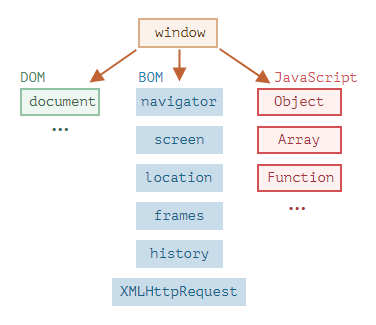

# 브라우저 환경에서의 자바스크립트

자바스크립트는 본래 웹 브라우저에서 사용하려고 만든 언어이다. 이후 진화를 거쳐 다양한 사용처와 플랫폼을 지원하는 언어로 변모했다.

자바스크립트가 돌아가는 플랫폼을 호스트라고 한다. 호스트는 브라우저, 웹서버, 심지어는 커피 머신이 될 수도 있다. 

호스트 환경에서는 랭귀지 코어에 더해 해당 호스트에만 있는 객체와 함수를 제공한다. 가령 웹브라우저는 웹페이지를 제어하기 위한 수단을 제공하고, Node.js는 서버 사이드 기능을 제공해준다. 아래 그림은 호스트 환경이 웹 브라우저일 때 모습이다.



## Window 객체

최상단에는 window라 불리는 루트 객체가 있다. window 객체는 2가지 역할을 한다.

1. 전역 객체의 역할

2. 브라우저 창을 나타내고, 이를 제어할 수 있는 메서드 제공

```javascript
function sayHi() {
  console.log('안녕하세요.');
}

// 전역 함수는 전역 객체(window)의 메서드임
window.sayHi();
```

```javascript
function sayHi() {
  console.log(`브라우저 창의 높이는 ${window.innerHeight}입니다.`);
}

window.sayHi();
// 브라우저 창의 높이는 937입니다.
```

Window의 객체가 브라우저 창을 나타내고 있으며 innerHeight의 속성의 값을 가져왔다.

## 문서 객체 모델(DOM)

문서 객체 모델(Document Object Model, DOM)은 웹 페이지 내의 모든 콘텐츠를 객체로 나타내준다.

`document` 객체는 페이지의 기본 ‘진입점’ 역할을 한다. `document` 객체를 이용해 페이지 내 그 무엇이든 변경할 수 있고, 원하는 것을 만들 수도 있다.

```javascript
document.body.style.backgroundColor = 'red';

// body 태그의 배경색이 빨간색으로 변함

const p = document.createElement('p');
p.innerHTML = '안녕하세요!';
document.body.appendChild(p);

// body 태그 안에 '안녕하세요' 라는 문자열 값을 가진 p 태그가 추가됨
```

> 스타일링을 위한 CSSOM
> 
> CSS Object Model은 JavaScript에서 CSS를 조작할 수 있는 API의 집합이다. HTML 대신 CSS가 대상인 DOM이라고 생각하면 좀 더 이해하기 쉽다.
> 
> CSSOM은 문서에 쓰이는 스타일 규칙을 수정할 때 DOM과 함께 쓰인다. 그런데 CSS 규칙은 대부분 정적이기 때문에 CSSOM을 실무에서 자주 접하지는 않는다. 자바스크립트를 이용해 CSS 규칙을 추가 혹은 제거해야 하는 경우는 극히 드물긴 하지만, 이때 CSSOM이 사용된다.

## 브라우저 객체 모델(BOM)

브라우저 객체 모델(Browser Object Model, BOM)은 문서 이외의 모든 것을 제어하기 위해 브라우저(호스트 환경)가 제공하는 추가 객체를 나타낸다. 

브라우저 객체 모델(BOM)은 문서 객체 모델(DOM)과는 달리 W3C의 표준 객체 모델은 아니다. 하지만 이 모델은 자바스크립트가 브라우저의 기능적인 요소들을 직접 제어하고 관리할 방법을 제공해 준다.

# :books:참고자료

https://ko.javascript.info/browser-environment

[코딩의 시작, TCP School](http://www.tcpschool.com/javascript/js_bom_window)
