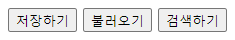

# 모던자바스크립트

## 챕터 : 이벤트 위임

캡처링과 버블링을 활용하면 강력한 이벤트 핸들링 패턴인 **이벤트 위임(event delegation)** 을 구현할 수 있다.

이벤트 위임은 비슷한 방식으로 여러 요소를 다뤄야 할 때 사용된다. 이벤트 위임을 사용하면 요소마다 핸들러를 할당하지 않고, 요소의 공통 조상에 이벤트 핸들러를 단 하나만 할당해도 여러 요소를 한꺼번에 다룰 수 있다.

### 이벤트 위임 장점

- 많은 핸들러를 할당하지 않아도 되기 때문에 초기화가 단순해지고 메모리가 절약됨
- 요소를 추가하거나 제거할 때 해당 요소에 할당된 핸들러를 추가하거나 제거할 필요가 없기 때문에 코드가 단축됨
- `innerHTML`이나 유사한 기능을 하는 스크립트로 요소 덩어리를 더하거나 뺄 수 있기 때문에 DOM 수정이 쉬워짐

### 이벤트 위임 단점

- 버블링되지 않는 이벤트에 대해서는 사용 불가
- 낮은 레벨에 할당한 핸들러엔 `event.stopPropagation()`를 쓸 수 없음

### 활용 사례

#### 선택한 부분 강조하기


위와 같은 팔괘도가 있을 때, 사용자가 선택한 부분이 강조되도록 코드를 짜려고 한다.

```js
const baguaTable = document.querySelector('#bagua-table');

let selected;

function handletheClick(e) {
  let target = e.target;
  if (target.tagName != 'TD') return;
  highLight(target);
}

function highLight(node) {
  if (selected) {
    selected.classList.remove('highlight');
  }
  selected = node;
  selected.classList.add('highlight');
}

baguaTable.addEventListener('click', handletheClick);
```

1. 팔괘도를 모두 포함하고 있는 table 태그에다가 이벤트 핸들러를 할당한다.

2. handletheClick 함수는 이벤트가 발생한 곳을 요소를 찾아 highLight 함수의 인자로 넘긴다.

3. highLight 함수는 해당 요소를 받아서 highlight 클래스를 추가하거나 제거한다. 이 때 selected 변수, 즉 기존에 선택된 요소가 있을 경우 그 요소의 클래스를 제거하고 새롭게 선택된 요소에만 클래스를 추가해준다.

여기서 핵심은 2번에서 event.target을 통해 실제로 이벤트가 일어난 곳을 찾는 부분이다.

### 여러 종류의 메뉴 구현



위와 같은 메뉴가 있을 때, 이벤트 위임을 사용하면 각각의 버튼마다 핸들러를 할당하지 않아도 된다.

```html
<div id="menu">
  <button data-action="save">저장하기</button>
  <button data-action="load">불러오기</button>
  <button data-action="search">검색하기</button>
</div>
```

```js
const menu = document.querySelector('#menu');

function handletheClick(e) {
  const action = e.target.dataset.action;
  if (action === 'save') {
    save();
  } else if (action === 'load') {
    load();
  } else {
    search();
  }
}

function save() {
  console.log('save');
}
function load() {
  console.log('load');
}
function search() {
  console.log('search');
}

menu.addEventListener('click', handletheClick);
```

원리는 팔괘도에서 이벤트가 발생한 요소만 강조한 것과 동일하다. 다른 점이 있다면 여기서는 dataset을 사용했다는 점이다.

#### dataset

HTML5 에서 새로 확장된 속성으로 HTML에 추가적인 커스텀 속성을 표시하기 위해 만들어졌다. "data-*" 어트리뷰트로 표기하며, HTML5 표준 속성처럼 접근할 수 있다.

데이터셋 속성은 다음과 같이 정의한다.

```html
 <button data-action="save">저장하기</button
```

DOM 속성으로 변환될 때 "data-" 는 제외하고 "속성명"만 실제 속성명으로 사용한다. 그러니까 여기서는 action만 속성명으로 사용되는 것이다.

#### 자바스크립트로 데이터셋 접근

DOM 생성시점에 속성을 파싱해서 "data-" 로 시작하는 속성은 표준 데이터셋 속성으로 인식한다. 이 "data-*" 속성들은 노드의 dataset 맵에 모아져 저장되며, 객체 프로퍼티 접근 방법으로 각각의 속성에 접근할 수 있다.

```js
const action = e.target.dataset.action
```

#### CSS로 데이터셋 접근

아래와 같이 CSS에서도 접근이 가능하다.

```css
button[data-action='save'] {
    background-color: red;
}
```

#### 사용상 제약사항

- 검색엔진에서 인덱싱을 하지 않음
  
  그렇기 때문에 검색엔진에 노출할 내용이나 태그에 넣어야 할 컨텐츠를 데이터셋 속성으로 표시하면 안 된다.

- 인터넷 익스플로러 10까지는 지원되지 않음

### 행동 패턴

이벤트 위임은 요소에 선언적 방식으로 '행동(behavior)'을 추가할 때 사용할 수도 있다.

행동 패턴은 두 부분으로 구성된다.

1. 요소의 행동을 설명하는 커스텀 속성을 data-set 속성을 이용해 요소에 추가합니다.
2. 문서 전체를 감지하는 핸들러가 이벤트를 추적하게 한다. 1에서 추가한 속성이 있는 요소에서 이벤트가 발생하면 작업을 수행한다.

```html
<input type="button" value="1" data-counter>
<input type="button" value="2" data-counter>
```

```js
function handletheClick(e) {
  if (e.target.dataset.counter != undefined) {
    e.target.value++;
  }
}

document.addEventListener('click', handletheClick);
```

# 참고자료

https://ko.javascript.info/event-delegation

[HTML 데이터셋(Dataset, data-*) 속성의 이해](https://blogpack.tistory.com/680)
