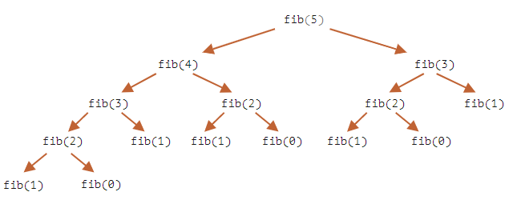

# 모던 자바스크립트

## 챕터 : 재귀와 스택

### 과제1

```js
function sumTo(n) {
  let sum = 0;
  for (let i = 1; i <= n; i++) {
    sum += i;
  }
  return sum;
}

function sumTo2(n) {
  let sum = 0;
  if (n == 1) {
    sum += n;
  } else {
    sum += sumTo2(n - 1);
  }
  return sum;
}

function sumTo3(n) {
  return (n * (n + 1)) / 2;
}
```

1. 반복문을 활용

2. 재귀 사용

3. 등차수열 공식 사용

총 3가지 방법으로 100까지의 합을 구했다. 등차수열 공식을 사용하는 경우가 제일 빠른데, 그 이유는 n에 상관없이 오직 세 개의 연산만 수행하면 되기 때문이다.

반복문을 사용하는 방법은 두 번째로 빠른데, 그 이유는 재귀를 사용할 경우 중첩 호출과 실행 스택 관리가 추가로 필요하기 때문이다.

#### 과제2

```js
function factorial(n) {
  if (n == 1) {
    return 1;
  } else {
    return n * factorial(n - 1);
  }
}
```

재귀를 활용해 팩토리얼을 구현했다.

#### 과제3

```js
function fib(n) {
  if (n == 1 || n == 2) {
    return 1;
  } else {
    return fib(n - 1) + fib(n - 2);
  }
}
```

맨 처음에는 당연히 재귀를 써야하는줄 알고 재귀로 문제를 해결하려고 했다. 그런데 fib(77)을 구하려고 하자 엔진이 멈춰버리는 현상이 발생했다. 그 이유는 함수 호출 도중에 수많은 서브 호출이 일어나기 때문이다.

재귀 트리를 직접 살펴보자.



트리로 보면 좀 더 명확하게 문제를 확인할 수 있다. fib(3)은 두 곳에서 독립적으로 호출되고 평가된다. fib(2)는 총 3번이, fib(1)은 총 5번 호출되고 평가되는 것을 확인할 수 있다. n이 5밖에 되지 않았는데 연산 횟수가 이 정도로 늘어나게 되면, n이 77이 된다면 엄청난 수의 연산이 일어나게 된다.

이 문제는 이미 평가된 값을 어딘가에 저장해놓는 방식이나 반복문을 기반으로 하는 알고리즘을 통해 최적화가 가능하다.

```js
function fib(n) {
  let a = 1;
  let b = 1;
  for (let i = 3; i <= n; i++) {
    let c = a + b;
    a = b;
    b = c;
  }
  return b;
}
```

#### 과제4

```js
let list = {
  value: 1,
  next: {
    value: 2,
    next: {
      value: 3,
      next: {
        value: 4,
        next: null,
      },
    },
  },
};

function printList(list) {
  let tmp = list;
  while (tmp) {
    console.log(tmp.value);
    tmp = tmp.next;
  }
}
```

먼저 반복문을 통해 단일 연결 리스트의 값을 출력했다. 

```js
function printList(list) {
  console.log(list.value);
  if (list.next) {
    printList(list.next);
  }
}
```

같은 결과를 출력하지만 이번에는 재귀를 사용했다. 반복문을 사용하면 중첩 함수를 호출하지 않기 때문에 추가적인 리소스를 사용하지 않는다. 다만 재귀를 사용하면 코드를 좀 더 직관적으로 작성할 수 있다는 장점이 있다.

#### 과제5

```js
function printReverseList(li) {
  if (li.next) {
    console.log(li.next);
    printReverseList(li.next);
  }
  console.log(li.value);
}
```

실행 컨텍스트와 스택에 대한 이해가 있어야 한다.

## :bulb:Tip - 실행 컨텍스트와 스택

실행 중인 함수의 실행 절차에 대한 정보는 해당 함수의 **실행 컨텍스트(execution context)** 에 저장된다.

실행 컨텍스트는 함수 실행에 대한 세부 정보를 담고 있는 내부 데이터 구조이다. 제어 흐름의 현재 위치, 변수의 현재 값, `this`의 값(여기선 다루지 않음) 등 상세 내부 정보가 실행 컨텍스트에 저장된다. 함수 호출 1 회당 정확히 하나의 실행 컨텍스트가 생성된다.

함수 내부에 중첩 호출이 있을 때는 아래와 같은 절차가 수행된다.

- 현재 함수의 실행이 일시 중지된다.
- 중지된 함수와 연관된 실행 컨텍스트는 **실행 컨텍스트 스택(execution context stack)**이라는 특별한 자료 구조에 저장된다.
- 중첩 호출이 실행된다.
- 중첩 호출 실행이 끝난 이후 실행 컨텍스트 스택에서 일시 중단한 함수의 실행 컨텍스트를 꺼내오고, 중단한 함수의 실행을 다시 이어간다.

___

위에서 알아본 내용을 바탕으로 실행 과정을 순서대로 작성해보자.

| 실행 컨텍스트 스택                             | 결과           |
| -------------------------------------- | ------------ |
| printReverseList({value:4, next:null}) | 4 출력(순서 : 1) |
| printReverseList({value:3, next:..})   | 3 출력(순서 : 2) |
| printReverseList({value:2, next:..})   | 2 출력(순서 : 3) |
| printReverseList({value:1, next:..})   | 1 출력(순서 : 4) |

next가 null일 때까지 if절에서 분기되어 printReverseList(li.next)를 실행하고, 실행 중이던 printReverseList(li)는 일시중지되어 실행 컨텍스트 스택에 쌓이게 된다.

최종적인 모습은 위와 같고, 마지막에 next가 null일 때 if절을 지나쳐 바로 4가 출력된다. 그 다음에 일시중지되었던 printReverseList({value:3, next:...}) 가 재실행되고, 이 때 이미 4가 출력되고 if 절을 지나친 상태이기 때문에 console.log(li.value) 만 실행이 된다. 그러면 3이 출력되고, 같은 원리로 2와 1이 출력되어 연결 리스트의 값을 역순으로 출력할 수 있게 된다.

```js
function printReverseList(li) {
  let arr = [];
  let tmp = li;
  while (tmp) {
    arr.push(tmp.value);
    tmp = tmp.next;
  }
  for (let i = arr.length - 1; 0 <= i; i--) {
    console.log(arr[i]);
  }
}
```

이번에는 반복문을 통해 연결 리스트의 값을 역순으로 출력했다. 연결 리스트를 직접 역순으로 출력한 것이 아니라 연결 리스트의 값을 새로운 배열에다가 넣고 그 배열을 역순으로 출력한 것이다.

# :books:참고자료

https://ko.javascript.info/recursion
