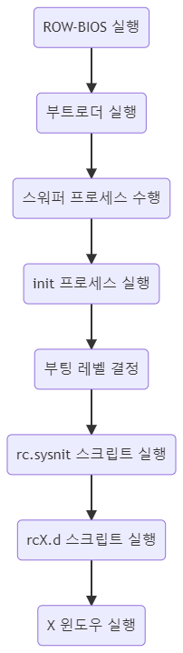
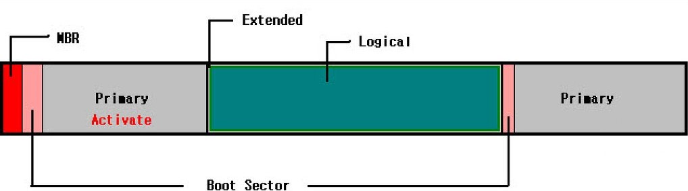

# PART 2-3 부트 매니저

## 리눅스 부팅 과정

## 1. 부트로더

### 1. 부트로더 기능

- 부트스트랩 로더의 준말로 디스크나 플래시에 저장된 운영체제를 읽어 주기억장치에 적재해주는 프로그램
- 부트로더는 커널이 시동되기 전에 필요한 작업들을 모두 마무리하고 최종적으로 운영체제를 시동시키는 프로그램
- 임베디드 시스템 부트로더란 PC의 BIOS와 OS Loader의 기능을 수행하는 프로그램으로 가장 먼저 실행됨
- 운영체제 실행에 필요한 환경을 설정, 운영체제 이미지를 메모리에 복사
- 부트매니저라고도 불리며 크기가 512MB로 하드디스크 첫 번째 섹터인 MBR에 위치
- MBR은 부트 매니저 프로그램과 파티션 정보를 저장
- 주 파티션마다 부트 섹터가 할당된다.
- 부트 섹터는 디스크의 다른 부분에 저장되는 부팅 프로그램을 담을 수 있는 하드디스크, 플로피 디스크 또는 비슷한 기억 장치의 디스크를 뜻함
- 분할된 주 파티션들은 자신의 부트 레코드를 MBR에 기록하여 실행한다.
- 한 컴퓨터에 다수의 운영체제가 있을 경우 작업 운영체제를 선택하여 부팅할 수 있게 한다.

### 2. GRUB(GRand Unified Bootloader)

- 리눅스의 전통적인 부트로더로 사용되어 왔던 LILO의 단점을 보완
- 부트 정보를 사용자가 임의로 변경할 수 있어, 부트 정보가 올바르지 않더라도 부팅 시 바로 수정하여 부팅할 수 있다.
- 다른 운영체제와 멀티부팅할 수 있다.
- 대화형 설정이므로 커널의 경로와 파일 이름만 알면 부팅할 수 있다.
- 메뉴 인터페이스 환경을 지원하며, 대화명 모드로 부트 정보를 설정할 수 있다.
- 하드디스크상에서 커널의 물리적 위치를 기록하지 않아도 커널이 위치한 파티션과 커널 이미지 파일명만 알고 있으면 부팅이 가능

### 

## 2. 런레벨

- 리눅스 부팅 시 작동하는 서비스들이 있는데, 런레벨 설정에 따라 서비스들을 조정 가능하다.
- 리눅스 부팅의 마지막 단계에서 모든 프로세스의 부모 프로세스인 init이 생성된다.
- 프로세스 init이 참조하는 것이 런레벨로, 런레벨은 init이 수행해야 할 일련의 처리 방법이다.
- 런레벨은 0에서 6까지 총 7가지이다.
- 최근 배포판에서는 GUI에 의한 다중 사용자 모드인 런레벨 5가 기본값으로 사용된다.

## 3. 로그인과 로그아웃

### 1. 로그인

- 리눅스는 X 윈도우상에서의 로그인/로그아웃과 콘솔상에서의 로그인/로그아웃이 있다.
- X윈도우란 그래픽 환경 기반의 시스템 소프트웨어를 뜻한다.
- 로그인 과정 
  - 입력한 패스워드와 파일 /etc/password 필드를 비교
  - 셸 설정 파일을 실행
  - 로그인 셸을 실행

### 2. 로그아웃

- 로그아웃은 logout, exit 또는 조합키(ctrl+D)를 사용한다.
- 관리자는 일정 시간 동안 작업을 수행하지 않는 모든 사용자들을 강제로 로그아웃할 수 있다.
