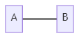
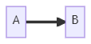
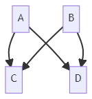

#  Mermaid 사용법

마크다운으로 공부한 내용들을 정리할 때 그래프가 필요한 적이 많았는데,

그때마다 직접 그리거나 인터넷에서 찾아 이미지 파일로 첨부하는 게 상당히 번거로웠다.

그래서 구글링을 해보니 javascript를 기반으로 하는 그래프 작성 툴인 Mermaid를 찾을 수 있었다.


Flowchart, Sequence diagram, Gantt diagram, Class diagram 등 다양한 그래프들을 그릴 수 있지만,

실제로 사용해보니 Flowchart만 사용하게 되는 것 같다.

Flowchart만 제대로 사용해도 웬만한 그래프는 다 작성할 수 있기 때문에 Flowchart에 대해서 좀 더 자세히 알아보자.


## Flowchart

```
flowchart LR or graph LR
	left-->right
```


위의 예시가 가장 기본적인 형태이다.

먼저 Flowchart의 방향을 설정해주고 노드들을 연결시켜 Flowchart를 완성시킨다.

flowchart 대신 graph를 사용할 수도 있다.

설정할 수 있는 방향은 다음과 같다.

- TB - top to bottom
- TD - top-down/ same as top to bottom
- BT - bottom to top
- RL - right to left
- LR - left to right


## Node shapes

노드들의 모양도 설정할 수 있다.

### A node with round edges

```
flowchart LR
    id1(This is the text in the box)
```


### A stadium-shaped node

```
flowchart LR
    id1([This is the text in the box])
```


### A node in a subroutine shape

```
flowchart LR
    id1[[This is the text in the box]]
```


### A node in a cylindrical shape

```
flowchart LR
    id1[(Database)]
```


### A node in the form of a circle

```
flowchart LR
    id1((This is the text in the circle))
```


### A node in an asymmetric shape

```
flowchart LR
    id1>This is the text in the box]
```


### A node (rhombus)

```
flowchart LR
    id1{This is the text in the box}
```


### A hexagon node

```
flowchart LR
    id1{{This is the text in the box}}
```


### Parallelogram

```
flowchart TD
    id1[/This is the text in the box/]
```


### Parallelogram alt

```
flowchart TD
    id1[\This is the text in the box\]
```


### Trapezoid

```
flowchart TD
    A[/Christmas\]
```


### Trapezoid alt

```
flowchart TD
    B[\Go shopping/]
```


## Links between nodes

노드들을 연결하는 연결선들도 원하는 대로 설정 가능하다.

### A link with arrow head

```
flowchart LR
    A-->B
```


### An open link

```
flowchart LR
    A --- B
```



### Text on links

```
flowchart LR
    A-- This is the text ---B
```

```
flowchart LR
    A---|This is the text|B
```


### Dotted link

```
flowchart LR;
   A-.->B;
```


### Thick link

```
flowchart LR
   A ==> B
```



### Chaining of links

머메이드는 노드들을 다양하게 연결할 수 있는 방법들을 제공한다.

```
flowchart LR
   A --> B --> C
```


```
flowchart LR
   a --> b & c--> d
```


```
flowchart TB
    A & B--> C & D
```



마크다운으로 정리한 파일을 깃허브에다가 매일매일 올리고 있는데,

아쉽게도 깃허브에서는 머메이드를 자동으로 렌더링해주는 기능이 없다고 한다.

그래서 [Mermaid Live Editor](https://mermaid-js.github.io/mermaid-live-editor)에서 작성을 한 후 이미지 파일로 저장해 첨부하고 있다.

이전에 구글링하면서 내가 딱 원하는 형태의 그래프를 찾는 것보다는 빨라졌지만 깃허브에서도 동작할 수 있도록 하는 방법을 찾아봐야겠다.


# :books:참고자료

https://mermaid-js.github.io/mermaid/#/
