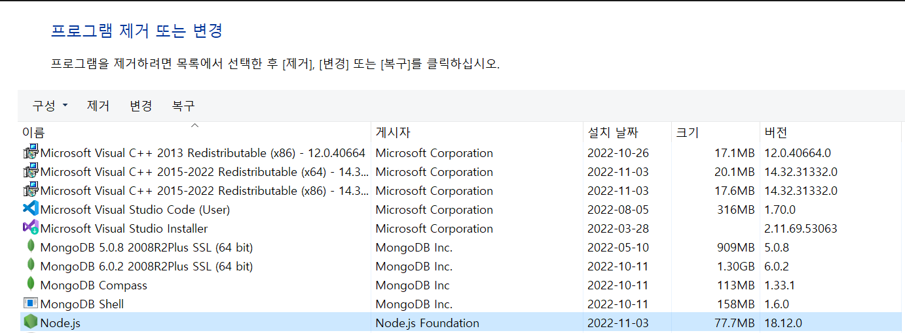
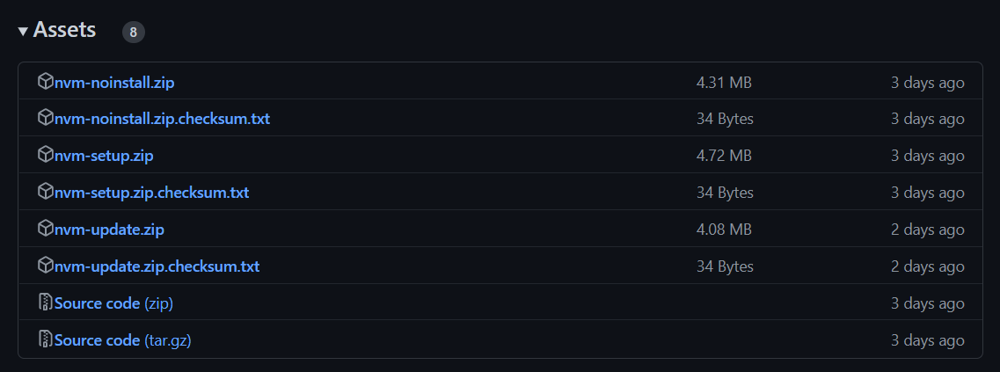
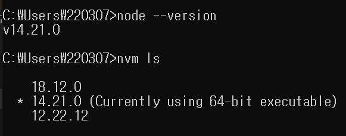

# Node.js

## Node.js와 nvm 재설치하기

회사에서 만든 IDE를 설치하려고 했는데, **node.js**가 설치되지 않았다는 경고문이 나왔다. 그래서 **node.js**가 정상적으로 설치되었는지 확인하기 위해 두 가지 작업을 진행했다.

- 터미널에서 **node** 명령어 실행
- 제어판에서 **node.js**가 설치되어있는지 확인

터미널에서는 명령어가 정상적으로 실행되는데, 제어판에서는 설치된 **node.js** 를 확인할 수가 없었다. 어떤 문제인지 확신이 서지 않아 **node.js** 와 **nvm**을 삭제하고 다시 설치하기로 결정했다.

## Node.js 재설치

사실 **windows**에서 **node.js**를 삭제하는 건 간단하다. 아래와 같이 제어판에서 프로그램 삭제를 진행해주면 되는데, 나는 제어판에서 확인을 할 수가 없는 상황이었기 때문에 설치된 폴더를 찾아 삭제해주었다. 참고로 기본 경로는 `C:\Program Files\nodejs\`이다.

무언가를 삭제하거나 설치할 때마다 **windows**가 가장 사용자 친화적인 운영체제라는 생각이 든다. 다른 운영체제들은 대부분 **CLI**를 통해 설치를 해야하는데 반해 **windows**는 **installer**를 다운받아 설치를 진행할 수 있기 때문이다. **node.js** 설치는 아래의 링크에서 **installer**를 받아 진행하면 되고, **LTS** 버전이 가장 안정적이기 때문에 **LTS** 버전을 받는 것이 좋다.

> https://nodejs.org/ko/download/

## nvm(nvm-windows) 재설치

먼저 **nvm** 재설치는 아래의 **nvm-windows**를 설치했다는 가정 하에 설명하겠다.

> https://github.com/coreybutler/nvm-windows

사실 **nvm** 자체가 **mac/Linux**를 위해 만들어진 것으로, **windows**에서 사용할 수가 없다. **nvm-windows**를 처음 봤을 때 **nvm**을 **windows**에 맞춘 단순한 클론인줄 알았는데 설명을 읽다보니 **windows** 유저들을 위해 만들어진 또 하나의 버전 매니저임을 알 수 있었다. 

이제 재설치를 진행하기 위해 **nvm-windows**를 삭제해보겠다. **nvm-windows**를 삭제하기 위해서는 아래 경로에서 `unins000`을 실행시켜주면 된다.

> C:\Users\사용자 이름\AppData\Roaming\nvm

다행히 nvm-windows도 installer를 제공하고 있기 때문에 설치를 위해서는 installer만 다운받으면 된다.

> https://github.com/coreybutler/nvm-windows/releases

위의 링크에서 가장 최신 버전의 **Assets**에서 **setup.zip**을 받아 압축을 풀고 **nvm-setup.exe**를 실행시켜주면 된다.

## 😃실행 화면

	

정상적으로 실행된다! 참고로 최근에는 대부분의 installer에서 마지막 단계에 환경 변수 등록 옵션이 있기 때문에 따로 환경 변수를 등록하지는 않았다. 혹시라도 위의 과정을 모두 진행했는데도 터미널에서 명령어가 실행되지 않는다면 환경 변수 등록 여부를 체크해보자.
