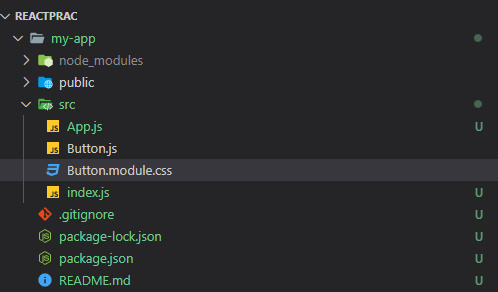
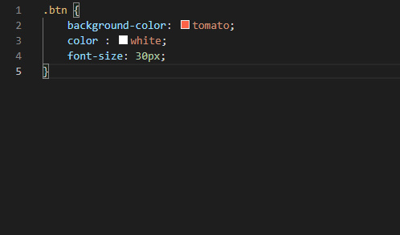
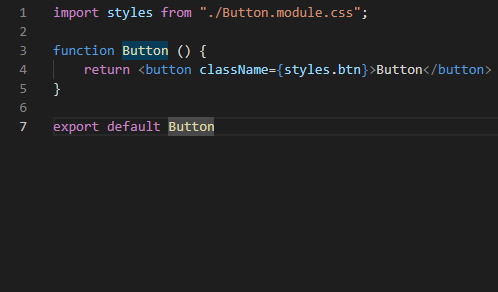
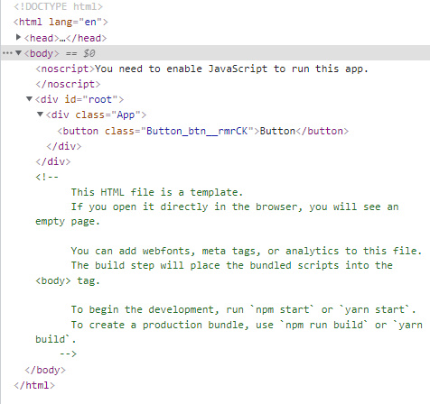

# React

## CSS MODULE

CRA에서 css를 적용하는 방법은 두 가지가 있다.

먼저 전통적인 방법으로 css를 별도의 파일로 저장하고 html의 link 태그를 이용해 적용하는 방법이 있다.

하지만 react는 컴포넌트 아키텍처를 사용하기 때문에 각각의 컴포넌트가 독립성을 가져야 한다.

기존의 방법으로 css파일을 만들어 연결시키면 css파일이 전역에 적용되기 때문에 각 컴포넌트에 동일한 css 가 적용된다.

이렇게 되면 각 컴포넌트마다 다른 css를 적용시킬 수 없기 때문에 컴포넌트 아키텍처를 사용하는 의미가 없어진다.

이에 대한 해결책이 바로 css module이다.

css module 파일을 만들 때는 css 파일의 이름을 (적용하려는 컴포넌트 이름).module.css 으로 작성하면 된다.

만약 Button이라는 컴포넌트에 대한 css파일을 만들려면 아래와 같이 만들면 된다.

    

그 다음에 아래와 같이 Button.module.css에 기존 css 파일과 같이 작성한다.

아래 파일은 btn이라는 클래스에다가 해당 css를 적용하겠다는 의미이다.

    

그리고 컴포넌트에 css 파일을 적용하는 방법은 아래와 같다.

기존과 같이 문자열로 클래스 이름을 적지 않는 이유는 create-react-app은 css 코드를 자바스크립트 오브젝트로 변환시켜주기 때문이다.

아까 작성한 btn 클래스에 대한 내용은 이 자바스크립트 오브젝트 안에 들어가게 되는 것이다.

    

브라우저에서 확인해보면 실제로 작성한 클래스 이름과 다르게 클래스 이름이 무작위로 생성된 걸 확인할 수 있다.

이는 다른 css 파일에서도 동일한 클래스 이름을 사용할 수 있음을 뜻한다.

그러니까 각각의 컴포넌트마다 css 파일을 다르게 적용시킬 수 있으므로 컴포넌트들이 독립적인 형태로 존재하게 되는 것이다.

    

노마드코더의 니콜라스 선생님이 늘 분할 정복이라는 말을 슬로건처럼 이야기하시는데,

분할 정복은 여러 알고리즘의 기본이 되는 해결방법으로,

기본적으로는 크고 방대한 문제를 용이하게 풀 수 있는 단위로 나눈 후 다시 합쳐서 해결하자는 개념이다.

css module로 각 컴포넌트의 독립성을 갖추는 방법을 배우면서 분할 정복이라는 개념을 조금이지만 몸소 느낄 수 있었다.

앞으로 프로젝트가 얼마나 커지든, 해결해야할 문제가 얼마나 복잡하든 항상 분할 정복을 생각하며 차근차근 해결해나가야겠다.

# :books:참고자료

https://velog.io/@kwonh/React-CSS%EB%A5%BC-%EC%9E%91%EC%84%B1%ED%95%98%EB%8A%94-%EB%B0%A9%EB%B2%95%EB%93%A4-css-module-sass-css-in-js

노마드코더 강의
