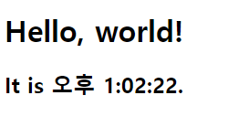
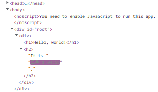

# React

React 공식 문서를 보며 실습한 내용을 기록으로 남긴다. 실습 환경은 CRA로 만든 React 애플리케이션에 진행했음을 미리 밝힌다.

## Docs - 엘리먼트 렌더링

엘리먼트는 React 애플리케이션을 이루는 가장 작은 단위이다. 엘리먼트는 화면에 표시할 내용을 기술한다.

```jsx
const element = <h1>Hello, world</h1>;
```

브라우저 DOM 엘리먼트와 달리 React 엘리먼트는 일반 객체이며 쉽게 생성할 수 있다. React DOM은 React 엘리먼트와 일치하도록 DOM을 업데이트한다.

### DOM에 엘리먼트 렌더링하기

HTML 파일 어딘가에 `<div>`가 있다고 가정해 보자.

```html
<div id="root"></div>
```

이 안에 들어가는 모든 엘리먼트를 React DOM에서 관리하기 때문에 이것을 “루트(root)” DOM 노드라고 부른다.

```react
// index.js

import React from 'react'
import ReactDOM from 'react-dom/client'

const element = <h1>Hello, world</h1>

const root = ReactDOM.createRoot(document.getElementById('root'))
root.render(element)
```

CRA를 통해 애플리케이션을 만들면 index.js 파일에 루트 DOM 노드가 만들어져 있다. 엘리먼트들을 루트 DOM 노드에 렌더링하기 위해서는 render 메서드의 인자로 엘리먼트들을 전달해주면 된다.

### 렌더링된 엘리먼트 업데이트하기

React 엘리먼트는 불변 객체이다. 엘리먼트를 생성한 이후에는 해당 엘리먼트의 자식이나 속성을 변경할 수 없다. UI를 업데이트하기 위한 가장 기본적인 방법은 새로운 엘리먼트를 생성하고 ReactDOM.render() 로 전달하는 것이다.

```js
const root = ReactDOM.createRoot(document.getElementById('root'))

function tick() {
  const element = (
    <div>
      <h1>Hello, world!</h1>
      <h2>It is {new Date().toLocaleTimeString()}.</h2>
    </div>
  )

  root.render(element)
}

setInterval(tick, 1000)
```

	

 코드를 실행시켜보면 시간이 1초마다 업데이트되는 것을 확인할 수 있다. 

	

그런데 개발자 도구에서 살펴보면 시간 부분만 업데이트되는 걸 확인할 수 있다. 우리는 분명 전체 엘리먼트를 다시 렌더링하는 로직을 작성했는데 왜 특정 부분만 업데이트가 되는 걸까?

그 이유는 ReactDOM은 렌더링한 엘리먼트와 그 자식 엘리먼트를 이전의 엘리먼트와 비교하고 DOM 을 원하는 상태로 만드는데 필요한 경우에만 DOM을 업데이트한다. 그러니까 여기서는 시간을 나타내는 문자열만 바꿔주면 원하는 DOM을 얻을 수 있기 때문에 시간 부분만 업데이트가 된 것이다.

# :books:참고자료

https://ko.reactjs.org/docs/rendering-elements.html