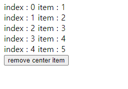
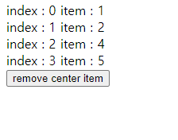

# React

React 공식 문서를 보며 실습한 내용을 기록으로 남긴다. 실습 환경은 CRA로 만든 React 애플리케이션에 진행했음을 미리 밝힌다. 이번 문서의 예시에서 App 컴포넌트가 계속 등장할텐데, CRA의 프로젝트의 최상위 컴포넌트이기도 한 App 컴포넌트는 최종적으로 렌더링되는 컴포넌트라고 생각하면 된다.

## Docs - Key

Key는 React가 어떤 항목을 변경, 추가 또는 삭제할지 식별하는 것을 돕는다. key는 엘리먼트에 안정적인 고유성을 부여하기 위해 배열 내부의 엘리먼트에 지정해야 한다.

Key를 선택하는 가장 좋은 방법은 리스트의 다른 항목들 사이에서 해당 항목을 고유하게 식별할 수 있는 문자열을 사용하는 것이다. 대부분의 경우 데이터의 ID를 key로 사용한다.

렌더링 한 항목에 대한 안정적인 ID가 없다면 최후의 수단으로 항목의 인덱스를 key로 사용할 수 있다. 항목의 순서가 바뀔 수 있는 경우 key에 인덱스를 사용하는 것은 권장하지 않는다. 이로 인해 성능이 저하되거나 컴포넌트의 state와 관련된 문제가 발생할 수 있다.

## :bulb:Tip - Index as a key is an anti-pattern

Robin Pokorny’s가 작성한 글을 일부 해석했다.

React에서 Key는 DOM 엘리먼트의 유일한 식별자이다. 만약 리스트 중간에 새로운 아이템을 넣거나 삭제해버리면 어떤 일이 일어나게 될까? DOM이 갱신되었을때, Key가 이전과 동일한 경우 React는 DOM 엘리먼트가 이전과 동일한 요소를 나타낸다고 추론한다. 하지만 인덱스를 key로 사용한다면 React의 추론은 틀린 것이 된다.

```jsx
function App() {
	const [list, setList] = useState([1, 2, 3, 4, 5])
	const handleBtnClick = () => {
		setList([1, 2, 4, 5])
	}
	return (
		<div>
			{list.map((item, index) => {
				return (
					<div key={index}>
						{`index : ${index} `}
						{`item : ${item}`}
					</div>
				)
			})}
			<button onClick={handleBtnClick}>remove center item</button>
		</div>
	)
```

위의 예시는 리스트 중간에 아이템이 삭제되었을 경우 어떤 일이 발생하는지 알아보기 위해 만들었다.

**버튼 누르기 전**

	

**버튼 누른 후**

	

가운데 요소가 사라지고 이제 인덱스는 갱신되기 전과 동일한 요소를 가리키고 있지 않다. 

1. 리스트와 요소가 static할 때
2. 요소의 id가 없을 때
3. 리스트가 절대 재정렬되거나 필터링되지 않을 때

위의 세 조건을 만족한다면 index를 key로 써도 안전하지만 이렇게 매우 한정적인 경우를 제외하고는 문제가 발생할 가능성이 크기 때문에 가능하다면 key는 유일한 값을 사용하는 것이 좋다.

### Key로 컴포넌트 추출하기

키는 주변 배열의 context에서만 의미가 있다. 예를 들어 `ListItem` 컴포넌트를 추출한 경우 `ListItem` 안에 있는 `<li>` 엘리먼트가 아니라 배열의 `<ListItem />` 엘리먼트가 key를 가져야 한다. 예시를 살펴보자.

```jsx
function ListItem(props) {
  return <li>{props.value}</li>;
}

function NumberList(props) {
  const numbers = props.numbers;
  const listItems = numbers.map((number) =>
    // 컴포넌트로 추출했기 때문에 ListItem 컴포넌트에 key를 지정해야 한다.
    <ListItem key={number.toString()} value={number} />
  );
  return (
    <ul>
      {listItems}
    </ul>
  );
}
```

### Key는 형제 사이에서만 고유한 값이어야 한다.

Key는 배열 안에서 형제 사이에서 고유해야 하고 전체 범위에서 고유할 필요는 없다. 두 개의 다른 배열을 만들 때 동일한 key를 사용할 수 있다.

# :books:참고자료

https://ko.reactjs.org/docs/lists-and-keys.html

https://robinpokorny.medium.com/index-as-a-key-is-an-anti-pattern-e0349aece318