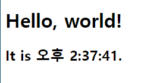
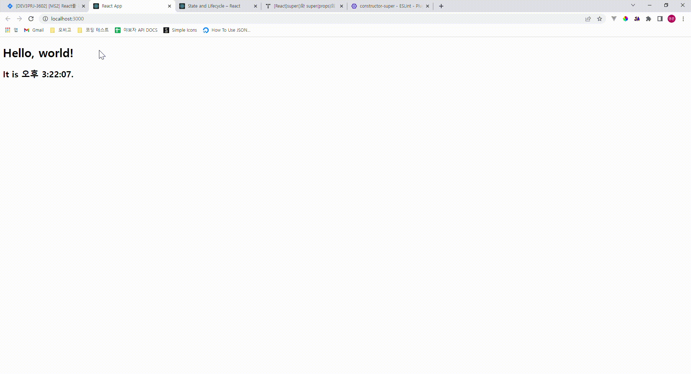

# React

React 공식 문서를 보며 실습한 내용을 기록으로 남긴다. 실습 환경은 CRA로 만든 React 애플리케이션에 진행했음을 미리 밝힌다.

## Docs - State와 생명주기

```react
import React from 'react'
import ReactDOM from 'react-dom/client'

const root = ReactDOM.createRoot(document.getElementById('root'))

function Clock(props) {
  return (
    <div>
      <h1>Hello, world!</h1>
      <h2>It is {props.date.toLocaleTimeString()}.</h2>
    </div>
  );
}

function tick() {
  root.render(<Clock data={new Date()} />)
}

setInterval(tick, 1000)
```

UI를 업데이트하는 가장 기본적인 방법은 컴포넌트를 다시 렌더링하는 것이다. 위 코드를 실행하면 시계 컴포넌트가 1초마다 다시 렌더링되면서 실제 시계처럼 동작하는 것을 확인할 수 있다.

하지만 이 방법은 업데이트를 일으키는 주체가 시계 컴포넌트가 아닌 setInterval 함수라는 점에서 문제가 있다. 시계 컴포넌트가 시간 데이터를 자체적으로 업데이트해서 UI를 매초 업데이트할 수 있도록 하는 것이 이상적인 방법이다. 이를 위해서는 시계 컴포넌트에 `state`를 추가해야 한다.

### 함수에서 클래스로 변환

state를 사용하기 위해 함수형 컴포넌트에서 클래스 컴포넌트로 변환시켜보자. 물론 지금은 React hook으로 인해 함수형 컴포넌트에서 state를 정의할 수 있지만, 그래도 여전히 클래스 컴포넌트를 사용하는 기업들도 있기 때문에 알아둬서 나쁠 건 없다.

```react
class Clock extends React.Component {
  render() {
    return (
      <div>
        <h1>Hello, world!</h1>
        <h2>It is {this.props.date.toLocaleTimeString()}.</h2>
      </div>
    );
  }
}
```

함수 컴포넌트와 차이점이 있다면,

1. 렌더링할 JSX를 render 라는 메서드 안의 return 값으로 적어준다.
2. props -> this.props로 바꿔준다.

이제 시계 컴포넌트는 함수가 아닌 클래스로 정의된다. `render` 메서드는 업데이트가 발생할 때마다 호출되지만, 같은 DOM 노드로 `<Clock />`을 렌더링하는 경우 `Clock` 클래스의 단일 인스턴스만 사용된다. 이것은 로컬 state와 생명주기 메서드와 같은 부가적인 기능을 사용할 수 있게 해준다.

### 클래스에 로컬 state 추가하기

```react
class Clock extends React.Component {
  constructor(props) {
    super(props);
    this.state = {date: new Date()};
  }

  render() {
    return (
      <div>
        <h1>Hello, world!</h1>
        <h2>It is {this.state.date.toLocaleTimeString()}.</h2>
      </div>
    );
  }
}

function tick() {
  root.render(<Clock />)
}

setInterval(tick, 1000)
```

공식문서를 그대로 따라오다가, 여기서 멈칫하게 되었다. 로컬 state의 초기값을 설정하기 위해 constructor 메서드를 사용하고 있었는데, 그 위에 있는 super 메서드가 눈에 걸렸다.

## :bulb:Tip - super()란?

super 메서드는 부모 클래스의 생성자를 참조한다는 의미로, 여기서는 React.Component를 의미한다. 나는 props의 초기값을 세팅해주기 위해 super 메서드를 사용하는구나! 하고 넘어가려고 했지만,

```react
const root = ReactDOM.createRoot(document.getElementById('root'))

class Clock extends React.Component {
  render() {
    return (
      <div>
        <h1>Hello, world!</h1>
        <h2>It is {this.props.date.toLocaleTimeString()}.</h2>
      </div>
    )
  }
}

root.render(<Clock date={new Date()} />)
```

	

위 코드가 정상적으로 렌더링되는 것을 보고 super(props) 코드가 없어도 this.props에 바로 접근할 수 있다는 것을 알게 되었다. 그럼 super()는 대체 왜 사용되는 것일까?

### super()을 사용하는 이유

Javascript에서는 super()을 선언하기 전까지 constructor() 안에서 this 키워드를 사용할 수 없다. 다음 코드를 살펴보자.

```js
class ParentCompnent {
  constructor(age) {
    this.age = age
  }
}

class ChildCompnent extends ParentComponent {
  constructor(age) {
    this.printAge()
    super(age)
  }
  printAge() {
    console.log(`I'm ${this.age} years old.`)
  }
}
```

자식 컴포넌트에서 age의 값이 정의되기도 전에 console.log에 의해 age가 호출되고 있다. 이런 경우를 방지하기 위해서 Javascript는 super() 이후에 this를 사용할 수 있도록 하는 것이다.

> Constructors of derived classes must call `super()`. Constructors of non derived classes must not call `super()`. If this is not observed, the JavaScript engine will raise a runtime error

추가로 설명하자면 derived classes, 그러니까 파생된 클래스들에서만 super()을 먼저 호출해야 한다. 파생된 클래스가 아니면 super()을 호출해서는 안된다. 

### super()에 props를 전달하는 이유

이제 왜 super()을 사용하는지에 대해서는 알게 되었다. 그런데 여전히 props를 초기화하지 않았는데도 this.props에 접근할 수 있다는 건 이해가 되지 않았다.

그에 대한 해답은 React에 있었다. 이전에 다른 프레임워크들을 공부하면서도 느꼈는데, 프레임워크를 만드는 사람들은 사람이라는 존재가 실수로 이루어졌다는 점을 잘 아는 것 같다. React는 멍청한 우리가 혹시라도 props를 세팅하지 않을 것에 대비해 constructior 호출 후에 props 속성을 자동으로 세팅해준다.

자, 마지막 질문만이 남았다. React가 알아서 props를 세팅해준다면, super()만 적어도 되지 않을까? 그럼에도 props를 굳이 전달하는 이유는 생성자 안에서 props에 접근하기 위해서이다.

___

잠깐 이야기가 샜는데, 다시 하던 일을 상기시켜보자. 우리는 자체적으로 시간을 업데이트하는 시계 컴포넌트를 만들고 있었다. 이를 위해서는 로컬 state가 필요했고, 로컬 state를 사용하기 위해서 함수형 컴포넌트에서 Class형 컴포넌트로 전환하던 중이었다. 

### 생명주기 메서드 추가

이제 시계 컴포넌트가 DOM에 렌더링될 때마다 매초 date state에 새로운 Date 객체의 값을 전달해주는 메서드를 추가하려고 한다. DOM에 렌더링되는 것을 React에서는 mount라고 하고, mount 될 때 특정 코드를 실행시켜주는 componentDidMount라는 생명주기 메서드가 존재한다.

```react
class Clock extends React.Component {
  constructor(props) {
    super(props)
    this.state = { date: new Date() }
  }
  componentDidMount() {
      setInterval(() => this.setState({ date: new Date() }), 1000)
  }
  render() {
    return (
      <div>
        <h1>Hello, world!</h1>
        <h2>It is {this.state.date.toLocaleTimeString()}.</h2>
      </div>
    )
  }
}
```

1. 먼저 `<Clock />`컴포넌트가 render() 메서드로 전달되면 React는 Clock 컴포넌트의 constructor을 호출한다.   constructor 메서드에서는 date라는 로컬 state에 Date 생성자로 만든 객체를 할당한다.
2. 시계 컴포넌트가 DOM에 렌더링될 때 componentDidMount 메서드가 실행되며, setInterval 함수가 매초마다 date state의 값을 새로운 Date 객체로 갱신한다. 



정상적으로 작동한다! 지금은 시계 컴포넌트 하나뿐이지만 많은 컴포넌트들이 있을 때는 컴포넌트가 삭제될 때 해당 컴포넌트가 사용 중이던 리소스를 확보하는 것이 중요하다.

따라서 DOM에서 컴포넌트가 삭제될 때마다 실행되는 componentWillUnmount에 setInterval를 해제하는 코드를 작성하면 좋다.

> SetInterval() returns an interval ID which uniquely identifies the interval, so you can remove it later by calling [`clearInterval()`](https://developer.mozilla.org/en-US/docs/Web/API/clearInterval).

SetInterval 함수는 interval을 구별할 수 있는 ID를 반환하는데, clearInterval에 이 ID를 전달하는 것으로 interval을 삭제할 수 있다.

```js
componentDidMount() {
	this.timerID = setInterval(() => this.setState({ date: new Date() }), 1000)
}
componentWillUnmount() {
    clearInterval(this.timerID)
}
```

## 🚀심화 학습

위 내용을 어느 정도 이해했다 싶으면 state에 대해서 더 알아보자.

### [State 올바르게 사용하기](./React_docs_stateCorrect.md)

# :books:참고자료

https://eslint.org/docs/rules/constructor-super

https://developer-talk.tistory.com/136