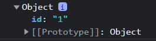

# React

## react-router-dom

아래 작성된 내용은 react-router-dom 6.4.5 버전을 토대로 작성되었다.

### useParams

useParams hook은 dynamic params의 객체를 반환한다. 가령 특정 페이지의 url이 `/detail/:id`일 때, id가 1인 페이지로 이동한다고 가정해보자. 그러면 useParams는 아래와 같은 객체를 반환한다.

	

# :books:참고자료

