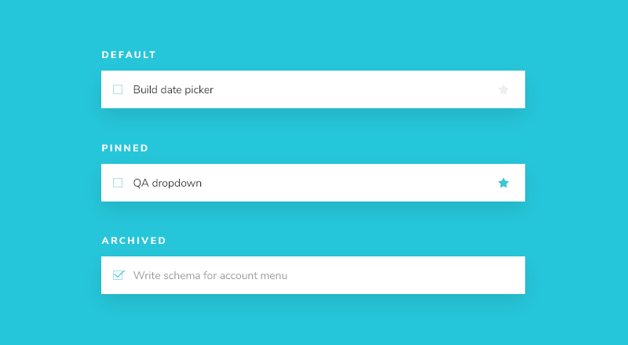
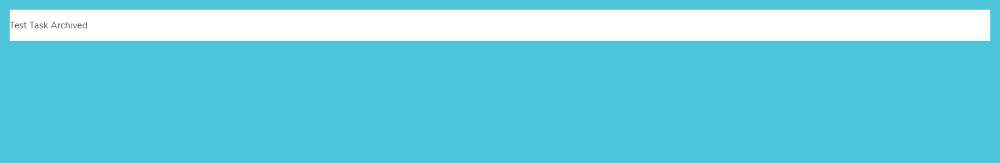

# Storybook

## 개요

Storybook은 UI 개발을 위한 도구로 컴포넌트를 분리해서 개발을 더 빠르고 쉽게 한다. 이렇게 하면 한 번에 컴포넌트 하나에 대해서만 작업할 수 있다. 따라서 개발 모드로 실행해 화면을 확인하거나 특정 데이터를 데이터베이스에 강제로 넣을 필요 없이 전체 UI를 개발할 수 있다.

## 튜토리얼

https://storybook.js.org/tutorials/intro-to-storybook

위 튜토리얼을 참고해서 진행했다. 위 튜토리얼은 CDD 방법론에 따라 구축되었는데, 이는 작은 컴포넌트부터 시작해서 화면 전체로 끝나는 "상향식" 프로세스이다. CDD 방법론은 UI를 구축할 때 직면하는 복잡성을 해결하는데 도움이 된다.

## 핵심 컴포넌트

Task 컴포넌트는 튜토리얼 앱의 핵심 컴포넌트로, 상태에 따라 조금씩 다르게 나타난다.



- PINNED : Task를 고정한 상태(북마크 기능과 유사)
  - Pin 아이콘 색깔 변화
- ARCHIVED : Task가 완료된 상태
  - checkbox 완료 처리
  - opacity 변화
  - Pin 아이콘 제거

## 시작하기

먼저 컴포넌트와 그에 해당하는 스토리 파일을 만든다.

```
+ src/components/Task.jsx
+ src/components/Task.Stories.jsx
```

```jsx
// src/components/Task.jsx

import React from 'react';

export default function Task({ task: { id, title, state }, onArchiveTask, onPinTask }) {
  return (
    <div className="list-item">
      <input type="text" value={title} readOnly={true} />
    </div>
  );
}
```

```jsx
// src/components/Task.stories.jsx

import React from 'react';

import Task from './Task';

export default {
  component: Task,
    // 컴포넌트
  title: 'Task',
    // 스토리북 사이드바에서 해당 컴포넌트를 참조하기 위한 이름
};

const Template = (args) => <Task {...args} />;

export const Default = Template.bind({});
Default.args = {
  task: {
    id: '1',
    title: 'Test Task',
    state: 'TASK_INBOX',
    updatedAt: new Date(2021, 0, 1, 9, 0),
  },
};

export const Pinned = Template.bind({});
Pinned.args = {
  task: {
    ...Default.args.task,
    state: 'TASK_PINNED',
  },
};

export const Archived = Template.bind({});
Archived.args = {
  task: {
    ...Default.args.task,
    state: 'TASK_ARCHIVED',
  },
};
```

스토리북은 컴포넌트와 그 하위 스토리들로 구성되어있다. 위의 구조는 아래와 같이 정리해볼 수 있겠다.

- Task 컴포넌트
  - 스토리 - Default
  - 스토리 - Pinned
  - 스토리 - Archived

스토리는 컴포넌트의 한 가지 상태라고 생각하면 좀 더 이해가 쉬울 것 같다.

### Template.bind({})

```
export const Default = Template.bind({});
```

위 코드는 전체 코드 중 주의 깊게 봐야 할 부분으로 함수의 복사본을 만드는 [표준 JavaScript](https://developer.mozilla.org/en-US/docs/Web/JavaScript/Reference/Global_Objects/Function/bind)의 한 기법이다. 이 기법을 통해 각각의 스토리가 고유한 속성을 갖지만 동일한 결과물을 사용하도록 할 수 있다. 만약 이 기법을 사용하지 않으면 어떻게 되는지 예시를 통해 알아보자.

```jsx
export const Default = Template;
Default.args = {
  task: {
    id: '1',
    title: 'Test Task',
    state: 'TASK_INBOX',
    updatedAt: new Date(2021, 0, 1, 9, 0),
  },
};

export const Pinned = Template;
Pinned.args = {
  task: {
    ...Default.args.task,
    state: 'TASK_PINNED',
  },
};

export const Archived = Template;
Archived.args = {
  task: {
    ...Default.args.task,
    title: 'Test Task Archived',
    state: 'TASK_ARCHIVED',
  },
};
```

Template은 Task 컴포넌트를 반환하는 함수이다. 함수는 참조형 데이터이기 때문에 bind를 통해 복사본을 생성하지 않는다면 모든 스토리의 Task가 마지막에 정의된 상태로 바뀌게 된다.



### 환경설정 파일

```js
.storybook/main.js

module.exports = {
  stories: ["../src/**/*.stories.mdx", "../src/**/*.stories.@(js|jsx|ts|tsx)"],
    // 스토리 검색 경로 설정
  staticDirs: ["../public"],
  addons: [
    "@storybook/addon-links",
    "@storybook/addon-essentials",
    "@storybook/addon-interactions",
    "@storybook/preset-create-react-app",
  ],
  framework: "@storybook/react",
  core: {
    builder: "@storybook/builder-webpack5",
  },
  features: {
    interactionsDebugger: true,
  },
};
```

위 파일에서 storybook에 대한 설정이 가능하다. 기본적으로 storybook init 명령어 실행시 자동으로 생성된다. 자동으로 프로젝트 타입도 확인하기 때문에 크게 신경 쓸 필요는 없다.

# :books:참고자료

https://storybook.js.org/