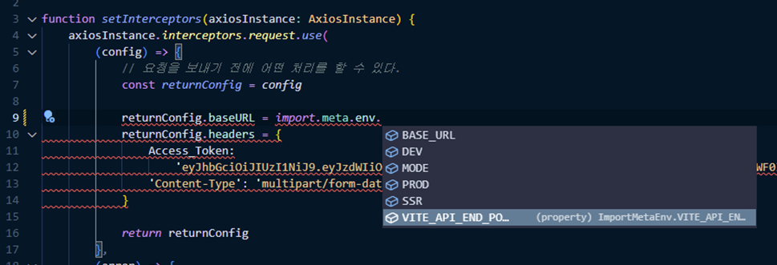

# Vite

## 환경 변수와 모드

Vite는 **`import.meta.env`** 객체를 이용해 환경 변수에 접근할 수 있도록 하고 있으며, 아래와 같은 환경 변수에 접근이 가능하다.

- **`import.meta.env.MODE`**: {string} 현재 앱이 동작하고 있는 [모드](https://vitejs-kr.github.io/guide/env-and-mode.html#modes)
- **`import.meta.env.BASE_URL`**: {string} 앱이 제공되는 베이스 URL이며, 이 값은 [`base` 설정](https://vitejs-kr.github.io/config/shared-options.html#base)에 의해 결정됨.
- **`import.meta.env.PROD`**: {boolean} 배포 모드 여부
- **`import.meta.env.DEV`**: {boolean} 개발 모드 여부
- **`import.meta.env.SSR`**: {boolean} 서버 실행 여부

### .env 파일

Vite는 dotenv를 이용해 환경 변수가 저장된 디렉터리 내 아래의 파일에서 환경변수를 가져옴.

```
.env                # 모든 상황에서 사용될 환경 변수
.env.local          # 모든 상황에서 사용되나, 로컬 개발 환경에서만 사용될 환경 변수
.env.[mode]         # 특정 모드에서만 사용될 환경 변수
.env.[mode].local   # 특정 모드에서만 사용되나, 로컬 개발 환경에서만 사용될 환경 변수

로컬에서만 사용된다는 건 Git에 의해 무시된다는 의미
```

.env 파일에서 환경변수를 정의할 때 VITE_를 사용해야만 import.meta.env 객체를 통해 환경변수 접근이 가능

```
VITE_API_END_POINT=https://example.com
```

### Typescript

`src` 디렉터리 내 `env.d.ts` 파일을 생성한 후, 아래와 같이 `ImportMetaEnv`를 정의하여 `VITE_` 환경 변수에 대한 타입을 정의할 수 있다.

```ts
interface ImportMetaEnv {
  readonly VITE_API_END_POINT: string
  // 다른 환경 변수들에 대한 타입 정의...
}
```




# :books:참고자료

https://vitejs-kr.github.io/guide/env-and-mode.html#env-files