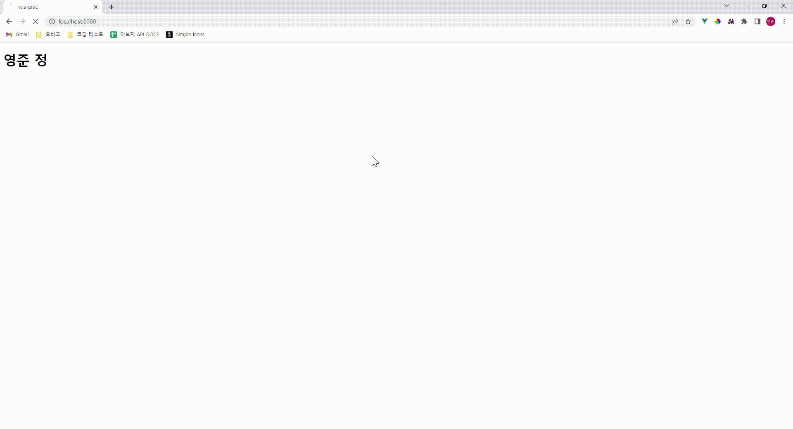

# Computed & Watch

## Computed 속성

컴퓨티드(computed) 속성은 템플릿의 데이터 표현을 더 직관적이고 간결하게 도와주는 속성이다. 좀 더 간단히 말하자면 템플릿의 가독성을 위해 사용하는 속성이다.

밑의 예시를 통해 Computed 속성에 따라 가독성이 얼마나 차이나는지 확인해보자.

```html
<template>
  <div class="body">
    <h1>{{ author.books.length > 0 ? '출판한 책이 있음' : '출판한 책이 없음' }}</h1>
  </div>
</template>

<script>
export default {
  name: 'App',
  data() {
    return {
      author: {
        name: '존 도우',
        books: ['Vue 2 - Advanced Guide', 'Vue 3 - Basic Guide', 'Vue 4 - The Mystery'],
      },
    };
  },
};
</script>
```

전체적인 흐름을 보자.

1. 작가가 출판한 책이 있는지 없는지에 따라 다른 텍스트를 보여주고자 한다.

2. 판단은 author 객체의 books 속성의 길이를 통해 이루어진다.

이 시점에서 템플릿은 더 이상 단순하고 선언적이지 않다. 물론 가독성을 해치지 않는 간단한 연산이라면 큰 문제는 없겠지만 연산이 길어질수록 vue의 핵심이라고 할 수 있는 '선언적' 이라는 개념에서 멀어지게 되는 것이다.

그렇다면 Computed 속성을 사용해서 이 문제를 해결해보자.

```html
<template>
  <div class="body">
    <h1>{{ publishedBooks }}</h1>
  </div>
</template>

<script>
export default {
  name: 'App',
  data() {
    return {
      author: {
        name: '존 도우',
        books: ['Vue 2 - Advanced Guide', 'Vue 3 - Basic Guide', 'Vue 4 - The Mystery'],
      },
    };
  },
  computed: {
    publishedBooks() {
      return this.author.books.length > 0 ? '출판한 책이 있다' : '출판한 책이 없다';
    },
  },
};
</script>
```

위의 코드를 통해 템플릿의 가독성이 월등히 좋아진 것을 확인할 수 있다. Computed 속성은 템플릿의 가독성을 높여준다는 장점뿐만 아니라 Computed 속성의 대상으로 정한 data 속성이 변했을 때 이를 감지하고 자동으로 다시 연산해주는 장점이 있다.

위의 코드에 적용시켜서 설명하자면,

1. publishedBooks의 대상은 author의 books 속성이다.

2. books 배열의 길이가 변하게 되면 publishedBooks의 속성도 변경된다. 

### Computed 속성의 Setter

Computed 속성은 기본적으로 getter이다. Computed 속성에 새로운 값을 할당하려고 하면 런타임 오류가 발생할 것이다. 그렇지만 드물게 writable, 수정 가능한 Computed 속성이 필요할 때가 있다. 아래 예시를 확인해보자.

```vue
<template>
  <div class="body">
    <h1>{{ fullName }}</h1>
  </div>
</template>

<script>
export default {
  data() {
    return {
      firstName: '존',
      lastName: '도우'
    }
  },
  computed: {
    fullName: {
      // getter
      get() {
        return this.firstName + ' ' + this.lastName
      },
      // setter
      set(newValue) {
        [this.firstName, this.lastName] = newValue.split(' ')
      }
    }
  }
}
</script>
```

get 메서드와 set 메서드에서 각각 어떤 일이 일어나는지 살펴보자.

#### get

fullName Computed 속성은 data의 속성의 firstName과 lastName을 합쳐서 이름 전체를 반환한다.

#### set

fullName 속성에 firstName과 lastName을 공백으로 구분하여 전달하면, set 메서드에 의해 firstName과lastName data 속성에 새로운 값이 할당된다.

 ```vue
 ...
   mounted() {
     setTimeout(() => {
       this.fullName = '영준 정';
     }, 2000);
   },
 ...
 ```

실제로 set 메서드가 제대로 작동하는지 확인해보자. 위 코드를 추가해서 컴포넌트가 마운트된 후 약간의 텀을 두고 fullName Computed 속성에 새로운 값을 할당해보도록 하겠다.



정상적으로 작동한다.

## Watch 속성

watch 속성은 특정 데이터의 변화를 감지하여 자동으로 특정 로직을 수행해주는 속성이다.

```html
<template>
  <div class="body">
    <input type="text" v-model="message" />
  </div>
</template>

<script>

export default {
  name: 'App',
  data() {
    return {
      message: 'Hello',
    };
  },
  watch: {
    message: function (value) {
      console.log(value);
    },
  },
};
</script>
```

사용방법은 다음과 같다. watch 속성에 감지할 데이터의 명으로 속성을 만든 후 함수를 정의해주면 된다. 함수의 첫 번째 파라미터는 감지하는 데이터가 된다. 

## Computed와 Watch, 언제 써야할까?

> https://ui.toast.com/weekly-pick/ko_20190307

위의 글이 해당 문제에 대한 답변을 가장 깔끔하게 적어놓았다고 생각한다.

정리하자면,

**`watch`는 "부수 효과" 처리를 위한 것이다. 만약 상태를 변경하고 싶다면 `computed`를 사용하는 것이 좋다.**

"부수 효과"는 컴포넌트 외부의 동작이나 비동기 처리를 말한다.

일반적인 예는 다음과 같다.

- 데이터를 가져오는 것 (Fetching data)
- DOM 조작하기
- 로컬 저장소 또는 오디오 재생과 같은 브라우저 API 사용

# :books:참고자료

[Computed | Cracking Vue.js](https://joshua1988.github.io/vue-camp/syntax/computed.html)

[Computed 속성과 Watch | Vue.js](https://v3.ko.vuejs.org/guide/computed.html#computed-%E1%84%89%E1%85%A9%E1%86%A8%E1%84%89%E1%85%A5%E1%86%BC)

https://medium.com/@hozacho/%EB%A7%A8%EB%95%85%EC%97%90vuejs-computed-vs-watch-%EC%96%B8%EC%A0%9C%EC%8D%A8%EC%95%BC%ED%95%A0%EA%B9%8C-d25316c4ef42

https://ui.toast.com/weekly-pick/ko_20190307
