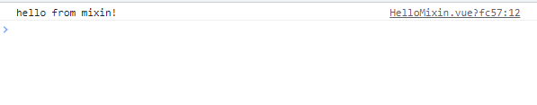
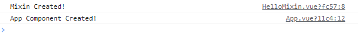
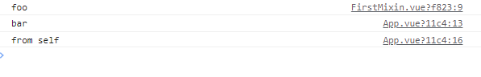

# Vue

## Mixins

믹스인(Mixins)은 여러 컴포넌트 간에 공통으로 사용하고 있는 로직, 기능들을 재사용하는 방법이다. 로직, 기능들을 재사용한다는 의미는 vue 확장자의 script 부분을 재사용한다는 의미와 같다. 

### 사용 방법

```js
// FirstMixin.js

<script>
export default {
  name: 'FirstMixin',
  created: function () {
    this.hello();
  },
  methods: {
    hello: function () {
      console.log('hello from mixin!');
    },
  },
};
</script>
```

먼저 mixin 파일을 만들어준다. 컴포넌트를 만드는 것과 크게 다르지 않다. 다만 위에서도 말했듯이 기능을 재사용하는 것이기 때문에 script 부분에 대한 정의만 이루어진다.

```js
// App.js

<script>
import FirstMixin from './components/FirstMixin.vue';

export default {
  name: 'App',
  mixins: [FirstMixin],
};
</script>
```

위와 같이 생성한 mixin 파일을 import 해서 결합시켜주면 된다.



결과는 위와 같다. FirstMixin.js 파일에서 created 에 정의한 console.log() 가 실행되는 것을 확인할 수 있다.

### 옵션 병합

#### data

mixin과 컴포넌트의 옵션이 중첩되어 있으면 Vue core의 적절한 전략을 사용하여 **병합**된다. 예를 들어 data 오브젝트의 내용이 상충하는 경우, 컴포넌트에 선언된 data 오브젝트를 우선으로 해 병합된다.

```js
// FirstMixin.js

<script>
export default {
  name: 'FirstMixin',
  data() {
    return {
      message: 'This message is from mixin!',
    };
  },
};
</script>
```

```js
// App.js

<script>
import FirstMixin from './components/FirstMixin.vue';

export default {
  name: 'App',
  mixins: [FirstMixin],
  created() {
    console.log(`${this.message}`);
  },
  data() {
    return {
      message: 'This message is from App Component!',
    };
  },
};
</script>
```


결과는 위와 같다.

#### hook

같은 이름의 훅 함수가 병합되어 모든 함수가 호출된다. 또한 mixin 훅은 컴포넌트 자체의 훅 **이전에** 호출된다.

```js
// FirstMixin.js

<script>
export default {
  name: 'Mixin',
  created() {
    console.log('Mixin Created!');
  },
};
</script>
```

```js
// App.js


<script>
import FirstMixin from './components/FirstMixin.vue';

export default {
  name: 'App',
  mixins: [FirstMixin],
  created() {
    console.log('App Component Created!');
  },
};
</script>
```



#### etc.

`methods`,`components`,`directives`와 같은 객체 값을 요구하는 옵션은 같은 객체에 병합된다. 이러한 객체에 충돌하는 키가 있을 경우 컴포넌트의 옵션이 우선순위를 갖는다.

```js
//FirstMixin.js


<script>
export default {
  name: 'FirstMixin',
  methods: {
    foo() {
      console.log('foo');
    },
    conflicting() {
      console.log('from mixin');
    },
  },
};
</script>
```

```js
<script>
import FirstMixin from './components/FirstMixin.vue';

export default {
  name: 'App',
  mixins: [FirstMixin],
  methods: {
    bar() {
      console.log('bar');
    },
    conflicting() {
      console.log('from self');
    },
  },
  created() {
    this.foo();
    this.bar();
    this.conflicting();
  },
};
</script>
```



FirstMixin에서 정의된 foo 메서드가 병합되어 실행되었고, conflicting 메서드는 컴포넌트를 우선하여 병합된 걸 확인할 수 있다.

# :books: 참고자료

[믹스인 — Vue.js](https://kr.vuejs.org/v2/guide/mixins.html)
