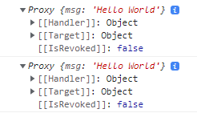

# Vue

## Composition API

### Reactivity API : Core

### ref()

인자로 전달된 값을 받아 반응형 및 변동 가능한 `ref`객체를 반환한다. `ref`객체는 `.value`라는 단 하나의 프로퍼티를 가지고 있으며, 이 프로퍼티는 인자로 전달된 값을 가리킨다. 

### computed()

`getter` 함수를 전달받아 `getter`에서 반환된 값에 대한 읽기 전용인  `ref`객체를 반환한다. `get`과 `set` 함수가 있는 객체를 전달받아 `writable`한 `ref` 객체를 만들 수 있다. 여기서 `writable`이란 값을 정의할 수 있다라는 의미로 받아들이면 된다. 

#### creating readonly computed ref:

```js
const count = ref(1)
const plusOne = computed(() => count.value + 1)

console.log(plusOne.value) // 2

plusOne.value++ // error
```

위에서 말했듯이, `computed`는 `ref` 객체를 반환한다. 따라서 위의 예시에서 `plusOne`은 실제로는 `ref(2)`와 같은 것이다. 따라서 해당 값에 접근하려면 `value` 프로퍼티를 사용해야 한다.

#### creating writable computed ref:

```js
const count = ref(1)
const plusOne = computed({
  get: () => count.value + 1,
  set: (val) => {
    count.value = val - 1
  }
})

plusOne.value = 1
console.log(count.value) // 0
```

`writable computed ref` 객체를 만들면서 `vue`가 아닌 `react`를 사용하는 듯한 느낌을 받았다. 아래는 `Composition API`를 사용하지 않았을 때, 동일한 결과를 출력하기 위한 코드이다.

```js
export default {
  data() {
    return {
      count: 1,
    }
  },
  computed: {
    plusOne: {
      get() {
        return this.count + 1
      },
      set(val) {
        this.count = val - 1
      },
    },
  },
  mounted() {
    this.plusOne = 1
    console.log(this.count) // 0
  },
}
```

기존에는 `vue`라는 틀에 맞추어 코드를 작성하는 느낌이었다면 이제는 `vue`를 활용해서 코드를 작성하는 느낌이 들었다. 

### reactive()

반응형 객체의 `proxy`를 반환한다. 여기서 `proxy`란 원본 객체를 가상화함으로써 기본적인 동작에 대한 재정의가 가능하게끔 하는 객체이다. 좀 더 이해하기 쉽도록 먼저 `proxy`라는 단어의 뜻을 알아보자.

`proxy`는 **대리자**라는 뜻을 갖고 있다. 이 뜻에 비춰보자면, `proxy`란 원본 객체에 직접 접근하지 않고 해당 객체에 대한 작업을 하기 위한 객체라고 볼 수 있다. 

#### creating a reactive object:

```js
const obj = reactive({ count: 0 })
```

#### Ref unwrapping:

```js
const count = ref(1)
const obj = reactive({ count })

// ref will be unwrapped
console.log(obj.count === count.value) // true

// it will update `obj.count`
count.value++
console.log(count.value) // 2
console.log(obj.count) // 2

// it will also update `count` ref
obj.count++
console.log(obj.count) // 3
console.log(count.value) // 3
```

`reactive` 객체는 속성들 중 값이 `ref` 객체에 해당하는 경우에는 반응성을 유지하기 위해 `proxy` 객체로 감싸지 않는다. 즉, `obj.count`와 `count.value`는 동일한 값을 참조하고 있다. 따라서 `count.value`의 값을 변경하거나 `obj.count`를 변경하면 양쪽의 값이 모두 변하는 것이다.

```js
const count = { value: 1 }
const obj = reactive({ count })

// ref will be wrapped
console.log(obj.count === count) // false
```

위의 예시처럼 `ref` 객체가 아닌 `count`가 일반 객체일 경우 `proxy` 객체로 감싸져 서로 다른 값을 참조해 둘을 비교했을 때 `false`가 나오는 걸 확인할 수 있다.

### 🥊ref() vs. reactive()

일반적으로 원시 타입을 반응형으로 만들 때는  `ref()`를 사용하고, 객체를 반응형으로 만들 때는 `reactive()`를 사용하는 것으로 알려져 있다. 원시 타입을 반응형으로 만들 때 `ref`를 사용하는 것은 맞지만 객체를 반응형으로 만들 때는 `ref()`, `reactive()` 어느 것을 사용해도 무방하다. 아래 예시를 확인해보자.

```js
const refState = ref({ msg: 'Hello World' })
console.log(refState.value)

const reactiveState = reactive({ msg: 'Hello World' })
console.log(reactiveState)
```

	

예시와 같이 `ref()`와 `reactive()`로 반응형 객체를 만들었을 때 둘 다 동일한 반응형 `proxy` 객체를 반환하고 있음을 알 수 있다. 그래서 어떤 것을 사용해도 상관은 없지만, 코드 가독성을 위해 한 가지만을 선택해서 사용하는 게 좋다. 어떤 것을 선택할지는 개인의 선택이지만 필자는 아래와 같은 이유로 `ref`를 사용한다.

- `ref` 객체의 `value` 프로퍼티가 반응형 데이터라는걸 명확하게 해주어서 가독성 및 유지보수에 좋음
- `ref()`가 `reactive()`보다 `API` 로직이 간결함

### readonly()

객체(반응형 혹은 일반)와 `ref`객체를 받아 읽기 전용인 `proxy` 객체를 반환한다.

```js
const original = ref({ count: 0 })

const copy = readonly(original)

watchEffect(() => {
  // works for reactivity tracking
  console.log(copy.value.count)
})

// mutating original will trigger watchers relying on the copy
original.value.count++

// mutating the copy will fail and result in a warning
copy.value.count++ // warning!
```

사실 `readonly`는 정적 타입 언어에서 사용되는 속성으로 변수나 객체를 말 그대로 읽기 전용으로 정의할 때 사용한다.

> ***From InfoWorld Article***
> *Use the readonly keyword when you are not sure whether the value of a variable of an object needs to change but you want to prevent other classes from changing the value.*

덧붙이자면 `readonly`는 변수나 객체의 값을 변경해야 할지 확실치 않지만, 다른 클래스로부터 값을 변경하는 것을 방지할 때 사용하라고 한다.

#### 🤔개인적인 의견

위 내용을 조금 일반화시켜보자면 변수나 객체의 값이 변경될 가능성이 있지만 외부로부터의 변경을 방지할 때 사용하라는 것인데, `computed`로 대체할 수 있다는 생각이 든다.

# :books:참고자료

https://vuejs.org/api/reactivity-core.html

https://developer.mozilla.org/en-US/docs/Web/JavaScript/Reference/Global_Objects/Proxy

https://www.youtube.com/watch?time_continue=1355&v=Z0OG00YQeMg&feature=emb_logo

https://www.infoworld.com/article/3546242/how-to-use-const-readonly-and-static-in-csharp.html
