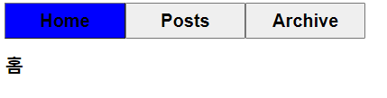

# 🔄컴포넌트 재사용성

Vue에는 컴포넌트 재사용성을 높이기 위해 Slot과 동적 컴포넌트를 사용한다.

## Slot

슬롯(slot)은 컴포넌트의 재사용성을 높여주는 기능이다. 특정 컴포넌트에 등록한 하위 컴포넌트의 마크업을 확장하거나 재정의할 수 있다.

```html
<!-- HeaderComponent.vue -->

<template>
  <div>
    <slot></slot>
  </div>
</template>

<script>
export default {
  name: 'HeaderComponent',
};
</script>

<style></style>
```

```html
<!-- App.vue -->

<template>
  <header-component>메인 페이지</header-component>
  <header-component>검색 페이지</header-component>
  <header-component>로그인 페이지</header-component>
</template>

<script>
import HeaderComponent from './components/HeaderComponent.vue';

export default {
  name: 'App',
  components: {
    HeaderComponent,
  },
};
</script>

<style>
</style>
```

App.vue에서 작성한 메인 페이지 등의 콘텐츠 내용이 HeaderComponent.vue에 작성한 slot 태그에 삽입된다.

slot에는 단순히 문자열뿐만 아니라 HTML 포함한 어떠한 템플릿 코드, 심지어 컴포넌트를 포함시킬 수도 있다.

### Fallback 콘텐츠

디폴트 값이라고 생각하면 좀 더 와닿을 것이다. slot 안에다가 값을 정의하고 상위 컴포넌트에서 slot을 가진 컴포넌트에 아무런 컨텐츠도 제공하지 않았을 때, slot에 정의된 값이 나오게 된다.

```html
<!-- HeaderComponent.vue -->

<template>
  <div>
    <slot>빈 페이지</slot>
  </div>
</template>
```

```html
<!-- App.vue -->

<template>
  <header-component>메인 페이지</header-component>
  <header-component>검색 페이지</header-component>
  <header-component>로그인 페이지</header-component>
  <header-component></header-component>
</template>
```

#### 결과


### 이름을 갖는 Slot

여러 개의 슬롯을 사용하는 것이 유용한 경우가 있다. 예를 들어, 아래와 같은 템플릿을 가진 컴포넌트가 있다고 해보자.

```html
<!--BaseLayoutComponent.vue -->

  <div class="container">
    <header>
      <!-- header 컨텐츠를 두고 싶은 곳 -->
    </header>
    <main>
      <!-- main 컨텐츠를 두고 싶은 곳 -->
    </main>
    <footer>
      <!-- footer 컨텐츠를 두고 싶은 곳 -->
    </footer>
  </div>
```

```html
 <!--BaseLayoutComponent.vue -->

  <div class="container">
    <header>
      <slot name="header">
    </header>
    <main>
      <slot>
    </main>
    <footer>
      <slot name="footer">
    </footer>
  </div>
 ...
 <style>
main {
  color: blue;
}

footer {
  color: red;
}
</style>
```

slot 태그의 name 속성은 각 slot의 특정한 ID로써 각각의 콘텐츠가 원하는 곳에 렌더링되도록 하는 데 사용된다. name이 없는 경우는 묵시적으로 default라는 name을 갖게 된다.

```html
<!-- App.vue -->

<template>
  <base-layout-component>
    <template v-slot:header>
      <h1>여기에는 헤더 내용</h1>
    </template>
    <template v-slot:default>
      <p>여기에는 메인 컨텐츠 내용</p>
    </template>
    <template v-slot:footer>
      <p>여기는 푸터에 해당하는 내용</p>
    </template>
  </base-layout-component>
</template>
```

#### 결과


상위 컴포넌트에서 각각의 slot에 컨텐츠를 작성할 때는 template 태그의 v-slot 디렉티브에 각각의 slot name을 작성해주면 된다.

## :bulb:Tip

간단한 팁으로 이름을 갖는 Slot은 축약형으로 바꿀 수 있다.

`v-slot:header -> #header` 

위와 같이 바꿀 수 있다. 하지만 축약형은 name 속성을 적어준 경우에만 가능하다는 점을 주의하자.

## 동적 컴포넌트

동적으로 컴포넌트를 전환해야하는 경우는 다양하겠지만, 특히 탭 인터페이스를 만들 때 상당히 유용하다.

동적 컴포넌트는 두 가지 개념에 대해서 알고 있어야 한다.

- component

- is 속성

**component**는 동적 컴포넌트를 렌더링하기 위한 메타 컴포넌트이다. 렌더링할 실제 컴포넌트는 **is 속성**에 의해 결정된다.동적 컴포넌트를 활용해서 간단한 탭 인터페이스를 만들어보겠다.




```html
<template>
  <button
    :class="{ tab: true, active: activeTab === tab.name }"
    v-for="tab in tabs"
    :key="tab.id"
    @click="activeTab = tab.name"
  >
    {{ tab.name }}
  </button>
  <div>
    <component v-bind:is="activeTab"></component>
  </div>
</template>

<script>
import Home from './components/HomeComponent.vue';
import Posts from './components/Postomponent.vue';
import Archive from './components/ArchiveComponent.vue';

export default {
  name: 'App',
  components: {
    Home,
    Posts,
  },
  data() {
    return {
      activeTab: 'Home',
      tabs: [
        {
          name: 'Home',
          id: 1,
        },
        {
          name: 'Posts',
          id: 2,
        },
        {
          name: 'Archive',
          id: 3,
        },
      ],
    };
  },
  methods: {},
};
</script>

<style>
.tab {
  width: 200px;
  height: 60px;
  font-size: 30px;
  font-weight: 700;
}
.active {
  background-color: blue;
}
</style>e>
```

```html
<!-- is 속성에서 렌더링될 각각 컴포넌트 -->

<template>
  <h1>페이명</h1>
</template>
```

전체적인 흐름을 보자면,

1. 각각의 페이지 버튼을 누르면 activeTab 데이터가 해당 페이지명으로 바뀐다.

2. activeTab은 is 속성에 바인딩되어있기 때문에 activeTab이 바뀔 때마다 해당 페이지명을 가진 컴포넌트를 렌더링하게 된다.

### Keep Alive

이처럼 컴포넌트를 전환할 때 vue 인스턴스는 소멸, 생성을 반복한다. 컴포먼트의 전환마다 페이지를 초기화되어야 한다면 문제가 없지만 만약 컴포넌트 안의 값을 유지해야 하거나 성능상의 이유로 리렌더링을 피하고 싶을 때 `Keep-alive` 엘리먼트를 사용할 수 있다. keep-alive 로 둘러싼 컴포넌트는 컴포넌트가 최초 생성되는 시점에 **캐시** 해둔다.

이를 확인하기 위해 HomeComponent에 카운터를 추가해보겠다.

```html
<template>
  <h1>홈</h1>
  <h2>How many people visited : {{ counter }}</h2>
  <button @click="counter += 1">Visit</button>
</template>

<script>
export default {
  data() {
    return {
      counter: 0,
    };
  },
};
</script>
```

visit 버튼을 누르면 카운터가 올라가는 간단한 구조이다. keep-alive 엘리먼트가 없는 상황에서는 카운터를 올리고 다른 탭으로 갔다가 오면 카운터 값이 초기화 되어있는 걸 확인할 수 있다.

```html
<template>
  <button
    :class="{ tab, active: activeTab === tab.name }"
    v-for="tab in tabs"
    :key="tab.id"
    @click="activeTab = tab.name"
  >
    {{ tab.name }}
  </button>
  <div>
    <keep-alive>
      <component v-bind:is="activeTab"></component>
    </keep-alive>
  </div>
</template>
```

component를 keep-alive 엘리먼트로 감싸주면 탭이 전환되고 나서도 카운터가 유지되는 것을 확인할 수 있다.

# :books: 참고자료

[Slots | Cracking Vue.js](https://joshua1988.github.io/vue-camp/reuse/slots.html)

[Slots | Vue.js](https://v3.ko.vuejs.org/guide/component-slots.html#slot-%E1%84%8F%E1%85%A5%E1%86%AB%E1%84%90%E1%85%A6%E1%86%AB%E1%84%8E%E1%85%B3)

[동적 &amp; 비동기 컴포넌트 | Vue.js](https://v3.ko.vuejs.org/guide/component-dynamic-async.html#keep-alive%E1%84%85%E1%85%B3%E1%86%AF-%E1%84%89%E1%85%A1%E1%84%8B%E1%85%AD%E1%86%BC%E1%84%92%E1%85%A1%E1%84%82%E1%85%B3%E1%86%AB-%E1%84%83%E1%85%A9%E1%86%BC%E1%84%8C%E1%85%A5%E1%86%A8-%E1%84%8F%E1%85%A5%E1%86%B7%E1%84%91%E1%85%A9%E1%84%82%E1%85%A5%E1%86%AB%E1%84%90%E1%85%B3)

[(Vue.js) keep-alive, 동적 컴포넌트에 대하여 | Let's Sunny](https://sunny921.github.io/posts/vuejs-keep-alive/)
