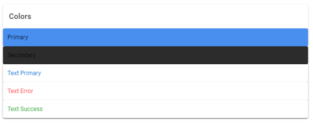

# Vue

## Vuetify

- Vue 기반 UI 프레임워크
- 구글의 Material Design을 기반으로 설계됨

### 장점

- 생산성이 높다.
- 일관성이 있어 유지보수가 용이하다.
- 지식이 부족해도 퀄리티있게 만들 수 있다.
- 코드에 대한 재사용성이 높다.

### 설치하기

> The current version of Vuetify does not support Vue 3. Support for Vue 3 will come with the release of [Vuetify v3](https://vuetifyjs.com/en/introduction/roadmap/#v30-titan). When creating a new project, please ensure you selected Vue 2 from the Vue CLI prompts, or that you are installing to an existing Vue 2 project.

`Vue 3`는 아직 `Vuetify`를 지원하지 않는다는 점을 주의하자.

#### Vue-cli 활용

```bash
vue add vuetify
```

12column 시스템


### [#](https://vuetifyjs.com/en/components/grids/#v-container)v-container

`v-container` provides the ability to center and horizontally pad your site’s contents

너비값이 반응형

화면에 따라 길이가 달라짐

### [#](https://vuetifyjs.com/en/components/grids/#v-col)v-col

v-col` is a content holder that must be a direct child of `v-row

cols

Sets the default number of columns the component extends. Available options are **1 -> 12** and **auto**.


### [#](https://vuetifyjs.com/en/components/grids/#v-row)v-row


`v-row` is a wrapper component for `v-col`. It utilizes flex properties to control the layout and flow of its inner columns

uses a standard gutter of **24px**

no-gutters로 gutter 없애기 가능

### [#](https://vuetifyjs.com/en/components/grids/#v-spacer)v-spacer

컴포넌트 사이 간격 주기 위한 컴포넌트

`v-spacer` is a basic yet versatile spacing component used to distribute remaining width in-between a parents child components


#### [#](https://vuetifyjs.com/en/components/grids/#align)Align


Change the vertical alignment of flex items and their parents using the **align** and **align-self** properties.


- start
- center
- end


Aligh-self

본인 자신만 정렬

[#](https://vuetifyjs.com/en/components/grids/#breakpoint-sizing)Breakpoint sizing

반응형 디자인을 쉽게 할 수 있음

#### [#](https://vuetifyjs.com/en/components/grids/#justify)Justify


Change the horizontal alignment of flex items using the **justify** property.

- start
- end
- center
- space-between
- space-around


v-app

최상단에 선언해야 하는 루트 컴포넌트

id가 app인 div로 치환이 됨


v-main

레이아웃을 제외한 컨텐츠 영역

main 태그로 치환됨


v-app-bar, v-footer

app 속성 추가해서

기본 레이아웃 컴포넌트로 사용가능


v-main 컴포넌트

vue DOM 마운트 될 때

앱바나 내비게이션 등의 레이아웃 컴포넌트들의

높이와 너비를 프레임워크 코어에 등록

v-main은 레이아웃 높이와 너비를 취하여 콘텐츠의 영역을 조절


breakpoint

  {{ *$vuetify**.**breakpoint**.*name }}

뷰포트

애플리케이션 화면 크기


| Device      | Code   | Type                   | Range              |
| :---------- | :----- | :--------------------- | :----------------- |
| Extra small | **xs** | Small to large phone   | < 600px            |
| Small       | **sm** | Small to medium tablet | 600px > < 960px    |
| Medium      | **md** | Large tablet to laptop | 960px > < 1264px*  |
| Large       | **lg** | Desktop                | 1264px > < 1904px* |
| Extra large | **xl** | 4k and ultra-wide      | > 1904px*          |

```
<template>
  <v-container fluid>
    <v-card-title>
      $vuetify.breakpoint.name : {{ $vuetify.breakpoint.name }}</v-card-title
    >
    <v-card outlined :height="height"></v-card>
  </v-container>
</template>

<script>
export default {
  computed: {
    height() {
      switch (this.$vuetify.breakpoint.name) {
        case 'xs':
          return 100
        case 'sm':
          return 200
        case 'md':
          return 300
        case 'lg':
          return 400
        case 'xl':
          return 500
        default:
          return 500
      }
    },
  },
}
</script>

<style></style>

```

$vuetify.breakpoint.mobile

mobile 너비 이하일 경우에는 true

이상은 false 반환


기본값은 1264

기준을 변경하고 싶으면

```js
import Vue from 'vue'
import Vuetify from 'vuetify/lib/framework'

Vue.use(Vuetify)

export default new Vuetify({
  breakpoint: {
    mobileBreakpoint: 'sm', // This is equivalent to a value of 960
  },
})

```

위와 같이 Vuetify 인스턴스를 생성하는 파일로 이동해 mobileBreakpoint의 값을 수정해준다.


## v-dialog

The `v-dialog` component inform users about a specific task and may contain critical information, require decisions, or involve multiple tasks. Use dialogs sparingly because they are interruptive.


fullscreen 속성

전체화면으로 열림

```
    <v-dialog v-model="dialog" width="500">
      <template v-slot:activator="{ on, attrs }">
        <v-btn color="red lighten-2" dark v-bind="attrs" v-on="on">
          Click Me
        </v-btn>
      </template>

      <v-card>
        <v-card-title class="text-h5 grey lighten-2">
          Privacy Policy
        </v-card-title>

        <v-card-text>
          Lorem ipsum dolor sit amet, consectetur adipiscing elit, sed do
          eiusmod tempor incididunt ut labore et dolore magna aliqua. Ut enim ad
          minim veniam, quis nostrud exercitation ullamco laboris nisi ut
          aliquip ex ea commodo consequat. Duis aute irure dolor in
          reprehenderit in voluptate velit esse cillum dolore eu fugiat nulla
          pariatur. Excepteur sint occaecat cupidatat non proident, sunt in
          culpa qui officia deserunt mollit anim id est laborum.
        </v-card-text>

        <v-divider></v-divider>

        <v-card-actions>
          <v-spacer></v-spacer>
          <v-btn color="primary" text @click="dialog = false"> I accept </v-btn>
        </v-card-actions>
      </v-card>
    </v-dialog>
```

모바일에서는 전체화면

pc에서는 작은 화면으로 열어야 하는 요구사항

fullscreen="$vuetify.breakpoint.mobile"


Breakpoint service object

The **breakpoint service** is a programmatic way of accessing viewport information within components. It exposes a number of properties on the `$vuetify` object that can be used to control aspects of your application based upon the viewport size.

Access these properties within Vue files by referencing `$vuetify.breakpoint.<property>`; where `<property>` corresponds to a value listed in the [Breakpoint service](https://vuetifyjs.com/en/features/breakpoints/#breakpoint-service-object) object. In the following snippet we log the current viewport width to the console once the component fires the mounted lifecycle hook:

While the `$vuetify` object supports SSR (Server-Side Rendering) including platforms such as NUXT, the breakpoint service detects the height and width values as **0**. This sets the initial breakpoint size to **xs** and in some cases can cause the layout to snap in place when the client side is hydrated in NUXT. In the upcoming section we demonstrate how to use `boolean` breakpoint values in the template and script tags of Vue components.


## Typography

These classes can be applied to all breakpoints from `xs` to `xl`. When using a base class, `.text-{value}`, it is inferred to be `.text-xs-${value}`.

- `.text-{value}` for `xs`
- `.text-{breakpoint}-{value}` for `sm`, `md`, `lg` and `xl`

The value property is one of:

- `h1`
- `h2`
- `h3`
- `h4`
- `h5`
- `h6`
- `subtitle-1`
- `subtitle-2`
- `body-1`
- `body-2`
- `button`
- `caption`
- `overline`

## Font emphasis

Material design, by default, supports **100, 300, 400, 500, 700, 900** font weights and italicized text.

```

<template>
  <div>
    <p class="font-weight-black">
      Black text.
    </p>
    <p class="font-weight-bold">
      Bold text.
    </p>
    <p class="font-weight-medium">
      Medium weight text.
    </p>
    <p class="font-weight-regular">
      Normal weight text.
    </p>
    <p class="font-weight-light">
      Light weight text.
    </p>
    <p class="font-weight-thin">
      Thin weight text.
    </p>
    <p class="font-italic">
      Italic text.
    </p>
  </div>
</template>
```


# The color system

The Material Design color system can help you create a color theme that reflects your brand or style.

## Color usage and palettes*link*

The Material Design color system helps you apply color to your UI in a meaningful way. In this system, you select a primary and a secondary color to represent your brand. Dark and light variants of each color can then be applied to your UI in different ways.

### Colors and theming

Color themes are designed to be harmonious, ensure accessible text, and distinguish UI elements and surfaces from one another.

The [Material Design palette tool](https://material.io/design/color/the-color-system#tools-for-picking-colors) or 2014 Material Design palettes are available to help you select colors.

A sample primary and secondary palette

\1. Primary color
\2. Secondary color
\3. Light and dark variants

### Primary color


A primary color is the color displayed most frequently across your app’s screens and components. Your primary color can be used to make a color...


A **primary color** is the color displayed most frequently across your app's screens and components.

#### Dark and light primary variants

Your primary color can be used to make a color theme for your app, including dark and light primary color variants.

#### Distinguish UI elements

To create contrast between UI elements, such as a top app bar from a system bar, you can use light or dark variants of your primary colors. You can also use these to distinguish elements within a component, such as the icon of a floating action button from its circular container.

### Secondary color


A secondary color provides more ways to accent and distinguish your product. Having a secondary color is optional, and should be applied sparingly to accent...


A **secondary color** provides more ways to accent and distinguish your product. Having a secondary color is optional, and should be applied sparingly to accent select parts of your UI.

If you don’t have a secondary color, your primary color can also be used to accent elements.

Secondary colors are best for:

Floating action buttonsSelection controls, like sliders and switchesHighlighting selected textProgress barsLinks and headlines

#### Dark and light secondary variants

Just like the primary color, your secondary color can have dark and light variants. A color theme can use your primary color, secondary color, and dark and light variants of each color.


	

```
<template>
  <v-container fluid>
    <v-card>
      <v-card-title>Colors</v-card-title>
      <v-card class="pa-3 primary lighten-1">Primary</v-card>
      <v-card class="pa-3 secondary darken-1">Secondary</v-card>
      <v-card class="pa-3 primary--text">Text Primary</v-card>
      <v-card class="pa-3 error--text">Text Error</v-card>
      <v-card class="pa-3 success--text">Text Success</v-card>
    </v-card>
  </v-container>
</template>
```

primary 기본값 변경하고 싶을 때

https://vuetifyjs.com/en/features/presets/#default-preset

참고 후 기본값에서 원하는 컬러로 변경해주기

```
export default new Vuetify({
  breakpoint: {
    mobileBreakpoint: 'sm', // This is equivalent to a value of 960
  },
  theme: {
    themes: {
      light: {
        primary: '#B00200',
      },
    },
  },
})

```


## helper class

vuetify에서 미리 정의해놓은 class

pa-3

padding을 3만큼 넣겠다는 의미

3은 여기서 12px

## [#](https://vuetifyjs.com/en/styles/spacing/#how-it-works)How it works


The helper classes apply **margin** or **padding** to an element ranging from 0 to 16. Each size increment was designed to align with common Material Design spacings. These classes can be applied using the following format `{property}{direction}-{size}`.

The **property** applies the type of spacing:

- `m` - applies `margin`
- `p` - applies `padding`

The **direction** designates the side the property applies to:

- `t` - applies the spacing for `margin-top` and `padding-top`
- `b` - applies the spacing for `margin-bottom` and `padding-bottom`
- `l` - applies the spacing for `margin-left` and `padding-left`
- `r` - applies the spacing for `margin-right` and `padding-right`
- `s` - applies the spacing for `margin-left`/`padding-left` (in LTR mode) and `margin-right`/`padding-right` (in RTL mode)
- `e` - applies the spacing for `margin-right`/`padding-right` (in LTR mode) and `margin-left`/`padding-left` (in RTL mode)
- `x` - applies the spacing for both `*-left` and `*-right`
- `y` - applies the spacing for both `*-top` and `*-bottom`
- `a` - applies the spacing for the property in all directions

The **size** controls the increment of the property in 4px intervals:

- `0` - eliminates all `margin` or `padding` by setting it to `0`
- `1` - sets `margin` or `padding` to 4px
- `2` - sets `margin` or `padding` to 8px
- `3` - sets `margin` or `padding` to 12px
- `4` - sets `margin` or `padding` to 16px
- `5` - sets `margin` or `padding` to 20px
- `6` - sets `margin` or `padding` to 24px
- `7` - sets `margin` or `padding` to 28px
- `8` - sets `margin` or `padding` to 32px
- `9` - sets `margin` or `padding` to 36px
- `10` - sets `margin` or `padding` to 40px
- `11` - sets `margin` or `padding` to 44px
- `12` - sets `margin` or `padding` to 48px
- `13` - sets `margin` or `padding` to 52px
- `14` - sets `margin` or `padding` to 56px
- `15` - sets `margin` or `padding` to 60px
- `16` - sets `margin` or `padding` to 64px
- `n1` - sets `margin` to -4px
- `n2` - sets `margin` to -8px
- `n3` - sets `margin` to -12px
- `n4` - sets `margin` to -16px
- `n5` - sets `margin` to -20px
- `n6` - sets `margin` to -24px
- `n7` - sets `margin` to -28px
- `n8` - sets `margin` to -32px
- `n9` - sets `margin` to -36px
- `n10` - sets `margin` to -40px
- `n11` - sets `margin` to -44px
- `n12` - sets `margin` to -48px
- `n13` - sets `margin` to -52px
- `n14` - sets `margin` to -56px
- `n15` - sets `margin` to -60px
- `n16` - sets `margin` to -64px
- `auto` - sets the spacing to **auto**

## [#](https://vuetifyjs.com/en/styles/display/#display)Display


Specify the elements `display` property. These classes can be applied to all breakpoints from `xs` to `xl`. When using a base class,`.d-{value}`, it is inferred to be `.d-${value}-xs`.

- `.d-{value}` for `xs`
- `.d-{breakpoint}-{value}` for `sm`, `md`, `lg` and `xl`

The value property is one of:

- `none`
- `inline`
- `inline-block`
- `block`
- `table`
- `table-cell`
- `table-row`
- `flex`
- `inline-flex`

When setting a specific breakpoint for a display helper class, it will apply to all screen widths from the designation and up. For example, `d-lg-flex` will apply to `lg` and `xl` size screens.

더 다양한 helper class가 있으니 참고


https://vuetifyjs.com/en/components/data-tables/#usage

https://vuetifyjs.com/en/components/buttons/

https://vuetifyjs.com/en/components/icons/