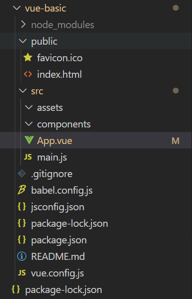

# Vue 기초

 Vue는 사용자인터페이스를 만들기 위한 프로그레시브 프레임워크이다. 

## 🏁시작

 Vue 프로젝트를 생성하기 위해서는 index.html에 스크립트 태그를 삽입하거나 cli을 이용하는 방법이 있다. 개인적으로는 cli 환경에 익숙해지는 게 좋다고 생각해서 cli 방식으로 프로젝트를 시작해보려고 한다.

> npm i -g @vue-cli

 터미널에 위 명령어를 입력해 터미널에서 vue 관련 명령어를 사용할 수 있도록 한다. 앞으로 만들 vue 프로젝트에서도 vue-cli를 사용할 것이기 때문에 전역에 패키지를 설치해주자.

전역에 패키지를 설치하려면 npm install 명령어에 `-g` 옵션을 지정한다. 전역으로 설치된 패키지는 전역에서 참조할 수 있다. 

___

> vue create [프로젝트명]

 위 명령어를 입력하면 CRA와 같이 vue 프로젝트를 생성할 수 있다. 다만 powershell에서 해당 명령어를 입력할 경우 아래와 같은 오류가 발생할 수 있다.

> vue : 이 시스템에서 스크립트를 실행할 수 없으므로 C:\Program Files\nodejs\vue.ps1 파일을 로드할 수 없습니다. 자세한 내용은 about_Execution_Policies(https://go.microsoft.com/fwlink/?LinkID=135170)를 참조하십시오.

 이는 Powershell의 실행 정책때문인데, 여기서 실행 정책은 PowerShell에서 구성 파일을 로드하고 스크립트를 실행하는 조건을 제어하는 안전 기능이다. 실행 정책은 총 7가지가 있는데 몇 가지만 간단하게 알아보자.

### Bypass

아무것도 차단되지 않으며 경고나 안내 없이 실행 가능

### Restricted

스크립트 허용하지 않음

___

실행정책을 변경해서 위 오류를 해결할 수도 있지만 간단하게 Powershell이 아닌 cmd 터미널에서 실행하는 걸로도 해당 오류를 우회할 수 있다.

> vue.cmd create [프로젝트명]

위 명령어를 실행하면 어떤 옵션으로 프로젝트를 시작할지 선택지가 제공된다. Vue2, 3 중 본인이 원하는 버전을 선택하면 되고, Manually select features은 기능 하나하나를 디테일하게 설정해주어야 하기 때문에 Vue에 익숙한 경우에만 선택하는 것을 권장한다.

## ⚙프로젝트 구조

프로젝트를 만들고 나면 다음과 같은 파일 구조를 확인할 수 있다.



```html
//index.html

<!DOCTYPE html>
<html lang="">
...
    <div id="app"></div>
    <!-- built files will be auto injected -->
  </body>
</html>
```

```javascript
//main.js

import { createApp } from 'vue'
import App from './App.vue'

createApp(App).mount('#app')
```

 렌더링 과정을 정말 간단하게 정리하자면, main.js 파일에서 App.vue 파일을 불러와서index.html의 <div id="App"></div> 태그에 삽입하는 방식이다. 따라서 실제 구현 내용이 작성되는 부분은 App.vue 파일이다. 

```html
<template>
  <h1>{{message}}</h1>
</template>

<script>
export default {
  name: 'App',
  components: {
  },
  // data: {
  //   message: "안녕하세요 vue!"
  // },
  data:()=>{
    return {
      message:"안녕하세요 vue!",
    }
  },
  method:{
    }
}
</script>

<style>
#app {
  font-family: Avenir, Helvetica, Arial, sans-serif;
  -webkit-font-smoothing: antialiased;
  -moz-osx-font-smoothing: grayscale;
  text-align: center;
  color: #2c3e50;
  margin-top: 60px;
}
</style>
```

vue 파일은 총 3개의 섹션으로 구분된다.

- template

화면 구성 섹션

- script

로직 섹션

- style

스타일 섹션

## ✔ 선언적 렌더링

 Vue.js의 핵심은 간단한 템플릿 구문을 사용해 선언적으로 DOM에 데이터를 렌더링하는 것이다. vue의 핵심인만큼 선언적이라는 부분에 대해 좀 더 자세히 알아보자.

한 정의에 따르면, 프로그램이 **어떤 방법으로** 해야 하는지를 나타내기보다 **무엇**과 같은지를 설명하는 경우에 "선언형"이라고 한다.

예를 들어, 웹 페이지는 선언형인데 웹페이지는 제목, 글꼴, 본문, 그림과 같이 "무엇"이 나타나야하는지를 묘사하는 것이지 "어떤 방법으로" 컴퓨터 화면에 페이지를 나타내야 하는지를 묘사하는 것이 아니기 때문이다. 이것은 전통적인 C와 자바와 같은 명령형 프로그래밍 언어와는 다른 접근방식인데, 명령형 프로그래밍 언어는 프로그래머가 실행될 알고리즘을 명시해주어야 하는 것이다. 간단히 말하여, 명령형 프로그램은 알고리즘을 명시하고 목표는 명시하지 않는 데 반해 선언형 프로그램은 목표를 명시하고 알고리즘을 명시하지 않는 것이다.

실제로 렌더링을 해보자.

```html
<div id="app">
{{message}}
</div>
```

```javascript
export default {
  name: 'App',      // data: {
  //   message: "안녕하세요 vue!"
  // },
  data:()=>{
    return {
      message: "안녕하세요 vue!"
    }
  },
}
```

vue에서 데이터를 변수처럼 사용하기 위해 script 섹션에 data 속성을 정의해보겠다. 공식문서에서는 data 속성을 선언할 때 객체 선언 방식을 사용하지만, 실제로는 deprecated되었기 때문에 함수형으로 선언해주면 된다.

message에 문자열을 할당하고, template 섹션에서 머스태시 보간법을 사용하면 화면에 데이터가 출력된다.

 template 섹션에는 무엇이 나타나야하는지를 묘사했을 뿐 다른 알고리즘은 작성되지 않았다. 이게 바로 선언적 렌더링이다.

## 😀마무리

여기까지 vue 프로젝트를 만들고 화면에 데이터를 렌더링하는 방법까지 알아보았다. React만 사용했던 나로서는 새로운 프레임워크를 시작하는 게 약간 걱정됐었는데, 막상 해보니 React와 큰 차이가 없다고 생각이 들었다. 회사에서 주로 쓰는 프레임워크인만큼 좀 더 깊은 학습이 필요할 것 같다.

# :books:참고자료

[선언형 프로그래밍 - 위키백과, 우리 모두의 백과사전](https://ko.wikipedia.org/wiki/%EC%84%A0%EC%96%B8%ED%98%95_%ED%94%84%EB%A1%9C%EA%B7%B8%EB%9E%98%EB%B0%8D)
