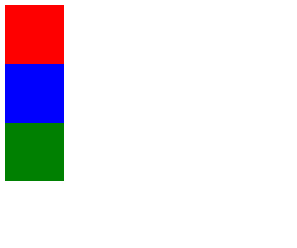

# Position

position 속성은 HTML 요소가 위치를 결정하는 방식을 설정한다.

이 속성에는 총 4가지 값이 존재한다. 각각을 차례대로 알아보자.


## Static

position 속성의 기본값으로 단순히 웹페이지의 흐름에 따라 차례대로 HTML 요소들을 위치시킨다.

position 속성값이 static인 경우 top, left, right, bottom 속성값의 영향을 받지 않는다.

	

세 요소를 모두 static으로 지정했을 때 모습이다.

static은 기본값이기 때문에 따로 속성값을 선언하지 않아도 된다.

명시적으로 선언해도 결과는 같다.

```html
<!DOCTYPE html>
<html lang="ko">
<head>
    <meta charset="UTF-8">
    <title>Position Practice</title>
    <style>
        body {
            height: 100vh;
        }

        div {
            width:100px;
            height:100px;
        }

        .red {
            background-color: red;
            top: 10px;
        }

        .blue {
            background-color: blue;
            position: static;
        }

        .green {
            background-color: green;
        }
    </style>
</head>
<body>
    <div class="red"></div>
    <div class="blue"></div>
    <div class="green"></div>
</body>
</html>
```


position fixed

body를 엄청 크게 하고 스크롤을 내려보면 화면 상단에 고정되어있는 걸 확인

고정되는 위치는 초기에 위치한 곳

position fixed를 이용하면 스크롤해도 항상 제자리에 머무른다.
처음 만들어진 자리에 고정 되어있다. 하지만 top, left, right, bottom 중 하나만 수정해도 서로 다른 레이어에 위치하게되어 원래 위치가 무시된다.
positon fixed를 이용하면 가장 위에 위치하게 된다. (맨 앞)


static

\1. position: static (default) - 박스를 처음 위치한 곳에 두는 것

top 등등 속성이 아무런 의미가 없음

\2. position: fixed - 처음에 위치한 자리에서 화면의 스크롤에 상관없이 고정되는 것, top,bottom, left, right 속성을 줘서 고정된 위치 이동시킬 수 있음. 단 이동이 되면 가장 위의 새 레이어에 놓이게됨
\3. position : relative - 박스가 처음 위치한 곳을 기준으로 이동,
top,bottom, left, right 속성을 주면 첫 위치를 기준으로 이동됨
\4. position : absolute - 가장 가까운 부모 엘리먼트에 position:relative를 추가한다면, 그 부모 기준으로 top,bottom,left,right이동하고/ 아닐시엔 body 기준으로 이동된다
