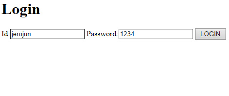
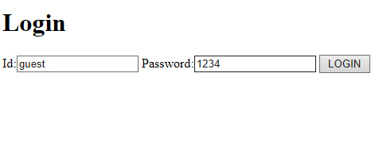

# Web Project-login 구현하기

멀티캠퍼스에 참여한 지도 이제 한 달이 넘어간다.

이제 웹 애플리케이션을 직접 만드는 과정에 들어섰는데, 지금까지 배운 모든 내용이 총집합된 과정이라 정말 어렵게 느껴진다.

그래서 완전하지는 않지만 복습도 할 겸 간단하게 로그인 기능을 구현한 웹 애플리케이션을 만드는 과정을 기록해보려고 한다.


로그인 기능은 어떻게 구현해야 할까?

정말 간단하게 생각해본다면 사용자가 아이디와 비밀번호를 입력했을 때,

데이터베이스에 그 정보가 있다면 로그인 성공 메시지를 띄우고, 없다면 로그인 실패 메시지를 띄우면 될 것이다.


이번에 만들 웹 애플리케이션은 웹 애플리케이션 모델 2 방식을 따를 것이다.

모델 2 방식의 핵심은 웹 애플리케이션의 각 기능(클라이언트의 요청 처리, 응답 처리, 비즈니스 로직 처리)을 분리해서 구현하자는 것이다.

모델 2 방식에는 여러 가지 개념들이 사용되는데, 가장 많이 사용되는 개념이 바로 MVC이다.


MVC는 Model-View-Controller의 약자로 일종의 프로그램 디자인 패턴이다.

원래 MVC는 모델 2 방식의 하위 개념이다.

하지만 MVC가 모델 2 방식의 뼈대를 이루기 때문에 모델 2 방식으로 구현한다는 말은 MVC로 구현한다는 말과 같다고 볼 수 있다.

각각의 구성 요소에서 어떤 일들을 담당하는지 좀 더 자세히 살펴보자.


## Model

- 데이터베이스 연동과 같은 비즈니스 로직을 처리한다.
- 일반적으로 DAO와 DTO 클래스로 이루어져 있다.

DTO는 Data Transfer Object의 약자로 쉽게 말하면 여러 데이터들을 모아놓은 객체이다.

가령 userDTO를 만든다면 안에는 아이디, 비밀번호, 이름 등 다양한 데이터들이 들어갈 것이다.


## View

- JSP가 화면 기능을 담당한다.
- Model에서 처리한 결과를 화면에 표시한다.


## Controller

- 서블릿이 컨트롤러의 역할을 한다.
- 클라이언트의 요청을 분석하고 필요한 모델을 호출한다.
- Model에서 처리한 결과를 보여주기 위해 JSP를 선택한다.


이번에 만들 웹 애플리케이션의 구조는 기본적으로는 MVC 패턴을 따르지만, Model 부분을 좀 더 세분화할 생각이다.

DAO와 Service 클래스로 나눌 생각이고, 각각은 아래와 같은 역할을 담당한다.


## Service

- 컨트롤러에게 호출되어 실제 비즈니스 로직 처리
- DAO를 호출해 DB CRUD를 처리 후 컨트롤러로 반환


## DAO

- 서비스에 의해 호출되어 DB CRUD를 담당

사실 지금 만들 웹 애플리케이션은 비즈니스 로직이 단일 DB 접근으로 끝나기 때문에 이렇게 세분화하는 건 의미가 없다.

다만 더 큰 프로젝트를 하게 됐을 때를 대비해 세분화하는 방법을 알아두자.


실행되는 순서는 다음과 같다.

1. 사용자가 로그인을 요청하면 서블릿에서 필요한 모델을 호출한다.
2. 모델의 DAO에서는 DB와 연동하여 사용자 정보를 불러온다.
3. Service에서는 비즈니스 로직 처리를 통해 사용자가 데이터베이스에 존재하는지 존재하지 않는지 판단하고 그 값을 컨트롤러로 반환한다.
4. 컨트롤러는 처리한 결과를 보여주기 위해 설정한 JSP파일로 포워딩한다. 

여기서 포워드는 하나의 서블릿에서 다른 서블릿이나 JSP와 연동하는 방법을 의미한다.


## Controller

### LoginController

```java
package login.controller;

import java.io.IOException;

import javax.servlet.RequestDispatcher;
import javax.servlet.ServletException;
import javax.servlet.annotation.WebServlet;
import javax.servlet.http.HttpServlet;
import javax.servlet.http.HttpServletRequest;
import javax.servlet.http.HttpServletResponse;

import login.service.LoginService;


@WebServlet("/LoginController")
public class LoginController extends HttpServlet {
	protected void doGet(HttpServletRequest request, HttpServletResponse response) throws ServletException, IOException {
		doPost(request, response);
	}

	protected void doPost(HttpServletRequest request, HttpServletResponse response) throws ServletException, IOException {
		// get요청이나 post요청이나 다 여기서 처리
		String command = request.getParameter("cmd");
		String url = "/login/result.jsp";
		
		if(command.equals("loginCheck")) {
			String id = request.getParameter("userId");
			String pwd = request.getParameter("userPwd");
			String message1 = null;
			String message2 = null;
			
			boolean flag = new LoginService().loginService(id, pwd);
	
			if(flag) {
				// 유저 정보가 있음
				message1 = "로그인 성공했습니다!";
				message2 = " 돌아오신 걸 환영합니다!";
			} else {
				// 유저 정보가 없음
				message1 = "로그인 실패했습니다.";
				message2 = "을 찾을 수 없습니다. 회원가입 부탁드립니다.";
			}
			request.setAttribute("message1", message1);
			request.setAttribute("message2", message2);
			request.setAttribute("id", id);
		}
		RequestDispatcher rd = request.getRequestDispatcher(url);
		rd.forward(request, response);
	}

}
```


## Model

### LoginService

```java
package login.service;

import login.DAO.LoginDAO;

public class LoginService {
	public boolean loginService(String id, String pwd) {
		boolean flag = false;

		flag = new LoginDAO().selectUser(id, pwd);
		
		return flag;
	}
}
```


### LoginDAO

```java
package login.DAO;

import java.sql.Connection;
import java.sql.PreparedStatement;
import java.sql.ResultSet;
import java.sql.SQLException;

import com.mysql.cj.protocol.Resultset;

import login.ConnectionManager.ConnectionManager;

public class LoginDAO {
	public boolean selectUser(String id, String pwd) {
		boolean flag = false;
		
		// 사용자 아이디와 비밀번호로 조건 걸어서 select 쿼리 실행
		Connection con = ConnectionManager.getConnection();
		String sql = "select count(*) from t_member where id=? and pwd=?";
		try {
			PreparedStatement pstmt = con.prepareStatement(sql);
			pstmt.setString(1, id);
			pstmt.setString(2, pwd);
			ResultSet rs = pstmt.executeQuery();
			while(rs.next()) {
				if(rs.getInt(1)>0) {
					flag = true;
            		// 데이터베이스에 사용자 정보가 존재하면 flag에 true 할당
				}
			}
		} catch (SQLException e) {
			e.printStackTrace();
		}
		return flag;
	}
}

```

### ConnectionManager

커넥션 객체를 만들기 위한 클래스를 따로 만들었다.

DAO에서 커넥션 객체를 만들어도 괜찮지만 역할을 나누면 나눌수록 코드는 더욱 간단해진다고 생각한다.

```java
package login.ConnectionManager;

import java.sql.Connection;
import java.sql.SQLException;

import javax.naming.Context;
import javax.naming.InitialContext;
import javax.naming.NamingException;
import javax.sql.DataSource;

public class ConnectionManager {
	public static Connection getConnection() {
		Connection con = null;
		Context initCtx = null;
		try {
			initCtx = new InitialContext();
			Context envCtx = (Context)initCtx.lookup("java:comp/env");
			DataSource ds = (DataSource)envCtx.lookup("loginDB");
			con = ds.getConnection();
		} catch (NamingException e) {
			// TODO Auto-generated catch block
			e.printStackTrace();
		} catch (SQLException e) {
			// TODO Auto-generated catch block
			e.printStackTrace();
		}
		
		
		return con;
	}
}
```


## View

### loginForm

```jsp
<%@ page language="java" contentType="text/html; charset=UTF-8"
    pageEncoding="UTF-8"%>
<!DOCTYPE html>
<html>
<head>
<meta charset="UTF-8">
<title>Insert title here</title>
</head>
<body>
	<h1>Login</h1>
	<form action="/LoginMVC2/LoginController?cmd=loginCheck" method="post">
	<!--스트링쿼리로 로그인체크 페이지로 이동하기 위한 추가정보 전달-->
		Id:<input type="text" name="userId" required/>
		Password:<input type="text" name="userPwd" required/>
		<input type="submit" value="LOGIN" />
	</form>
</body>
</html>
```

### result

```jsp
<%@ page language="java" contentType="text/html; charset=UTF-8"
    pageEncoding="UTF-8"%>
<!DOCTYPE html>
<html>
<head>
<meta charset="UTF-8">
<title>Insert title here</title>
</head>
<body>
<%
	String message1 = (String) request.getAttribute("message1");
	String message2 = (String) request.getAttribute("message2");
	String id = (String) request.getAttribute("id");
	out.print(message1);
%>
<br>
<%
	out.print(id+"님"+message2);
%>
</body>
</html>
```


## 실제 사용 화면

### 로그인 성공

	

	

### 로그인 실패

	

	

아이디와 비밀번호가 데이터베이스에 있는지 판단하고 메시지 출력하는 게 고작이지만,

그 안에서 일어나는 과정들을 모두 이해하기 위해서는 정말 많은 개념들이 필요하다는 걸 느낄 수 있었다.