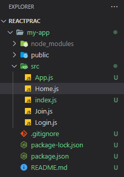
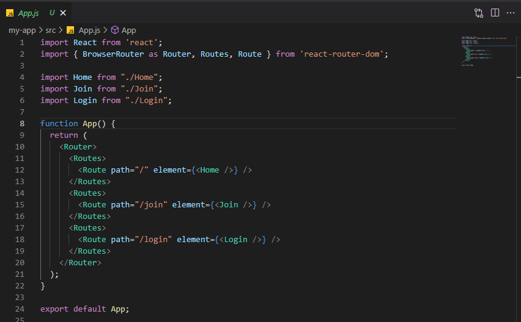
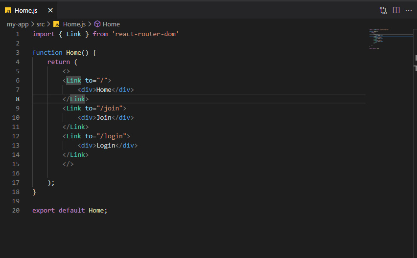
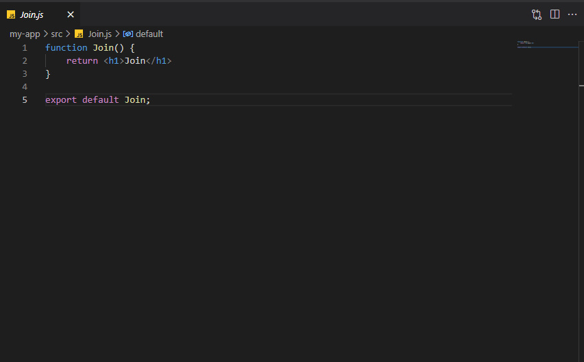
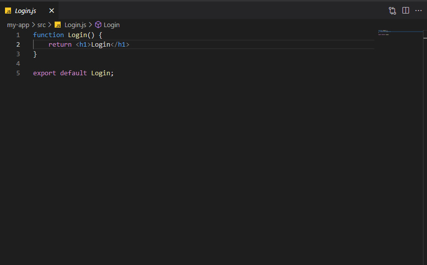
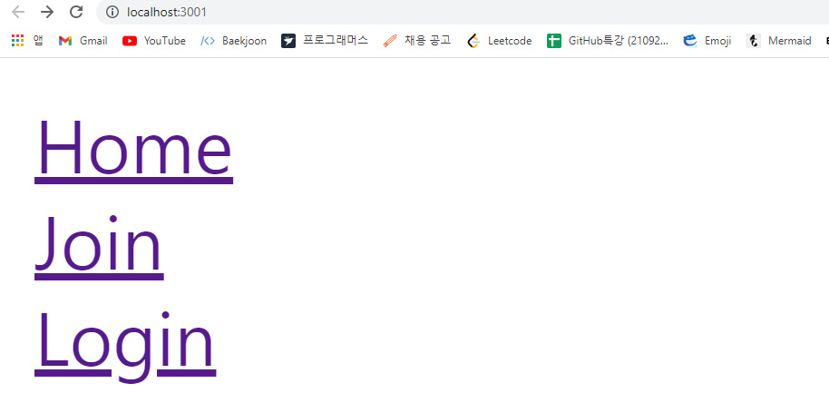
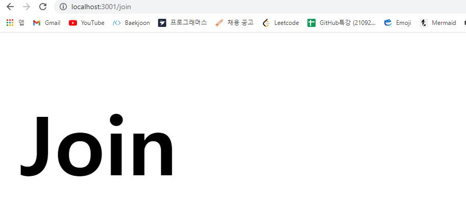
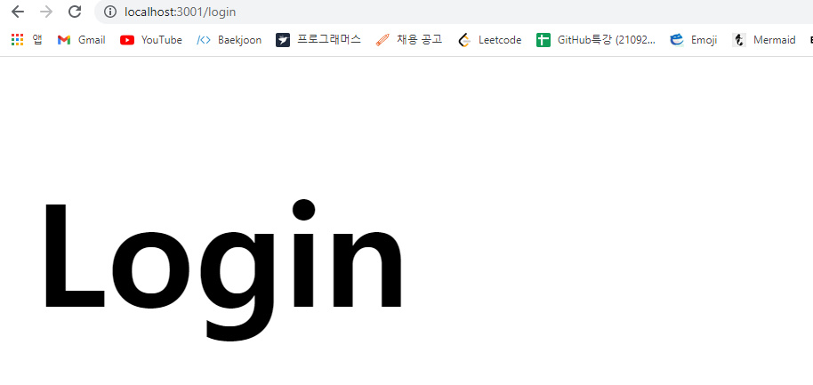

# react-router-dom

과거에는 웹 사이트에서 제공하는 정보가 그렇게 많지 않았다.

그래서 클라이언트의 요청이 있을 때마다 서버가 완전히 새로운 페이지를 렌더링하는 것이 가능했다.

하지만 시간이 지날수록 페이지마다 갖고 있는 데이터 양이 커져갔고,

매번 새로운 페이지를 전달하는 게 점점 버거워지게 되었다.

## SPA란?

이러한 문제를 해결하기 위해 등장한 것이 SPA(Single Page Application)이다.

이름에서도 파악할 수 있듯이, 어떤 웹 사이트의 전체 페이지를 하나의 페이지에 담아 동적으로 화면을 바꿔가며 표현하는 것이 SPA이다.

페이지 변경이 일어난다고 보여지는 것 또한 최초 로드된 자바스크립트를 통해 미리 브라우저에 올라간 템플릿만 교체되는 것이다.

## SPA 라우팅

그렇다면 브라우저에 올라간 템플릿의 교체는 어떻게 이루어질까?

여기서 필요한 것이 바로 라우팅이다.

다른 주소에 따라 다른 뷰를 보여주는 것을 라우팅이라고 하는데, 

리액트에는 이 기능이 자체적으로 내장되어 있지는 않다.

따라서 우리가 직접 브라우저의 API 를 사용하고 주소마다 다른 뷰를 보여줄 수 있도록 설정해야 한다.

## react-router-dom 사용법

리액트에서 라우팅 기능을 위해 사용하는 것이 바로 react-router-dom이다. 

create-react-app을 통해 만든 간단한 프로젝트를 통해 react-router-dom을 어떻게 사용하는지 알아보자.

	

프로젝트의 구조는 다음과 같다.

파일 하나하나를 좀 더 자세히 살펴보자.

	

기본적인 구조는 Route 컴포넌트 안에 여러 개의 Routes 컴포넌트가, 그 안에 실제 주소와 렌더링할 컴포넌트가 담긴 Route 컴포넌트가 들어있는 구조이다.

Route 태그의 path에는 Base url, 가령 http://localhost:3000 을 제외한 나머지만 적어주면 된다.

http://localhost:3000/ 로 이동을 한다면 Home 컴포넌트가 렌더링되고,

 http://localhost:3000/join 으로 이동을 한다면 Join 컴포넌트가 렌더링되는 것이다.

## :bulb:Tip!

react-router-dom에는 BrowserRouter와 HashRouter가 제공되는데, 둘의 주요 차이점은 URL을 저장하고 웹 서버와 통신하는 방식이다.

	

여기서 Link는 브라우저의 새로고침 없이도 유저를 다른 페이지로 이동시켜주는 컴포넌트이다.

Route 컴포넌트로 각 주소에 어떤 컴포넌트가 렌더링될지 설정했다면, Link는 해당 주소로 이동할 수 있는 통로를 만들어준다고 볼 수 있다.

	

				

Join과 Login에는 단순히 해당 컴포넌트의 이름만을 반환하도록 코드를 작성했다.

	

	

	

실제 작동하는 모습은 위와 같다.

# :books:참고자료

노마드코더 강의

https://velog.io/@beginal/%ED%95%B4%EC%8B%9C-%EB%9D%BC%EC%9A%B0%ED%84%B0-%EB%B8%8C%EB%9D%BC%EC%9A%B0%EC%A0%80

https://velopert.com/3417

https://www.huskyhoochu.com/what-is-spa/