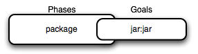

# Spring-Maven

메이븐이란 자바 프로젝트의 빌드를 자동화 해주는 빌드 툴이다.

빌드란 프로젝트에서 쓰인 각각의 파일 및 자원 등을 JVM이나 WAS가 인식할 수 있는 구조로 패키징하는 과정이라고 할 수 있다.


## Life Cycle

메이븐은 프레임워크이기 때문에 동작 방식이 정해져있고, 빌드 순서 또한 미리 정의되어있다.

이 빌드 순서를 메이븐의 라이프 사이클이라고 한다.

메이븐의 라이프 사이클 종류에는 총 3가지 종류가 있다.

1. Default

일반적인 빌드를 위한 라이프 사이클이다. 

2. Clean

이전 빌드를 통해 생성된 모든 파일들을 삭제한다.

3. Site

프로젝트의 웹 사이트 생성을 담당한다.


## Phase

각각의 라이프 사이클 안에는 Phase, 단계가 존재한다.

Phase는 의존관계를 가지고 있어 해당 Phase가 수행되려면 이전 Phase들이 모두 수행되어야 한다.


## Goal

메이븐에서 Phase를 실행하면 해당 phase와 연결된 플러그인의 Goal이 실행된다.

메이븐의 모든 기능은 플러그인 방식을 기반으로 작동하는데, 이 때 플러그인에서 실행할 수 있는 각각의 작업을 Goal이라고 한다.

각 phase는 0개 이상의 Goal과 바인드되어 있다.

ex)

	

package Phase가 jar플러그인과 연결되어 있으며, jar플러그인의 jar기능을 수행한다는 의미이다.


## POM.xml

이렇게 빌드가 이루어질 때 메이븐이 참고하는 설정 파일이 바로 POM.xml(Project Object Model)이다. 

```xml
<?xml version="1.0" encoding="UTF-8"?>
<project xmlns="http://maven.apache.org/POM/4.0.0" xmlns:xsi="http://www.w3.org/2001/XMLSchema-instance"
	xsi:schemaLocation="http://maven.apache.org/POM/4.0.0 https://maven.apache.org/xsd/maven-4.0.0.xsd">
	<modelVersion>4.0.0</modelVersion>
	<parent>
		<groupId>org.springframework.boot</groupId>
		<artifactId>spring-boot-starter-parent</artifactId>
		<version>2.5.6</version>
		<relativePath/> <!-- lookup parent from repository -->
	</parent>
	<groupId>sia</groupId>
	<artifactId>taco-cloud</artifactId>
	<version>0.0.1-SNAPSHOT</version>
	<name>taco-cloud</name>
	<description>Taco Cloud Example</description>
	<properties>
		<java.version>11</java.version>
	</properties>
	<dependencies>
		<dependency>
			<groupId>org.springframework.boot</groupId>
			<artifactId>spring-boot-starter-thymeleaf</artifactId>
		</dependency>
		<dependency>
			<groupId>org.springframework.boot</groupId>
			<artifactId>spring-boot-starter-web</artifactId>
		</dependency>

		<dependency>
			<groupId>org.springframework.boot</groupId>
			<artifactId>spring-boot-devtools</artifactId>
			<scope>runtime</scope>
			<optional>true</optional>
		</dependency>
		<dependency>
			<groupId>org.projectlombok</groupId>
			<artifactId>lombok</artifactId>
			<optional>true</optional>
		</dependency>
		<dependency>
			<groupId>org.springframework.boot</groupId>
			<artifactId>spring-boot-starter-test</artifactId>
			<scope>test</scope>
		</dependency>
	</dependencies>

	<build>
		<plugins>
			<plugin>
				<groupId>org.springframework.boot</groupId>
				<artifactId>spring-boot-maven-plugin</artifactId>
				<configuration>
					<excludes>
						<exclude>
							<groupId>org.projectlombok</groupId>
							<artifactId>lombok</artifactId>
						</exclude>
					</excludes>
				</configuration>
			</plugin>
		</plugins>
	</build>

</project>

```

- modelVersion : POM model의 버전

- parent : 프로젝트의 계층 정보

- groupId : 프로젝트를 생성하는 조직의 고유 아이디를 결정한다. 일반적으로 도메인 이름을 거꾸로 적는다.

- artifactId : 프로젝트 빌드시 파일 대표이름 이다. groupId 내에서 유일해야 한다.

  Maven을 이용하여 빌드시 다음과 같은 규칙으로 파일이 생성 된다.

  artifactid-version.packaging

- version : 프로젝트의 현재 버전, 프로젝트 개발 중일 때는 SNAPSHOT을 접미사로 사용.

- packaging : 패키징 유형(jar, war, ear 등)

- name : 프로젝트, 프로젝트 이름

- description : 프로젝트에 대한 간략한 설명

- url : 프로젝트에 대한 참고 Reference 사이트

- properties : 버전관리시 용이 하다. ex) 하당 자바 버전을 선언 하고 dependencies에서 다음과 같이 활용 가능 하다.
    ` <version>${java.version}</version>`

- dependencies : dependencies태그 안에는 프로젝트와 의존 관계에 있는 라이브러리들을 관리 한다.

- build : 빌드에 사용할 플러그인 목록


# :books:참고자료

 https://goddaehee.tistory.com/199

https://jeong-pro.tistory.com/168

http://wiki.gurubee.net/display/SWDEV/Maven+Lifecycle

http://maven.apache.org/guides/introduction/introduction-to-the-lifecycle.html