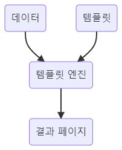

# Thymeleaf

Thymeleaf는 웹 환경과 독립 실행형 환경 모두를 위한 서버 사이드 자바 템플릿 엔진이다.

템플릿 엔진이란 템플릿 양식과 특정 데이터 모델에 따른 입력 자료를 합성해 결과 문서를 출력하는 소프트웨어(또는 소프트웨어 컴포넌트)를 말한다.



템플릿 엔진이 필요한 이유는 무엇일까?

그 이유는 두 가지 정도로 살펴볼 수 있다.

1. 많은 코드를 줄일 수 있다.

대부분의 템플릿 엔진은 기존의 HTML에 비해서 간단한 문법을 제공한다.

2. 재사용성이 높다.

실제로 웹페이지 혹은 웹 애플리케이션을 만들 때 똑같은 디자인에 보이는 데이터만 바뀌는 경우가 굉장히 많다.

템플릿 엔진을 사용하면 하나의 템플릿을 만들어 데이터만 바꿔서 넣으면 된다.


템플릿 엔진은 기준에 따라

- 레이아웃 템플릿 엔진, 텍스트 템플릿
- 서버 사이드 템플릿 엔진, 클라이언트 사이드 템플릿 엔진

으로 나눌 수 있다.


이번에 살펴볼 타임리프는 텍스트 템플릿과 서버 사이드 템플릿에 해당되는 템플릿 엔진이다.

텍스트 템플릿이란 템플릿에 특정 데이터를 넣어 결과 문서를 출력하는 템플릿이다.

서버사이드 템플릿은  DB 혹은 API에서 가져온 데이터를 미리 정의된 템플릿에 넣고 html을 만들어 클라이언트에게 전달하는 템플릿이다.


## 타임리프 문법

타임리프 공식 문서에서 가져온 내용이다.


## 기본 표현

일반적인 표현 방식들은 기존의 프로그래밍 언어들과 크게 다르지 않다.

### Simple expressions:

- Variable Expressions: `${...}`
- Selection Variable Expressions: `*{...}`
- Message Expressions: `#{...}`
- Link URL Expressions: `@{...}`
- Fragment Expressions: `~{...}`

다른 페이지에서 공통 부분을 불러 사용할 수 있다.

### Literals:

- Text literals: `'one text'`, `'Another one!'`,…
- Number literals: `0`, `34`, `3.0`, `12.3`,…
- Boolean literals: `true`, `false`
- Null literal: `null`
- Literal tokens: `one`, `sometext`, `main`,…

### Text operations:

- String concatenation: `+`
- Literal substitutions: `|The name is ${name}|`

### Arithmetic operations:

- Binary operators: `+`, `-`, `*`, `/`, `%`
- Minus sign (unary operator): `-`

### Boolean operations:

- Binary operators: `and`, `or`
- Boolean negation (unary operator): `!`, `not`

### Comparisons and equality:

- Comparators: `>`, `<`, `>=`, `<=` (`gt`, `lt`, `ge`, `le`)
- Equality operators: `==`, `!=` (`eq`, `ne`)

### Conditional operators:

- If-then: `(if) ? (then)`
- If-then-else: `(if) ? (then) : (else)`
- Default: `(value) ?: (defaultvalue)`

### Special tokens:

- No-Operation: `_`

타임리프가 실행되지 않는 것처럼 보인다.

HTML에 작성해놓은 내용 그대로를 활용할 수 있다.


## 표현식

th:[속성]="서버 전달 받은 값 또는 조건식" 형태로 태그 안에 삽입하면 된다.

```html
<span th:text="${user.name}">user name</span>
```

다양한 속성들이 있으며 자주 쓰이는 속성은 다음과 같다.

| 이름   | 설명                                                         |
| ------ | ------------------------------------------------------------ |
| text   | 텍스트 내용<br />`<span th:text="{user.name}">user name</span>` |
| utext  | HTML 문법으로 작성된 내용<br />`<span th:utext="{content}">HTML content</span>` |
| value  | 요소의 value 값<br />`<input name="ingredients" type="checkbox" th:value="${ingredients.id}" />`<br /><br />스프링 인 액션의 예제로 타코 주문 애플리케이션에서 재료 선택 페이지의 일부분이다. |
| if     | 조건문<br />`<input type="text" th:field="*{ccNumber}" />`<br />`<span class="validationError" th:if="${#fields.hasError('ccNumber')}" th:text="*{ccNumber}">CC Num Error</span>`<br /><br />스프링 인 액션의 예제. 유효성 검사 등 다양한 기능들이 연관되어 있지만,<br />결과적으로 조건문을 통해 ccNumber 필드에 에러가 있으면 에러 메시지를 출력하도록 한다. |
| each   | 반복문<br />`<div th:each="ingredient : ${protein}">...</div>`<br /><br />스프링 인 액션의 예제. protein 변수는 iterator이다.<br />for(Ingredient ingredient : protein)과 같다. |
| object | form submit을 할 때, form의 데이터를 th:object에 설정해준 객체로 받는다. |
| field  | th:object에 설정된 객체의 필드와 연결시켜준다.               |


# :books:참고자료

크레이그 월즈, 스프링 인 액션, 제이펍, 2020

https://gmlwjd9405.github.io/2018/12/21/template-engine.html

https://velog.io/@haerong22/Thymeleaf-%EC%A0%95%EB%A6%AC