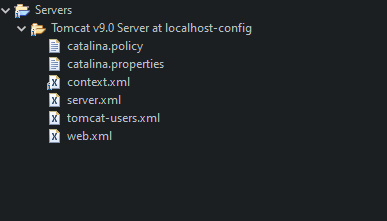

# ConnectionPool

데이터베이스와 프로그래밍은 뗄레야 뗄 수 없는 관계이다.

프로그램 자체가 데이터와 프로세스로 이루어져 있기에 데이터들을 관리하는 데이터베이스는 프로그래밍에 필수요소이다.

이전에 자바와 데이터베이스를 연결하는 방법으로 JDBC를 알아보았다.

```java
public class ConnectionManager {
	public static Connection getConnection() {
		Connection con = null;
		String driver = "com.mysql.cj.jdbc.Driver";
		String url = "jdbc:mysql://localhost:3306/kdt13";
		String id = "root";
		String pwd = "mysql";
		
		try {
			Class.forName(driver);
			con = DriverManager.getConnection(url,id,pwd);
		} catch (ClassNotFoundException e) {
			// TODO Auto-generated catch block
			e.printStackTrace();
		} catch (SQLException e) {
			// TODO Auto-generated catch block
			e.printStackTrace();
		} 
		
		return con;
	}

```

위의 코드는 JDBC 드라이버를 로드해 커넥션(Connection) 객체를 생성하는 코드이다.

이렇게 생성된 커넥션 객체는 DBMS에 쿼리를 보내 데이터베이스에서 그 결과를 가져오는 일종의 통로 역할을 한다.


하지만 위의 방식은 클라이언트의 요청이 있을 때마다 객체를 생성해 데이터베이스에 연결하는 방식이기 때문에 굉장히 비효율적이다.

요청이 적다면 그렇게 큰 문제가 되지는 않겠지만, 수십 수백명이 동시에 데이터베이스와 연동하는 기능을 사용한다면 엄청난 시간이 걸릴 것이다.

이러한 문제를 해결하기 위해서 등장한 것이 바로 커넥션풀(ConnectionPool)이다.

커넥션풀은 미리 데이터베이스와 연결시킨 객체를 저장해두었다가 필요할 때 꺼내서 쓰는 기술을 의미한다.


## 커넥션풀 동작 과정

톰캣 컨테이너에서 제공하는 커넥션풀이 어떻게 작동하는지 알아보자.


1. 톰캣 컨테이너를 실행한 후 웹 애플리케이션을 실행한다.
2. 톰캣 컨테이너 실행 시 커넥션풀 객체를 생성한다.
3. 생성된 커넥션 객체는 DBMS와 연결한다.
4. 데이터베이스와의 연동 작업이 필요할 경우 웹 애플리케이션은 커넥션풀에서 제공하는 메서드를 호출하여 연동한다.


톰캣 컨테이너는 자체적으로 커넥션풀 기능을 제공한다.

톰캣 실행시 톰캣은 설정 파일에 설정된 데이터베이스 정보를 이용해 미리 데이터베이스와 연결하여 커넥션풀 객체를 생성한다.

그리고 애플리케이션이 데이터베이스와 연동할 일이 생기면 커넥션풀 객체의 메서드를 호출해 빠르게 작업한다.


## DataSource 클래스와 JNDI(Java Naming and Directory Interface)

실제 웹 애플리케이션에서 커넥션풀 객체를 구현할 때는 Java SE에서 제공하는 javax.sql.DataSource 클래스를 이용한다.

- 커넥션 풀의 Connection을 관리하기 위한 클래스이다.
- JNDI를 통해서 이용할 수 있다.
- DataSource 객체를 통해서 필요한 Connection을 획득, 반납 등의 작업을 한다.


JNDI는 필요한 자원을 키/값 쌍으로 저장한 후 필요할 때 키를 이용해 값을 얻는 방법이다.

즉, 미리 접근할 자원에 키를 지정한 후 애플리케이션이 실행 중일 때 이 키를 이용해 자원에 접근해 작업을 하는 것이다.


톰캣 컨테이너가 커넥션풀 객체를 생성하면 이 객체에 대한 JNDI 이름을 미리 설정해 놓는다.

그리고 나중에 웹 어플리케이션에서 데이터베이스와 연동 작업을 할 때 JNDI 이름으로 접근하여 작업한다.


## 톰캣 DataSource 설정 및 사용 방법

### 1. JDBC 드라이버와 커넥션풀 기능 관련 jar 파일을 /WEB-INF/lib 폴더에 설치한다.

WEB-INF 폴더는 웹 애플리케이션에 관한 정보들이 저장되는 곳이고,

그 안의 lib 폴더는 웹 애플리케이션에서 사용되는 여러 가지 라이브러리 압축 파일이 저장되는 곳이다.


### 2. 아래 위치에 있는 context.xml에 커넥션풀 객체 생성 시 연결할 데이터베이스 정보를 작성한다.

	

context.xml 파일에서 `<context>`태그 안에다가 데이터베이스 정보를 작성해준다.

| 속성            | 설명                                                         |
| --------------- | ------------------------------------------------------------ |
| name            | DataSource에 대한 JNDI 이름, 이후에 이 이름으로 DataSource에 접근한다. |
| auth            | 인증 주체                                                    |
| driverClassName | 연결할 데이터베이스 드라이버 클래스 이름                     |
| factory         | 연결할 데이터베이스 종류에 따른 커넥션풀 생성 클래스 이름    |
| maxActive       | 동시에 최대로 데이터베이스에 연결할 수 있는 커넥션 개수      |
| maxIdle         | 사용되지 않고 풀에 저장될 수 있는 최대 커넥션 개수<br />음수일 경우 제한이 없음 |
| maxWait         | 새로운 연결이 생길 때까지 기다릴 수 있는 최대 시간           |
| user            | 데이터베이스 접속 ID                                         |
| password        | 데이터베이스 접속 비밀번호                                   |
| type            | 데이터베이스 종류별 DataSource                               |
| url             | 데이터베이스 주소와 포트 번호 및 SID                         |

위의 표를 참고해 속성값을 자신에 맞게끔 작성해준다.


### 3. 커넥션풀을 사용할 프로젝트 안의 web.xml에 JNDI 설정을 위해 `<resouce-ref> `태그를 넣는다.

	

`<res-ref-name>`태그에 들어가는 이름은 context.xml 파일에 설정한 이름과 같아야 한다.


### 4. 데이터베이스와 연동 시 미리 설정한 키 값을 통해 데이터베이스와 연결해 작업한다.

```java
	public static Connection getConnection_v2() {
		Connection con = null;
		Context initCtx = null;
		try {
			initCtx = new InitialContext();
			Context envCtx = (Context)initCtx.lookup("java:comp/env");
            // JNDI에 접근하기 위해 기본 경로를 지정한다.
			DataSource ds = (DataSource)envCtx.lookup("loginDB");
            // 톰캣 context.xml에서 설정한 name값을 이용해 미리 연결한 DataSource 객체를 받아온다.
			con = ds.getConnection();
            // DataSource 클래스의 getConnection 메서드로 Connection 객체를 가져온다.
		} catch (NamingException e) {
			// TODO Auto-generated catch block
			e.printStackTrace();
		} catch (SQLException e) {
			// TODO Auto-generated catch block
			e.printStackTrace();
		}
		
		
		return con;
	}
```

여기서 주목해야할 부분은 이전과 달리 커넥션 객체를 생성하지 않고 미리 생성해 놓은 객체를 받아온다는 점이다.


# :books:참고자료

https://devbox.tistory.com/entry/JSP-%EC%BB%A4%EB%84%A5%EC%85%98-%ED%92%80-1

https://opentutorials.org/module/3569/21223

이병승, 자바 웹을 다루는 기술, 도서출판 길벗, 2019